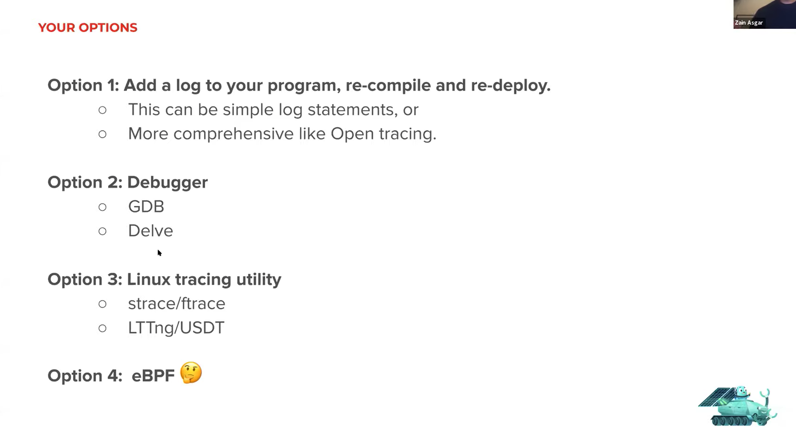
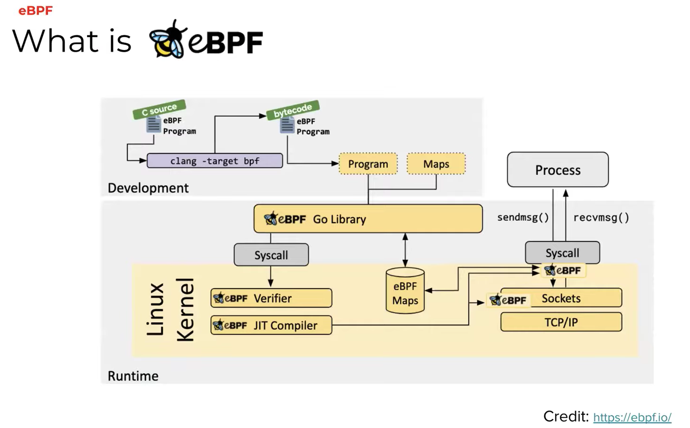
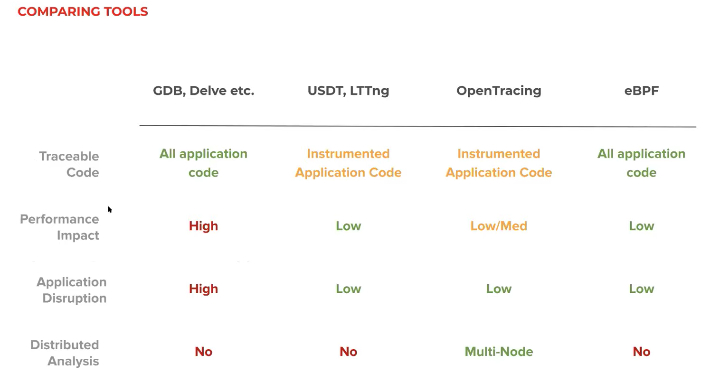

<iframe width="560" height="315" src="https://www.youtube.com/embed/0mxUU_--dDM" frameborder="0" allow="accelerometer; autoplay; clipboard-write; encrypted-media; gyroscope; picture-in-picture" allowfullscreen></iframe>

**Refer article "Debugging Go in prod using eBPF" by Zain Asgar : https://blog.pixielabs.ai/blog/ebpf-function-tracing/post/**

## 前言:

在 Golang 上面來 debugging 其實有許多方式，不論是最常使用的 logging 或是透過 delve 甚至是 GDB 。 都算是常見方式來 debugging Go 。 但是最近看到這篇文章，覺得裡面提到的 eBPF (extended Berkeley Packet Filter) 算是蠻有趣，在這裡稍微做個簡單的整理。

## Golang 上除錯的方式 (Debugging in Go)

一般來說要在 Go application 中來 debugging ，有以下的方式:

### **Add log:**

就如同大家熟悉的，使用 `fmt.Println()` 或是 `log.Println()` 。

### **Using debugger (delve or GDB)**

不論是透過 vscode 內建的 delve ，或是透過 GDB 來做 debugging 。 透過 debugger 來除錯，其實是相當消耗系統資源，並且經常會中斷整體應用程式的運行。

### Tracing 

## 什麼是 eBPF

## 為何使用這個?

## 相關問題：

