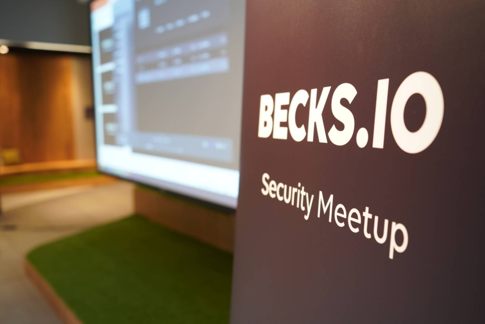

大家好，我是 LINE Tech Evangelisgt – Evan Lin。LINE 一直以來不遺餘力地提升資訊安全，除了以 DevSecOps 的概念為基礎，將資安 DNA 注入 LINE 產品與服務，更積極促進整體資安生態圈的成長。 而 Beer is beautiful, hacks is amazing, BECKS is gold. BECKS是Beer與Hacks兩個字所組成。 透過一系列的 BECKS.IO – Security Meetup 資安社群活動，為韓國、日本、台灣等地的優秀資安人才提供當面交流、建立良好連結的機會!   本次 BECKS.IO 小聚選於台北的 Avenue 舉辦，邀請台灣的講者們，在輕鬆開放的氛圍中，暢談不同企業與個人的資安思維及實務經驗，並展望相關技術的未來發展。

KKTIX 活動網頁:  [活動網址](https://becks.kktix.cc/events/twbecks7)

## Detect and track Apple devices for fun and profit - Ta-Lun Yen / TXOne Networks (Trend Micro) Threat Researcher

#### Apple HotSpot

#### Bluetooth scan and detection

## From NLP to Neural Network based Malware Detection - aaaddress1 / Chroot member

### 惡意程式 (malware) 的 syntax pattern (from assembly call)

- uExitCode -> intterup 

### 如何防禦 Malware 

- 把程式切塊，找尋可疑區塊。

#### 是否可以借助「語義學」模型來找出 malware 判斷方式

**缺點:**

- 指令與指令間的關係 (for loop 回傳 pattern)
- 大量改版，變種的 malware 。
- 根據舊的 malware 新增索引包，很容易被判斷跳脫

### 語義學(semantics)介紹

- 根據一個詞的前後文來判斷文字本身的意思
- e.g.
  - I `drink` beer, I `drink` wine.
  - I `guzzle` beer, I `guzzle` wine.
- 透過共生矩陣表 (tokenFeq) 來找出前後文出現頻率，有出現 +1 。
- 透過詞頻率畫出的折線圖，可以找出類似的詞。 (e.g. drink and guzzle)
- cosine similarity 

### 為何不直接用 semantics 分析方式?

- 如果有新的詞出現，造成 tokenFeq 得重新建立（訓練）

所以，本次分享將用 distributed memory sharing 方式來建立，而非使用共通的 tokenFeq 。

### 透過相關dimention 來分類，而非直接緊接的詞。

e.g. 

- Apple -> 技術相關的品牌 
- NBA -> 運動類別
- Apple Watch -> 運動心跳 -> 技術品牌
- China -> 政治類別
- 華為 -> 科技品牌 -> 政治類別
- 接下來就可以計算兩個單詞的相似度 similarity 
  - China x 華為 --> 相似度就會很高。
- 

### 相關的 Q&A 

### Q:  

## 活動小結

今晚的聚會邀請到國內外資安專家，不藏私分享資安策略和經驗，幫助與會者在短短數小時內，從不同角度領略實現資安的各種可能。BECKS 是由 Beer 與 Hacks 兩個字所組成，透過本次小聚，我們再度凝聚資安社群，讓資安專家分享最新研究，並讓各領域的資安研究員進行面對面討論，除了幫助更多人了解 LINE 的安全設計，更希望透過交流，讓多元的資安思維得以迸發出精彩的火花!

立即 follow「BECKS」活動訊息，就能收到第一手 Meetup 活動最新消息的推播通知。▼

「BECKS」活動專頁：[https://becks.io](https://becks.io)

## 關於「LINE開發社群計畫」

LINE今年年初在台灣啟動「LINE開發社群計畫」，將長期投入人力與資源在台灣舉辦對內對外、線上線下的開發者社群聚會、徵才日、開發者大會等，已經舉辦30場以上的活動。歡迎讀者們能夠持續回來察看最新的狀況。詳情請看:

- [2019 年LINE 開發社群計畫活動時程表](https://engineering.linecorp.com/zh-hant/blog/line-taiwan-developer-relations-2019-plan/)
- [LINE Taiwan Developer Relations 2019 回顧與 2019 開發社群計畫報告](https://engineering.linecorp.com/zh-hant/blog/line-taiwan-developer-relations-2019/)
- [2020 年LINE 開發社群計畫活動時程表](https://engineering.linecorp.com/zh-hant/blog/2020-line-tw-devrel/)

### 徵才訊息
《LINE 強力徵才中!》與我們一起 Close the Distance 串聯智慧新世界 >> [詳細職缺訊息](https://career.linecorp.com/linecorp/career/list?classId=&locationCd=TW)
