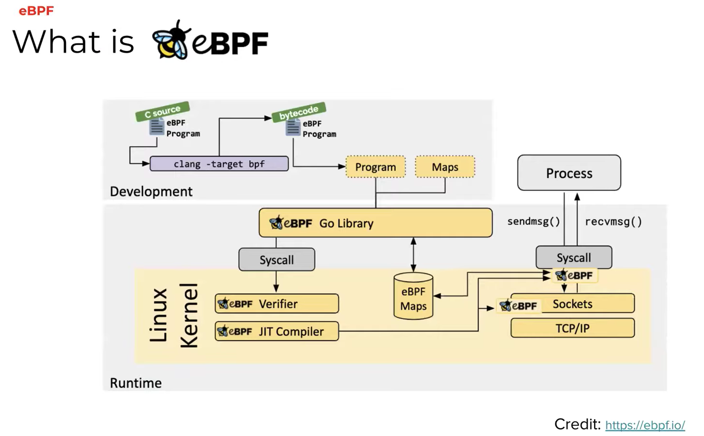
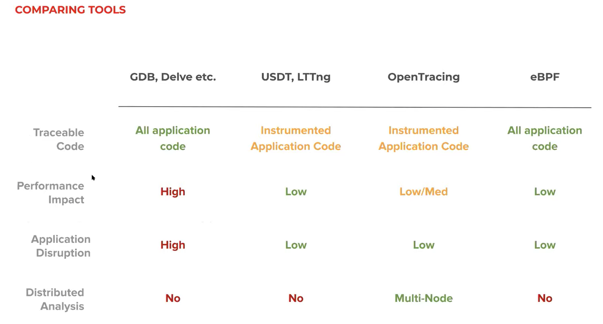

<iframe width="560" height="315" src="https://www.youtube.com/embed/0mxUU_--dDM" frameborder="0" allow="accelerometer; autoplay; clipboard-write; encrypted-media; gyroscope; picture-in-picture" allowfullscreen></iframe>

**Refer article "Debugging Go in prod using eBPF" by Zain Asgar : https://blog.pixielabs.ai/blog/ebpf-function-tracing/post/**

## 前言:

在 Golang 上面來 debugging 其實有許多方式，不論是最常使用的 logging 或是透過 delve 甚至是 GDB 。 都算是常見方式來 debugging Go 。 但是最近看到這篇文章，覺得裡面提到的 eBPF (extended Berkeley Packet Filter) 算是蠻有趣，在這裡稍微做個簡單的整理。

## Golang 上除錯的方式 (Debugging in Go)

一般來說要在 Go application 中來 debugging ，有以下的方式:

### **Add log:**

就如同大家熟悉的，使用 `fmt.Println()` 或是 `log.Println()` 。

### **Using debugger (delve or GDB)**

不論是透過 vscode 內建的 delve ，或是透過 GDB 來做 debugging 。 透過 debugger 來除錯，其實是相當消耗系統資源，並且經常會中斷整體應用程式的運行。

### Tracing 

這裡指的是透過外部的 tracing tool ，不論事 USDT 還是 strace 都算是一種方式。

## 什麼是 eBPF

eBPF (extended Berkeley Packet Filter) 根據官方網站 (https://ebpf.io/) ，是一個技術可以讓 application 跑在 sandbox 上面，並且可以透過 Syscall hook 方式來查看相關的資料而不需要修改任何的 kernel source code 。

應用範圍有:

**Secuerity:**  透過 eBPF 可以做為一個與系統呼叫 (Syscall) 與硬體設備的中間層。

**Tracking and Profiling**:由於 Linux 系統都有提供 eBPF 的接口，可以透過這個直接 tracking 與 Profiling 你的應用。 (with very low latency) 。

這也是這篇文章提到的主要技巧。

## 為何使用這個?

既然提到 Debugging Go App 的所有工具，必須要跟其他方式做個比較。可以看到 eBPF 具有以下特性：

- Performance Impact 非常的低（disruption 也很低），類似於 Tracing tool 。但是跟 GDE 與 Delve 一樣可以追蹤到 Application Code。
- 但是無法作分散式系統的測量，因為一次 eBPF 只能針對你需要 hook 的應用來做 debugging 跟 tracing 。

## 更多介紹：

<iframe width="560" height="315" src="https://www.youtube.com/embed/7pmXdG8-7WU" frameborder="0" allow="accelerometer; autoplay; clipboard-write; encrypted-media; gyroscope; picture-in-picture" allowfullscreen></iframe>