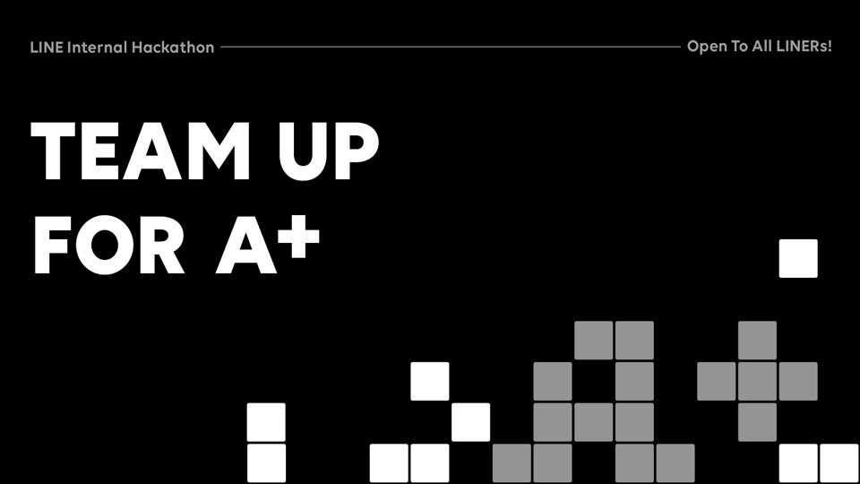
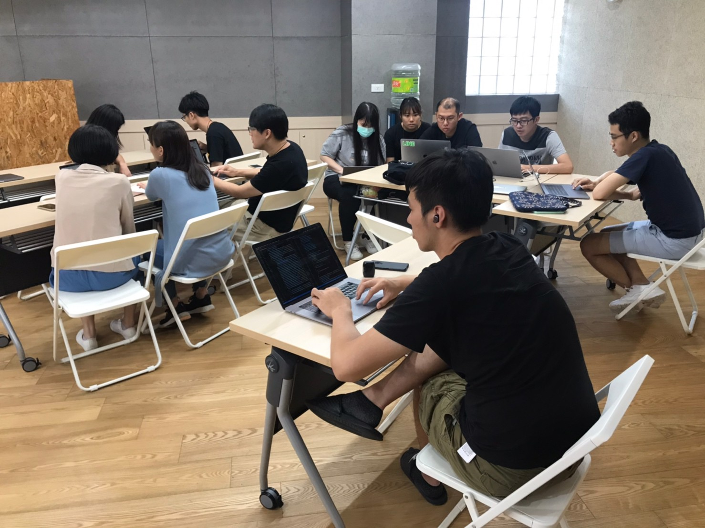
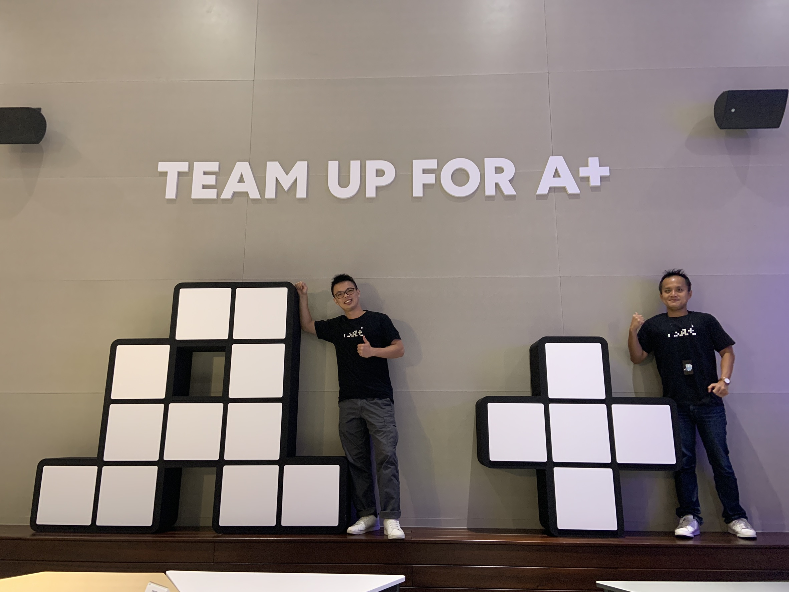
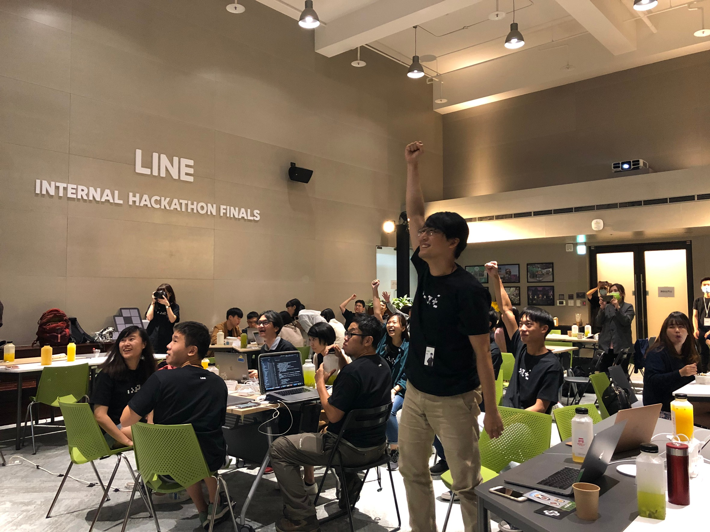
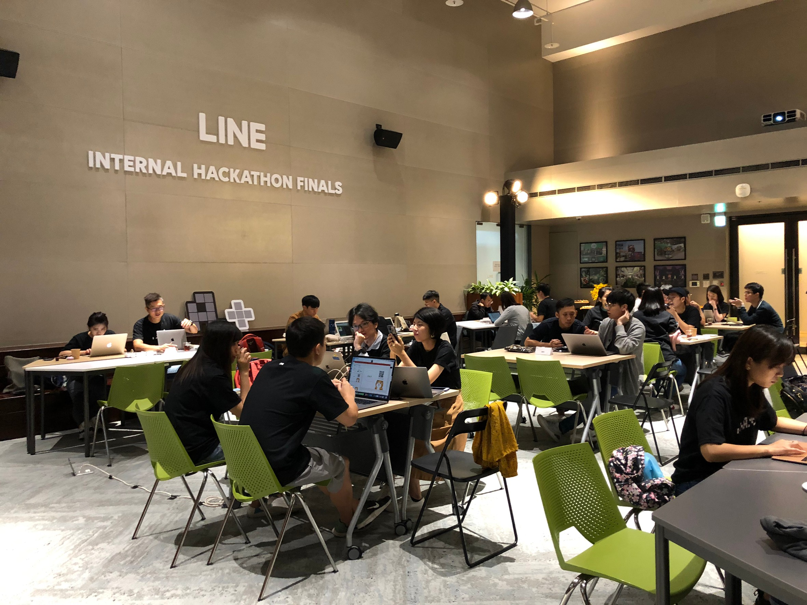

大家好，我是 LINE Tech Evangelist - Evan Lin 。LINE 很重視員工們的自主創新與團隊合作，所以各地都會舉辦 LINE Internal Hackathon 。 在 LINE 台灣這已經是第二屆的內部黑客松競賽，也期待能夠看到不同團隊激盪後滿滿的創意。

第一屆內部舉辦的時候，受到許多的迴響。不少非工程團隊也希望能夠一起參與，所以今年特定修改參賽方式，第二屆的 LINE 內部黑客松競賽的主題就是 「Team up for A+」 ，目標希望同仁們能團隊合作，共同優化與創新出更令人驚豔（WOW) 的產品服務。

## 第一屆回顧 LINE Internal Hackathon 2019 -  LINE Attitude

第一屆的 LINE Taiwan Internal Hackathon 主旨為 「AI is new Attitude」，由於 LINE 是一家注重 AI 的公司，我們也希望每一位員工都能透過機器學習為出發點，來反思每一個服務，一些內部應用是否可以透過機器學習與人工智慧的方式來優化。

第一屆的 LINE Internal Hackathon 我們收到許多有趣的應用，在 TECHPULSE 2019 上我們也分享了第一名的成果與技術。 也就是透過人工智慧的方式來幫助出差報帳的系統。

### 20019 LINE Internal Hackathon 第一名：自動報帳系統

LINE 的開發團隊遍及許多國家，於是 LINE 的工程團隊有許多的機會可以到不同國家的分公司去合作與討論。但是回來後最令出差人員困擾的就是要將許多的單據一步步的用人工的方式要輸入到系統與表單之中，這樣的作業流程往往要半個小時左右，相當的消耗人力。

去年的參賽隊伍透過人工智慧學習的方式，透過超過數百張出差表單的學習經驗。透過 iPhone 的軟體拍照之好，透過 OCR 的辨識與學習經驗，自動將不同表單填寫到正確的表單位置。並且產出報帳需要的表單文件。大大的將原本三十分鐘節省報帳的流程到兩分鐘之內。因此獲得了評審的青睞。

## 今年新增 (What's new in 2020)

第一屆舉辦後收到不少的迴響：

- 非工程團隊能有否參與的機會？ 有點子但是都找不到工程師來一起組隊。
- 有沒有更多的時間能讓參賽隊伍完成這個專案？

吸取了去年的意見，於是今年的參賽規則也做了部分的修改：

- 每個參賽的隊伍需要有不同團隊的成員（e.g. 開發人員＋行銷團隊，或是開發人員＋人力資源團隊）。但是開發人員與測試人員都算是工程團隊而無法這樣組隊。

- 第一階段提案入選的隊伍，能夠有三次的 Hacking Space (黑客工作訪)的機會。週末下午有特定的空間與餐點（下午茶）提供讓每個參賽隊伍能極盡可能得提高產品的完成度。

  

（ Hacking Space 的紀錄照片）

同事們都很妥善利用公司所提供的時間與空間，在不影響專案進度的狀況下熱情的參與。 

## 總決賽

經過了三次的 Hacking Space 的活動後，也到了最後總決賽的日子。 為了讓公司內沒有參賽的同仁可以一起觀賞總決賽的展示說明。這一次特定在總決賽舉辦在公司內部的十二樓會議空間。  整天的活動分成三個部分：

- **Hacking**: 
  - 讓同仁做最後衝刺的機會，並且可以調整簡報的順暢度。
- **猜謎活動：** 
  - 下午舉辦的猜謎活動，一些有趣的問題外。也讓緊張的氣氛獲得緩解。
- **最終展示簡報：**
  - 最終的簡報展示，必須包含可以 demo 或是讓評審實際遊玩的產品。

現場也有一些必要的佈置，並且也替每一位同仁定制了專屬的紀念 T-shirt 。提供給每一個參賽的同仁可以拍照，讓本次的活動不留白。

## 猜謎小活動

從去年第一屆就開始的猜謎小活動，其實題目都相當的有趣。除了有 LINE Friends 相關小故事猜謎外，也有一些 LINE 相關服務的問題。除了可以讓每一個同仁更佳的了解 LINE 之外，也可以讓每個同仁舉舉手，運動一下也可以舒緩緊張的比賽氣氛。

## 活動小結

今年的參賽題目都相當的有趣（礙於都有可能變成未來產品，不方便公開）。除了許多產品有人工智慧與機器學習的輔助之外，更有許多產品是相當有趣的突發奇想。也由於今年有 Hacking Space 的安排，每一個參賽隊伍的作品完成度都很高，不僅僅都可以讓評審現場的試玩之外，也都開放給公司內同仁測試。 完成度與穩定度之高，讓評審們都讚不絕口。 

也想要參加有趣的 LINE 內部的黑客松活動嗎？ 那還不趕快投遞你的履歷加入 LINE 喔！

立即加入「LINE開發者官方社群」官方帳號，就能收到第一手Meetup活動，或與開發者計畫有關的最新消息的推播通知。▼

「LINE開發者官方社群」官方帳號ID：[@line_tw_dev](https://lin.ee/s5RsZHo)

## 關於「LINE開發社群計畫」

LINE今年年初在台灣啟動「LINE開發社群計畫」，將長期投入人力與資源在台灣舉辦對內對外、線上線下的開發者社群聚會、徵才日、開發者大會等，已經舉辦30場以上的活動。歡迎讀者們能夠持續回來察看最新的狀況。詳情請看:

- [2019 年LINE 開發社群計畫活動時程表](https://engineering.linecorp.com/zh-hant/blog/line-taiwan-developer-relations-2019-plan/)
- [LINE Taiwan Developer Relations 2019 回顧與 2019 開發社群計畫報告](https://engineering.linecorp.com/zh-hant/blog/line-taiwan-developer-relations-2019/)
- [2020 年LINE 開發社群計畫活動時程表](https://engineering.linecorp.com/zh-hant/blog/2020-line-tw-devrel/)

### 徵才訊息
《LINE 強力徵才中!》與我們一起 Close the Distance 串聯智慧新世界 >> [詳細職缺訊息](https://career.linecorp.com/linecorp/career/list?classId=&locationCd=TW)
