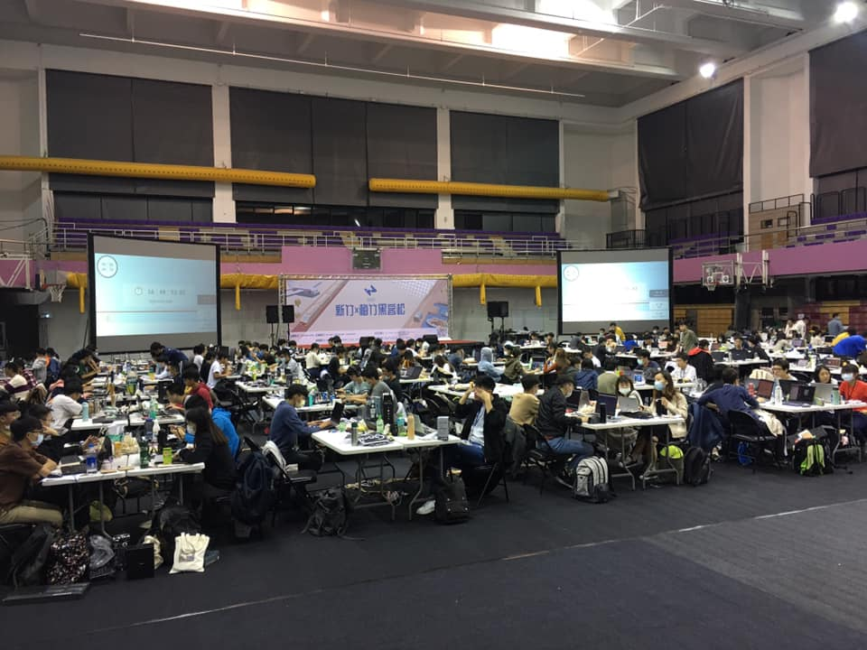
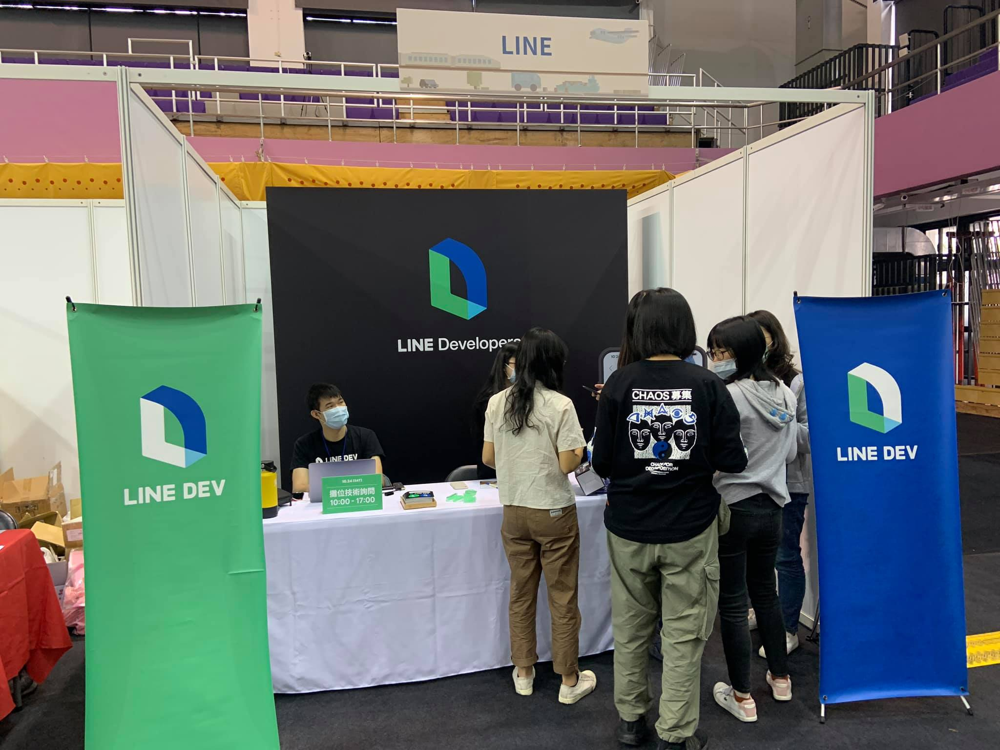
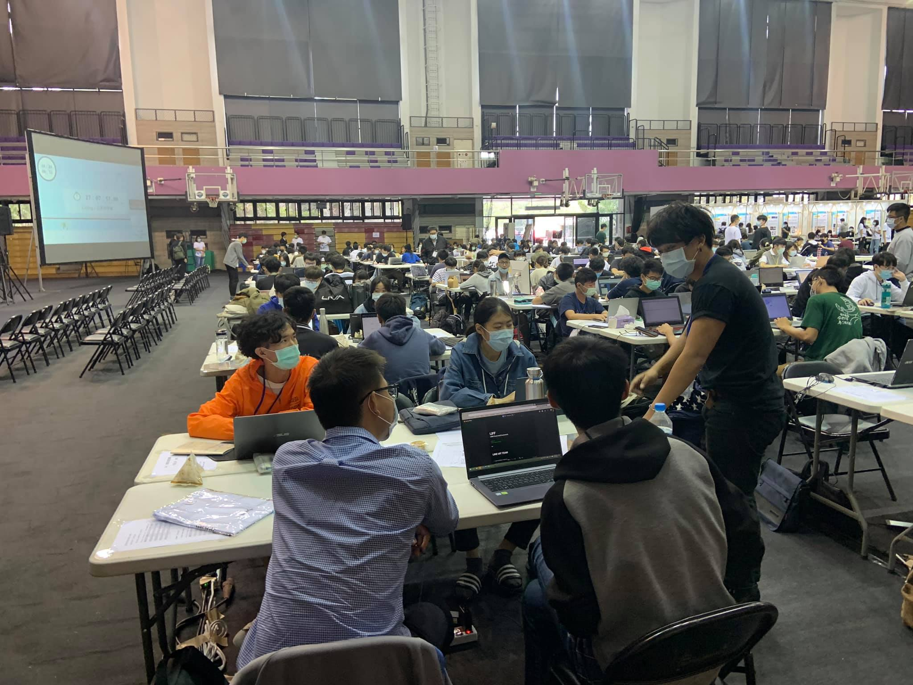
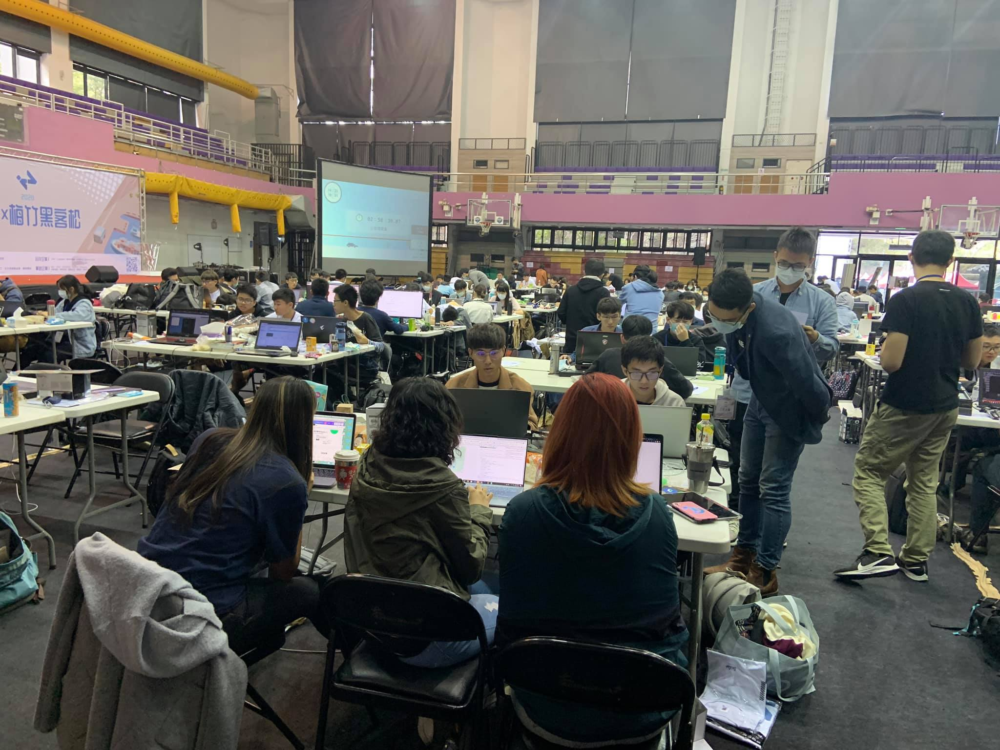
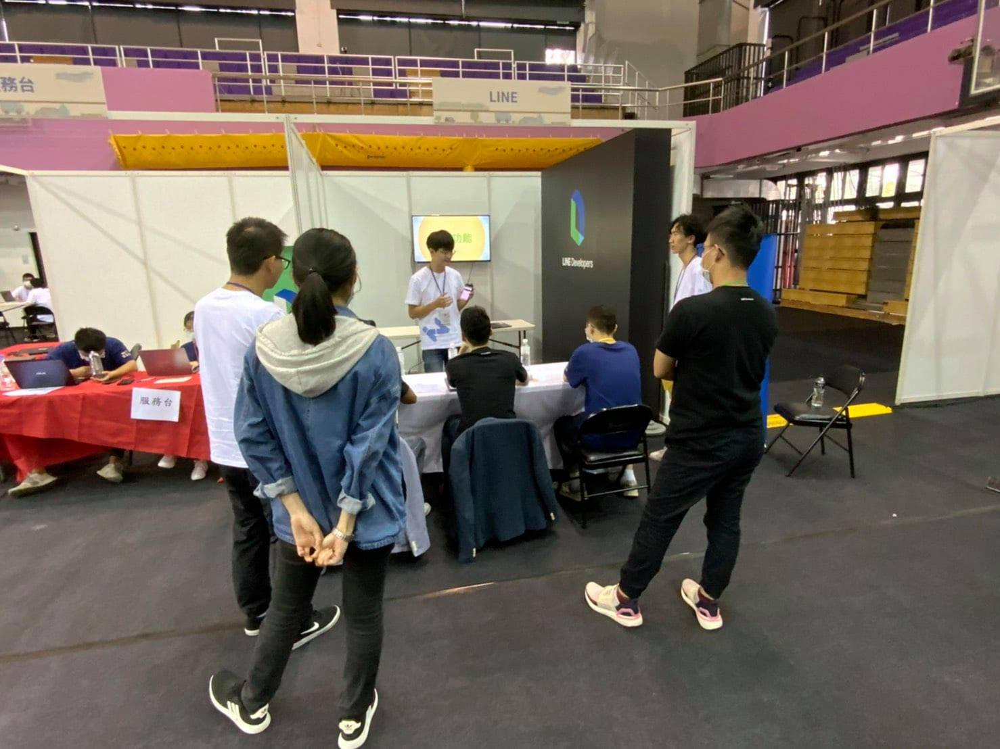
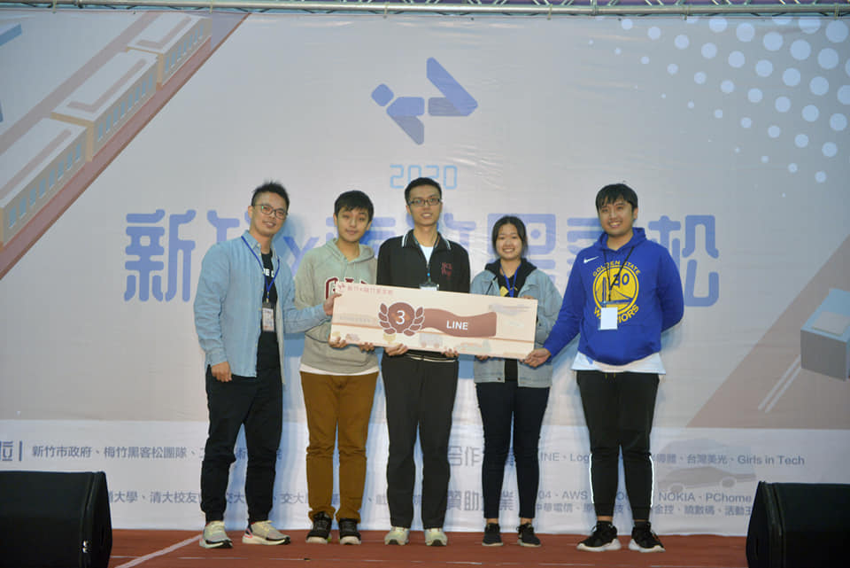
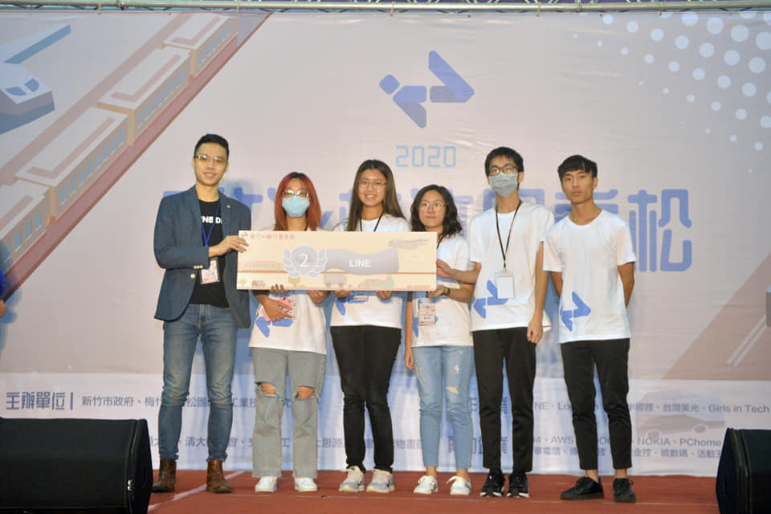
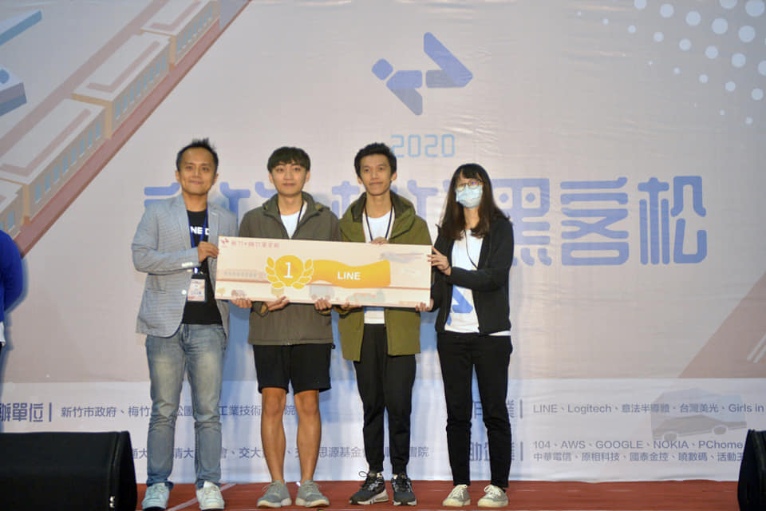
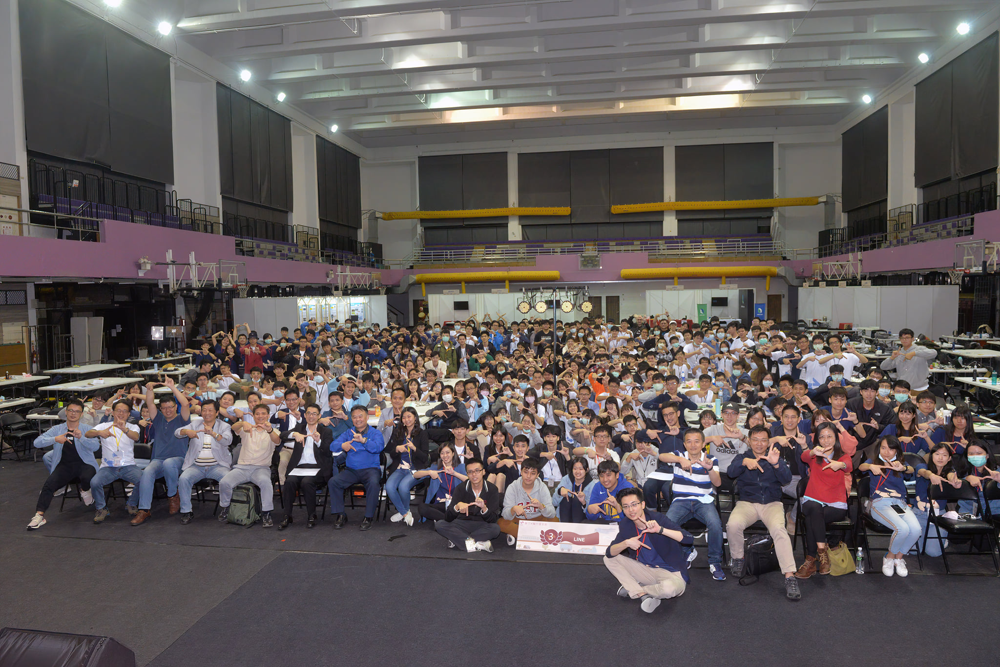

(照片來源： [梅竹黑客松官方粉絲團](https://www.facebook.com/HackMeiChu))

## 寫在前面：

大家好，我是 LINE Tech Evangelist - Evan Lin 。LINE 很重視員工們的自主創新與團隊合作，所以各地都會舉辦 LINE Internal Hackathon 。 並且在[日前也舉辦了 在 LINE 台灣第二屆的內部黑客松競賽](https://engineering.linecorp.com/zh-hant/blog/line-taiwan-internal-hackathon-2020/)，而這次很開心跟新竹市政府與梅竹黑客松主辦單位一同支持學生們創新的 Hacking 精神，一起舉辦了 [「新竹 x 梅竹黑客松」](https://www.facebook.com/HackMeiChu) LINE 的競賽組別。

在決賽前一週， LINE 的開發工程師也應邀出席了企業工作坊透過教導同學們 LIFF 與 LIFF Share Target Picker 來讓每一個參賽的同學能夠了解。 （詳情請看： [梅竹黑客松賽前企業工作坊 – LIFF shareTargetPicker](https://engineering.linecorp.com/zh-hant/blog/meichu-liff-share-target-picker-workshop/) )

## 活動擺攤

首先在活動擺攤上，當天 LINE Dev 也有參與擺攤並且歡迎大家來加入我們的官方粉絲團與官方帳號。也歡迎文章的讀者可以一起加入。

### 相關資訊

- [LINE 開發者官方社群](https://lin.ee/s5RsZHo)
- [LINE Developer Taiwan 官方粉絲團](https://www.facebook.com/LINEDevelopersTW/)
- [LINE Developer Group Taiwan LINE 開發者討論群組](https://www.facebook.com/groups/linebot/)
- [LINE Developer Taiwan YouTube 頻道](https://www.youtube.com/channel/UCx1pKSdILDqvS_gcGM4OHPg)

### 競賽說明

LIFF (LINE Frontend Framework) 是 LINE 為網頁應用 (Web Application）所開發應用套件。 透過 LIFF 除了可以快速做相關的 LINE Login 取得使用者資訊，更可以將有趣的資訊直接在網頁上分享給你 LINE 的好友。

本次的主題希望同學們能發揮想像力，透過 LIFF 來開發出一個令人為之讚嘆（WoW) 的應用服務。

更多 LIFF 的相關開發文件請參考: https://developers.line.biz/en/docs/liff/

(摘自[文章](https://engineering.linecorp.com/zh-hant/blog/liff-share-target-picker/)， 可以看得出來透過 Share Target Picker 作出的應用可以比直接在 LINE 中傳訊息要快上兩倍左右。)

(LIFF Share Target Picker 可以做出很有趣的應用，[圖為迷音圖修改器 Share Target Picker from 工作坊)](https://engineering.linecorp.com/zh-hant/blog/meichu-liff-share-target-picker-workshop/)

#### 相關文章

- [Share Target Picker 已經公開，透過 LIFF 來分享訊息將更加的便利](https://engineering.linecorp.com/zh-hant/blog/liff-share-target-picker/)
- [梅竹黑客松賽前企業工作坊 – LIFF shareTargetPicker](https://engineering.linecorp.com/zh-hant/blog/meichu-liff-share-target-picker-workshop/)
- [LINE 開發社群計畫: 2020 九月 LINE 平台更新整理與 LIFF ShareTargetPicker 案例分享](https://engineering.linecorp.com/zh-hant/blog/line-api-platform-update-202009/)
- [在 Vue3 中引入 LIFF 的 ShareTargetPicker 分享 FlexMessage 訊息給 LINE 好友](https://engineering.linecorp.com/zh-hant/blog/how-to-use-liff-in-vue3/)

## 決賽衝刺

（同學們都會把每次導師來詢問的時候，盡可能地詢問相關技術跟導師身上學習）

（看著同學們的大包小包，感受的出來兩天一夜的備戰心情）

這是一個維持兩天一夜的黑客松競賽，可以看到同學們的熱情。 一開始都可以看到同學們對於競賽題目，競賽項目與需要必備的企業組題目項目都有相關疑問。 經過導師們每一組的詢問與討論過後，可以感受到同學們都是有備而來。

中間也有遇到同學們在開發過程中遇到一些問題無法解決，導師們也都是現職的 LINE 台灣服務的開發工程師，導師們也都可以坐下來跟同學們一起討論，一起 tracing 相關的問題。 

## 決賽報告

(照片來源： [梅竹黑客松官方粉絲團](https://www.facebook.com/HackMeiChu))

經過了一天與一夜的努力後，第二天下午就是每一組的展示與報告時間。筆者很開心能夠參與評審的評分之一。聽取的每一個同學們的簡報，可以感受到同學們兩天來的努力與創意的激盪。

由於本組是需要有實際成果的展示，所以有些組別由於設定問題無法完美地將成果展現出來，實屬可惜。但是 LINE 台灣對於服務的可落地性與使用者體驗相當的重視，在此次比賽中我們也希望能傳達相關的概念給同學們，讓同學們感受到身為通訊平台領導品牌的堅持。

接下來我們將分享前三名的作品如下：

### 前三名頒獎

(照片來源： [梅竹黑客松官方粉絲團](https://www.facebook.com/HackMeiChu)， 頒獎人 Nijia Lin)

**題目：**

-  4Fun

**成員:**

- 交大資工系郭乃恩
- 交大資工系褚又嘉
- 交大資工系許哲瑋
- 台大資工系沈郁均

該團隊透過 LINE 的 Share Target Picker 可以分享在 Twitter 上面看到有趣的訊息，你可以直接在 tweet 網址傳給他們的官方帳號，之後就會得到相關的 LIFF 頁面。 點取該頁面就可以開啟 Share Target Picker 來分享給你的好友。 好友看到的訊息也都透過 FLEX Message 來包裝過，整個就相當的精美與漂亮。

(照片來源： [梅竹黑客松官方粉絲團](https://www.facebook.com/HackMeiChu)，頒獎人 Sing-Ming Chen)

**題目：**

-  Agent.J

**成員:**

- 夏宇澄 清大資訊工程學系 大一
- 劉昱辰 台大電機工程學系 大二
- 賴怡臻 交大資訊管理與財務金融學系 大二
- 施易劭 交大資訊管理與財務金融學系 大二
- 陳瑋嘉 交大資訊管理與財務金融學系 大二

這個隊伍想要解決出去遊玩的時候，相簿往往難以搜尋。 並且因為去遊玩時候，有時候需要有人代墊款項或是分帳的需求。 所以他們打造出一個以地點資訊（地圖）為出發點，透過出去遊玩的地點來做出團體相簿。 並且結合 LINE Bot ，可以快速查找相簿，讓你尋找出遊資訊再也不需要每個群組的相簿一一翻找。

其中由於時間的限制，對於權限控管的部分也還沒有完整。 透過 LIFF 與 Share Target Picker 除了可以分享相簿之外，未來也能夠邀請一同編輯。

(照片來源： [梅竹黑客松官方粉絲團](https://www.facebook.com/HackMeiChu)，頒獎人: Evan Lin)

**題目：**

-  找外快？打開 LINE

**成員:**

- 清大資工所吳易東
- 清大資工所郭芝瑜
- 清大資工所郭俊豪

學生們經常有空閑時間希望能夠打工賺一點外快，但是卻很難找到適合自己的外快嗎？ 這個痛點造就這一組的題目，透過網頁登入後可以直接在後台刊登外快工作。 這一組很有創意的是，透過自然語言處理 (NLP) 的技術。 可以自動將外快工作自動找出相關的關鍵字，比如說：「 修電腦」，「家教」這一些關鍵字。 當找外快的同學登入網站後，就可以根據自己登記專長資料的關鍵字媒合。
如果自己也是希望找「家教」的工作，就會收到官方帳號的通知說，有適合你的工作。
透過 LIFF 與 Share Target Picker 則可以很快速的將外快推薦給自己的好朋友。讓好朋友也有外快的工作可以做。 

## 活動總結

LIFF 簡單易學，加上透過高度分享功能的 Share Target Picker 希望能可透過本次的活動讓更多同學們更能夠瞭解相關的功能與應用。
兩天一夜的黑客松活動，充分展現同學們的熱情與源源不絕的創意。希望之後能有更多的機會來跟同學一起腦力激盪，來打造讓使用者驚艷 (WoW) 的產品服務。

立即加入「LINE開發者官方社群」官方帳號，就能收到第一手Meetup活動，或與開發者計畫有關的最新消息的推播通知。▼

「LINE開發者官方社群」官方帳號ID：[@line_tw_dev](https://lin.ee/s5RsZHo)

## 關於「LINE開發社群計畫」

LINE今年年初在台灣啟動「LINE開發社群計畫」，將長期投入人力與資源在台灣舉辦對內對外、線上線下的開發者社群聚會、徵才日、開發者大會等，已經舉辦30場以上的活動。歡迎讀者們能夠持續回來察看最新的狀況。詳情請看:

- [2019 年LINE 開發社群計畫活動時程表](https://engineering.linecorp.com/zh-hant/blog/line-taiwan-developer-relations-2019-plan/)
- [LINE Taiwan Developer Relations 2019 回顧與 2019 開發社群計畫報告](https://engineering.linecorp.com/zh-hant/blog/line-taiwan-developer-relations-2019/)
- [2020 年LINE 開發社群計畫活動時程表](https://engineering.linecorp.com/zh-hant/blog/2020-line-tw-devrel/)

### 徵才訊息
《LINE 強力徵才中!》與我們一起 Close the Distance 串聯智慧新世界 >> [詳細職缺訊息](https://career.linecorp.com/linecorp/career/list?classId=&locationCd=TW)
