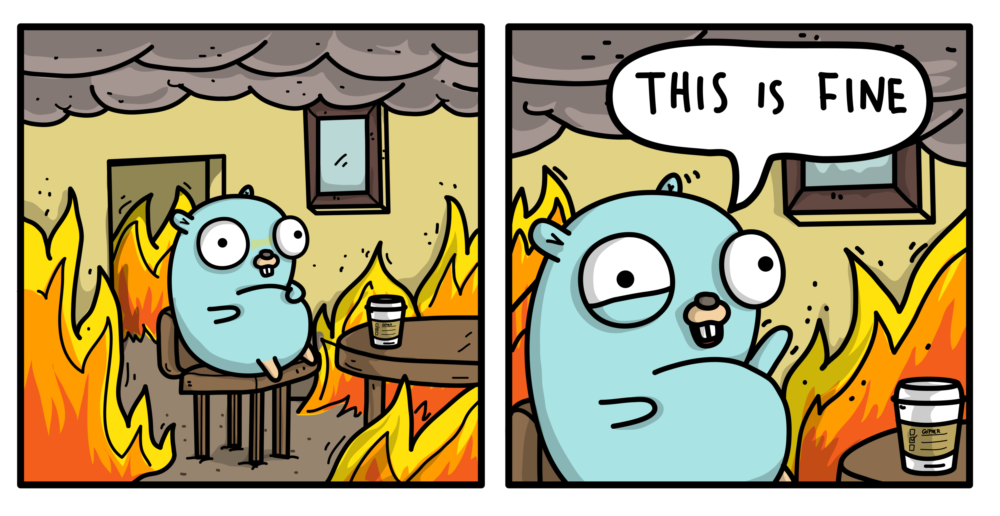

## 前言:

Generics (泛型)一直是 Golang 這個程式語言比較受到 C++ 與 Java 轉過來的開發者們經常訓問的問題。 這個問題不僅僅算是經常被語言戰爭中主要的攻防端，更有許多發了需求要加入 `generics` （[參考](https://github.com/golang/go/wiki/ExperienceReports#generics))

這邊幫大家整理一下與嘗試一下最新版本的 Go2 到底 Generics 狀況如何了。


## 為何程式語言需要 Generics

Generics (泛型)

```
泛型程式設計（generic programming）是程式設計語言的一種風格或範式。泛型允許程式設計師在強型別程式設計語言中編寫代碼時使用一些以後才指定的類型，在實例化時作為參數指明這些類型。
```

(來源： [wiki](https://zh.wikipedia.org/wiki/%E6%B3%9B%E5%9E%8B))

也就是說，在強型態程式語言中，因為型態都必須去先給與。撰寫 function 的時候很難將型態加以抽象畫。 讓型態可以事後在套入。拿個簡單的例子來說，根據文章 "[Why Gnerics](https://blog.golang.org/why-generics)" 曾經舉過這個很棒的範例。先假設你需要將一個 slice 裡面所有元素從小到大來排序。

根據 Int 你可能會寫:

```Golang
func ReverseInts(s []int) []int {
    first := 0
    last := len(s) - 1
    for first < last {
        s[first], s[last] = s[last], s[first]
        first++
        last--
    }
    return s
}
```

而如果是字串的時候，可能如下：

```
func ReverseInts(s []string) []sting {
    first := 0
    last := len(s) - 1
    for first < last {
        s[first], s[last] = s[last], s[first]
        first++
        last--
    }
    return s
}
```

根據以上的方式，你會發現兩個 function 其實真的沒有任何的差異。但是卻由於資料格式不同，需要特地用兩個 function 分開來撰寫。 這樣對於維護上往往不直覺，以後發現其中可以優化或是有問題的時候，就一次需要把所有用到型態的程式碼都一起維護，相當的不直覺。

## 在 Type Parameters 之前Golang 沒有其他替代方案嗎？

先不談 Generics ，其實 Golang 可以透過 Interfaces 的方式來做相關的開發，這裡是相關的實作方式。 先來解釋什麼是 `interfaces` :

```
Interfaces are named collections of method signatures.
```

(Refer: [Go by Example](https://gobyexample.com/): [Interfaces](https://gobyexample.com/interfaces))

根據這個[範例](https://play.golang.org/p/XJASG4MxBQr) 可以簡單瞭解 `interfaces` 主要用法。 那為人所熟悉的應用方式是什麼呢？ 就是 `sort.Sort()`

```
package main
 
import "sort"
import "fmt"
 
type ByLength []string
 
func (s ByLength) Len() int {
    return len(s)
}
func (s ByLength) Swap(i, j int) {
    s[i], s[j] = s[j], s[i]
}
func (s ByLength) Less(i, j int) bool {
    return len(s[i]) < len(s[j])
}
 
func main() {
    fruits := []string{"peach", "banana", "kiwi"}
    sort.Sort(ByLength(fruits))
    fmt.Println(fruits)
}

```

透過 `sort.Sort()` 的 function，你可以套入 `int` 或是 `string` 的排序方式，甚至你可以為了自定義的 struct 定義自己的 `Len()`， `Swap()` 與 `Less()` 之後就可以套用 `sort.Sort()`。  當然其實也有 Go generation  ， reflection 等等方式也是可以使用。 這裡就不再詳述，歡迎大家參考延伸閱讀。

#### 衍伸閱讀

- [Who needs generics? Use ... instead!](https://appliedgo.net/generics/) 


## Golang Generic Proposal 介紹影片:

<iframe width="560" height="315" src="https://www.youtube.com/embed/WzgLqE-3IhY" frameborder="0" allow="accelerometer; autoplay; clipboard-write; encrypted-media; gyroscope; picture-in-picture" allowfullscreen></iframe>

以下有根據 Golang Generics Proposal 的敘述投影片，請注意這是第一個版本 (2019/07) 的 Generic Proposal ，裡面還是使用 Contract 的方式來實現 Type Parameters 。 但是這個部分在之後已經修改成 `interfaces` 來讓語法比較清楚。 必須得老實說，當初 Contract 出來的時候，我真的也搞不太懂 `contracts ` 跟 `interfaces` 的差異。

```
What happened to contracts?
An earlier draft design of generics implemented constraints using a new language construct called contracts. Type lists appeared only in contracts, rather than on interface types. However, many people had a hard time understanding the difference between contracts and interface types. It also turned out that contracts could be represented as a set of corresponding interfaces; there was no loss in expressive power without contracts. We decided to simplify the approach to use only interface types.
```

https://go.googlesource.com/proposal/+/refs/heads/master/design/go2draft-type-parameters.md


## 試玩 Go2 Playground

就讓我們來透過 Go2 playground 提供的 Type Parameters 來回頭看我們原本的問題。是否有方式可以透過 `Type Parameters` 來實作呢？

馬上來看結果: https://go2goplay.golang.org/p/doitUP4_1Jm

```
func ReverseSlice[T any](s []T) []T {
	first := 0
	last := len(s) - 1
	for first < last {
		s[first], s[last] = s[last], s[first]
		first++
		last--
	}
	return s
}

func main() {
	fmt.Println(ReverseSlice([]string{"Hello", "playground"}))
	fmt.Println(ReverseSlice([]int{1, 3, 5}))
}

```


## Type Parameters加上限制

使用 `any` Type Parameter 其實相當的方便，但是往往取決於你可能處理的資料並不適合所有的型態的時候。其實需要加上一些資料的限制。 舉個例子來說明：

#### 範例： 兩個參數取比較大的

```
	if a < b {
		return a
	}
	return b
```

這是一個相當簡單的比較方式，但是可以看到如果將這個方式透過 Type Parameters 來撰寫。會發現輸入的參數將不支援 string ，所以需要以下的相關修改。

https://go2goplay.golang.org/p/9BgTT0hCgD7

```
type numeric interface {
	type int, int8, int16, int32, int64, uint, uint8, uint16, uint32, uint64, float32, float64
}

func min[T numeric](a, b T) T {
	if a < b {
		return a
	}
	return b
}

func main() {
	fmt.Println(min(42, 84))
	fmt.Println(min(3.14159, 2.7182))
}
```


## 小結論：

Type Parameters 與 Go2 Playground 其實還在開發中，使用上也沒有那麼直觀與好用之外，可能還有一些 bugs 。 不過真的很期待使用 Type Parameters 讓開發上可以真正將演算法與型態脫鉤，讓 function 能夠更簡潔。


## 相關文章：

- Golang Blog: 2019/07/31 "[Why Gnerics](https://blog.golang.org/why-generics)"

- Golang Blog: https://blog.golang.org/generics-next-step

- Type Parameters in Go [https://go.googlesource.com/proposal/+/master/design/15292/2013-12-type-params.md](https://go.googlesource.com/proposal/+/master/design/15292/2013-12-type-params.md)

- https://groups.google.com/g/golang-dev/c/U7eW9i0cqmo/m/-gDfa_6KAAAJ?fbclid=IwAR27mCQ8vgV9w8A201SlLMkyTnWJbfKVBoVRFutGU1zt1_KOCib9pVeQSMs

- Type Parameters Draft Design in Gohttps://go.googlesource.com/proposal/+/refs/heads/master/design/go2draft-type-parameters.md

- Go2 Playground https://go2goplay.golang.org
