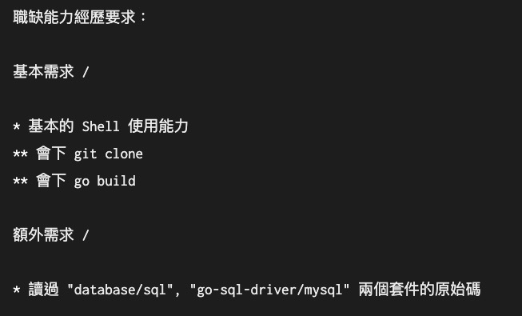

# 前提

一個關於 [PTT BBS 後台 Golang 後端夥伴（因爲是交朋友專案，沒有薪水）的討論](https://moptt.tw/p/Soft_Job.M.1610976994.A.2C8)，在 Golang TG 的討論上也帶出關於 PTT 後台需求的討論。 以下經過整理後，貼上相關的討論內容。

以下先整理一些關於徵夥伴文的相關脈絡，裡面許多內容都是引用原文作者。

PTT 原文在這：  https://moptt.tw/p/Soft_Job.M.1610976994.A.2C8


## 為何在找夥伴的文章上要求讀過 `database/sql` 與 `go-sql-driver/mysql` 兩個套件?

主要是風格問題，我(Pichu Chen) 基本上很擔心有人直接把 C Code Porting 成 Golang 的 Code, 然後註解通通都寫請去看 C Code 的哪個 function, 那這樣就GG了XD

## 關於 PTT BBS 找 Golang 人才現階段目的?

這階段會想要先把整體 BBS 該有的讀寫的 interface 以及後續討論和採用的文化建立起來。


## 所以讀過 SQL 套件並不是要把 PTT 資料寫進資料庫? 

其實bbs文章算滿階層的，就是文章自己擁有一個unique id，然後board去ref一個個的id，這個其實ptt已經有了，就是他們自家的網址轉換系統（像是: https://www.ptt.cc/bbs/car/M.1611180581.A.E43.html）這個什麼M.161180581.A.E43這類，所以既然有現成的key跟key generator，這方面應該可以不用重新設計。另外圖片跟log...er... bbs的資料應該絕大多數都不是圖片也不是log就是。


## PTT 如果資料寫進資料庫的話

然後要不要把 BBS 的後端資料庫轉成 SQL 的討論歷史有點長了，但就結論而言數年來的討論下來，其實真的整個變成全SQL 架構的真的是沒有（也許巴哈有？畢竟他們家沒開源所以不知道）不過這階段我會想要先把整體 BBS 該有的讀寫的 interface 以及後續討論和採用的文化建立起來，因為先前確實有不少討論要不要轉成 SQL 的文章，但是實際上的效能測試也是幾乎沒有，那interface建立起來之後再試試看另外一個分支是以SQL實作的分支，這樣有效能數據之後這個問題才會比較容易在討論中有結論。


## 如果 PTT 資料有機會放入 RMDB 的話

如果說是把原有的資料庫轉成 SQL 系列的關聯式資料庫或者是 MongoDB 的話，我覺得優點上會是這些是現代開發人員熟悉的資料庫工具，再來是效能部分有其他團隊幫忙把關，以及有現成的分散式資料庫的設計。

缺點的部分我在數年前有問過學長，比較大的部分在於 SQL Command 需要另外做 Parsing，會有額外的開銷，再來是並不是所有東西都適合無腦塞SQL ，像是圖片或是Log檔設計我可能就不會把它放在關聯式資料庫上，我猜AWS S3 也不會。

但是也不是說 SQL 在 BBS 專案中就一無是處，印象中在 PTT BBS 他們有把推文放在關聯式資料庫，不過不確定是一般的 PgSQL, MySQL 還是 Sqlite (我猜是sqlite, 因為有喵到類似程式碼)

那至於現代新設計是否應該或是不應該使用 FileSystem 作為 DB, 我認為還是要看問題本身，新的專案例如 CoreDNS 他確實還是把發出的lease以空白分隔的格式存下來，他其實也是可以使用sqlite的，不過我認為他用sqlite的話他需要另外引入外部套件，再來是如果線上 OP 需要直接刪掉某個 lease 紀錄時他需要下 DELETE 命令，不會比 vim 打開後刪掉快。

再來現代關聯式資料庫的優點除了提供統一的操作介面以外，另外的好處是他有個基於 b+-tree 的 index, 這點是目前 BBS 系統中看不到的。目前BBS 系統中有看到稍微加速的索引會像是我要找 pichu 然後先以字首 p 做分類，去取 /usr/p/pichu 資料夾底下的東西，那眾所皆知， e i 的字頻通常會比較高，所以很有可能在這個資料夾裡的使用者或是版面數量會比其他資料夾多，造成些許的不平衡。比較好的做法也許是像是 git 的資料庫設計一樣，先將 userid 做 sha1 hash, 然後也是取一碼或是兩碼來做資料夾索引，這樣比較容易平衡。

但是現有的基於文章的作法確實也是有些缺點，舉例來說檔案最小大小會受限於檔案系統的限制，假如某個檔案系統的block size 是4KB, 那即使他只有一行12 Byte的文字，在硬碟中也會佔用4KB 以及一個 inode, 也因此後面各站都會宣傳禁止「一行文」，甚至後來發展出推文系統，基本上就是為了處理這個問題。不過現代硬碟空間其實大很多了，inode 數量也多很多了，是不是還是問題也可以重新探討。又或者是加上一些現代的機制去統計哪些文章被修改的次數可能已經超過一年了，屬於冷門文章了，然後去預測他接下來一年內被修改的機率低於一個 p 值之後就把他們Archive起來成同一個大檔案，在用另外一個 sqlite 檔案來索引他們的 fseek 位置和 length (更想不開的話也許還可以加上壓縮省空間。

也就是說，前人在設計這套系統的時候，他其實不太像是「使用資料庫」而以，他比較像是去討論如何設計一套資料庫，然後不同間 BBS 之間有互相參考之類的，才變成現在這個樣子。

至於這些討論文章，其實要去各個小站裡面翻，應該是Google 不太到了，或者是像這篇文一樣，時間到就被 telegram 洗到不知道哪邊去了～


# 其他：

- PTT BBS source code https://github.com/ptt/pttbbs
- PTT File struct https://github.com/ptt/pttbbs/wiki/STRUCTURE
- MapleBBS 3.0 簡報文件 https://hackmd.io/@holishing/BkJHevM4f?type=view


# TG 討論全文:

作為查詢之用

```
hsu jimmy, [20.01.21 19:04]
[徵才] BBS 後端實作 (全遠端)(無薪)
https://moptt.tw/p/Soft_Job.M.1610976994.A.2C8

Wu Gordon, [20.01.21 19:06]
[ Photo ]

Wu Gordon, [20.01.21 19:06]
好好奇為什麼需要

Stefan ﾠ😹, [20.01.21 19:07]
[In reply to Wu Gordon]
暗示了沒有用orm

Wu Gordon, [20.01.21 19:08]
但也沒有需要去修改成自己的版本為什麼會需要讀過呢？ 套件doc使用規範應該就可以滿足使用方式🤔

Wu Gordon, [20.01.21 19:08]
我只是好奇這樣需求的背後思維

Stefan ﾠ😹, [20.01.21 19:09]
也就是說重度使用了sql

Stefan ﾠ😹, [20.01.21 19:09]
任何形式的包裝也沒有做好

Stefan ﾠ😹, [20.01.21 19:09]
像sourcemod那種亂來的sql

Evan Lin, [20.01.21 19:13]
[In reply to Stefan ﾠ😹]
除了這個之外，可能希望能了解這兩個套件的寫作風格。
這樣也能確保知道對方寫作的方式可以基於這兩個套件的風格？

Wu Gordon, [20.01.21 19:14]
這樣啊

Julian Chu, [21.01.21 07:34]
看起來比較像是要借鑑database/sql的概念跟架構，提供一個共同的介面，抽換driver就可以存取不同格式的BBS檔案資料

Rayer Tung, [21.01.21 07:47]
話說ptt 用的不是通用SQL(好像是Postgres)嗎

Rayer Tung, [21.01.21 07:48]
有啥理由得自己幹一個adapter起來 而不是用既有的實作？

Rayer Tung, [21.01.21 07:49]
每個實作其實都是用共通介面的啊

Yami Odymel https://yami.io/, [21.01.21 07:54]
世紀之謎

Julian Chu, [21.01.21 08:27]
沒有印象ptt是用sql ，這資訊哪邊可以看?

Peiming, [21.01.21 08:27]
[In reply to Rayer Tung]
因為沒有用到任何 SQL，一個文章就是一個檔案這樣。https://github.com/ptt/pttbbs/wiki/STRUCTURE

Julian Chu, [21.01.21 08:28]
[ 🍺 Sticker ]

Peiming, [21.01.21 08:28]
更進一步的資訊要再找一下

Rayer Tung, [21.01.21 09:40]
ah, make sense.... 我一直以為他以前有匯入成sql過。不過這樣的話，第一件事應該是，把這個用FS當DB的系統匯入一個真正的DB吧 o_o

Rayer Tung, [21.01.21 09:41]
而不是想辦法硬幹FS當DB的Adapter

Rayer Tung, [21.01.21 09:41]
[In reply to Julian Chu]
這是印象中，不過顯然我印象錯了 😆

Peiming, [21.01.21 09:45]
[In reply to Rayer Tung]
這個想法主要是為了讓各家 bbs 可以寫自己的 driver，因為現在每個站台的 bbs 用的不太一樣
https://github.com/clyang/bbslist

Rayer Tung, [21.01.21 09:47]
這計畫滿宏大的 😆 不過我倒是覺得，假設我能決策的話，我會先把ptt轉db，而這個「對其他bbs的adapter」的priority我會放得很後面。不過也許他們有更多原因是我所不知道的，也說不定。

Rayer Tung, [21.01.21 09:47]
畢竟以FS當DB，在25年前make sense，但是在現在（甚至十年前）都是很不可理解的一件事。

Pichu Chen, [21.01.21 14:57]
[In reply to Rayer Tung]
Hello,

如果說是把原有的資料庫轉成 SQL 系列的關聯式資料庫或者是 MongoDB 的話，我覺得優點上會是這些是現代開發人員熟悉的資料庫工具，再來是效能部分有其他團隊幫忙把關，以及有現成的分散式資料庫的設計。

缺點的部分我在數年前有問過學長，比較大的部分在於 SQL Command 需要另外做 Parsing，會有額外的開銷，再來是並不是所有東西都適合無腦塞SQL ，像是圖片或是Log檔設計我可能就不會把它放在關聯式資料庫上，我猜AWS S3 也不會。

但是也不是說 SQL 在 BBS 專案中就一無是處，印象中在 PTT BBS 他們有把推文放在關聯式資料庫，不過不確定是一般的 PgSQL, MySQL 還是 Sqlite  (我猜是sqlite, 因為有喵到類似程式碼)

那至於現代新設計是否應該或是不應該使用 FileSystem 作為 DB, 我認為還是要看問題本身，新的專案例如 CoreDNS 他確實還是把發出的lease以空白分隔的格式存下來，他其實也是可以使用sqlite的，不過我認為他用sqlite的話他需要另外引入外部套件，再來是如果線上 OP 需要直接刪掉某個 lease 紀錄時他需要下 DELETE 命令，不會比 vim 打開後刪掉快。

再來現代關聯式資料庫的優點除了提供統一的操作介面以外，另外的好處是他有個基於 b+-tree 的 index, 這點是目前 BBS 系統中看不到的。目前BBS 系統中有看到稍微加速的索引會像是我要找 pichu 然後先以字首 p 做分類，去取 /usr/p/pichu 資料夾底下的東西，那眾所皆知， e i 的字頻通常會比較高，所以很有可能在這個資料夾裡的使用者或是版面數量會比其他資料夾多，造成些許的不平衡。比較好的做法也許是像是 git 的資料庫設計一樣，先將 userid 做 sha1 hash, 然後也是取一碼或是兩碼來做資料夾索引，這樣比較容易平衡。

但是現有的基於文章的作法確實也是有些缺點，舉例來說檔案最小大小會受限於檔案系統的限制，假如某個檔案系統的block size 是4KB, 那即使他只有一行12 Byte的文字，在硬碟中也會佔用4KB 以及一個 inode, 也因此後面各站都會宣傳禁止「一行文」，甚至後來發展出推文系統，基本上就是為了處理這個問題。不過現代硬碟空間其實大很多了，inode 數量也多很多了，是不是還是問題也可以重新探討。又或者是加上一些現代的機制去統計哪些文章被修改的次數可能已經超過一年了，屬於冷門文章了，然後去預測他接下來一年內被修改的機率低於一個 p 值之後就把他們Archive起來成同一個大檔案，在用另外一個 sqlite 檔案來索引他們的 fseek 位置和 length (更想不開的話也許還可以加上壓縮省空間。


也就是說，前人在設計這套系統的時候，他其實不太像是「使用資料庫」而以，他比較像是去討論如何設計一套資料庫，然後不同間 BBS 之間有互相參考之類的，才變成現在這個樣子。

至於這些討論文章，其實要去各個小站裡面翻，應該是Google 不太到了，或者是像這篇文一樣，時間到就被 telegram 洗到不知道哪邊去了～

Liu Kakashi, [21.01.21 15:01]
寫的很好耶，應該要留存一下

Rayer Tung, [21.01.21 15:04]
其實bbs文章算滿階層的，就是文章自己擁有一個unique id，然後board去ref一個個的id，這個其實ptt已經有了，就是他們自家的網址轉換系統（像是: https://www.ptt.cc/bbs/car/M.1611180581.A.E43.html）這個什麼M.161180581.A.E43這類，所以既然有現成的key跟key generator，這方面應該可以不用重新設計。另外圖片跟log...er... bbs的資料應該絕大多數都不是圖片也不是log就是。MAPLE時代的concern其實我也稍微知道一點，當年的SQL可能跑起來不如FS。但是現代的DB，有index，有redundency，有partition，這些都能大幅度的增加讀寫效率，當然MAPLE都20多歲了，改動這個的確非常困難，不過我想寫一個go sql lib相容的interface跟這個比，這投資哪個好哪個不好我覺得也許能討論一下? 😆

Rayer Tung, [21.01.21 15:05]
尤其是FS備份我猜應該他們用禮拜天早上rsync? 如果是的話，DB應該會做得比他好得多....

Rayer Tung, [21.01.21 15:05]
但是ptt是否仍然有那麼高的投資價值我就尊重主事者的看法了，畢竟其實共識上這算是一個sunsetting的東西，只是我們看能不能讓他走得更長一點

Pichu Chen, [21.01.21 15:33]
[In reply to Rayer Tung]
基本上沒有說要和sql lib 相容，當時會先請大家去看這兩個專案的原因上面 tg 群組裡面也有人提到了，主要是風格問題，我基本上很擔心有人直接把 C Code Porting 成 Golang 的 Code, 然後註解通通都寫請去看 C Code 的哪個 function, 那這樣就GG了XD

然後要不要把 BBS 的後端資料庫轉成 SQL 的討論歷史有點長了，但就結論而言數年來的討論下來，其實真的整個變成全SQL 架構的真的是沒有（也許巴哈有？畢竟他們家沒開源所以不知道）不過這階段我會想要先把整體 BBS 該有的讀寫的 interface 以及後續討論和採用的文化建立起來，因為先前確實有不少討論要不要轉成 SQL 的文章，但是實際上的效能測試也是幾乎沒有，那interface建立起來之後再試試看另外一個分支是以SQL實作的分支，這樣有效能數據之後這個問題才會比較容易在討論中有結論。

Rayer Tung, [21.01.21 15:35]
只是覺得幹一個sql interface可能難度滿大的，更令人擔心的是會不會因為FS讀寫的關係犧牲掉每個method的效能。不過的確，這個要做下去才知道，沒東西benchmark用猜的其實意義不大，這方向我覺得沒啥問題。領導這陳年堆積東西其實挺雜的，加油。

Rayer Tung, [21.01.21 15:36]
既然只是為了風格統一，我想應該很快就會有能benchmark的版本了

Evan Lin, [21.01.21 16:04]
[In reply to Rayer Tung]
可能看整體營運的想法為何，畢竟 ptt -> db 的等於就是打掉重練的架構。
不考慮 legacy 的疑慮，對其他 bbs adapter 或許真的比較重要。
在以前 Maple 時代要對接真的是很累～要跑另一個程式慢慢的對齊 (twbbs?)

如果能將 ptt 當成 single source of truth ，可以提供許多 API 讓更多人發想運用。
是很好的～ API 出來～我想也會有更多應用會發想出來（我就蠻期待的）

Kevin Yang, [21.01.21 16:06]
ptt 可能不久之後就掰了吧

Kevin Yang, [21.01.21 16:07]
不開放註冊 人氣一直掉

Kevin Yang, [21.01.21 16:07]
還有各路警察

Rayer Tung, [21.01.21 16:07]
[In reply to Evan Lin]
其實把ptt的fs based結構Restful化 就等於把MAPLE系列的bbs都能Restful化 我還滿期待那天的到來的 😆

Marcus Liu, [21.01.21 16:44]
其實 ptt 一直有在 call for help 
他們也是想先解決掉註冊問題

Marcus Liu, [21.01.21 16:44]
https://g0v.hackpad.tw/Ptt--ctwZwU7BxcJ

Julian Chu, [21.01.21 16:44]
就算是轉成sql 對現有資料的parser還是要做的吧， 直接轉sql風險比較高，提供一個介面增加彈性，先相容現有的資料格式，我個人覺得是低風險又可以比較快看到成果的選擇

Marcus Liu, [21.01.21 16:44]
但說真的 我覺得很難

Evan Lin, [21.01.21 16:54]
[In reply to Pichu Chen]
@pichuchen 跟 @killercat9  如果不介意，我整理一下這邊討論內容到部落格再來轉貼到臉書社團去。
就不會埋落在時代的洪流惹

Pichu Chen, [21.01.21 16:54]
我OK  CC BY-SA

Rayer Tung, [21.01.21 16:54]
沒問題

Rayer Tung, [21.01.21 16:55]
CC BY SA
```


