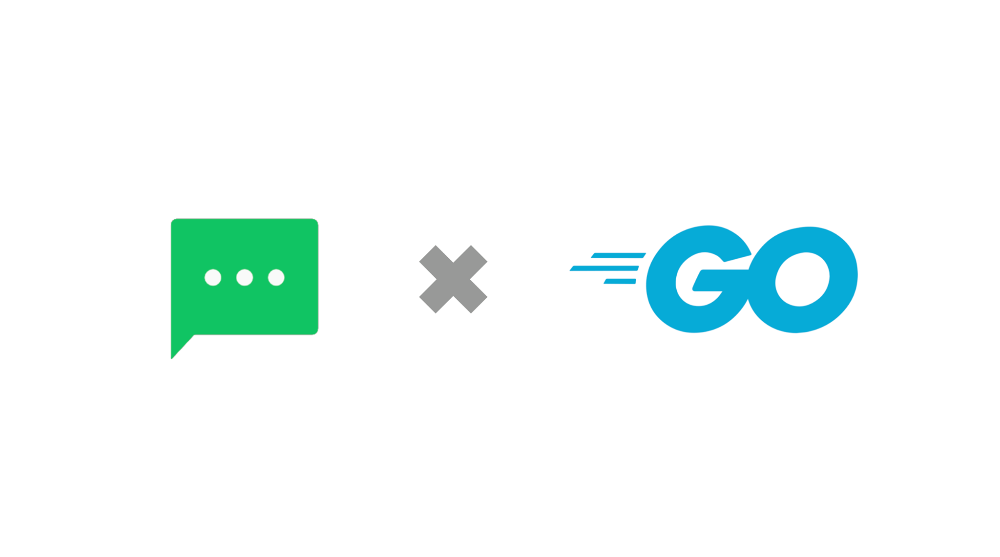
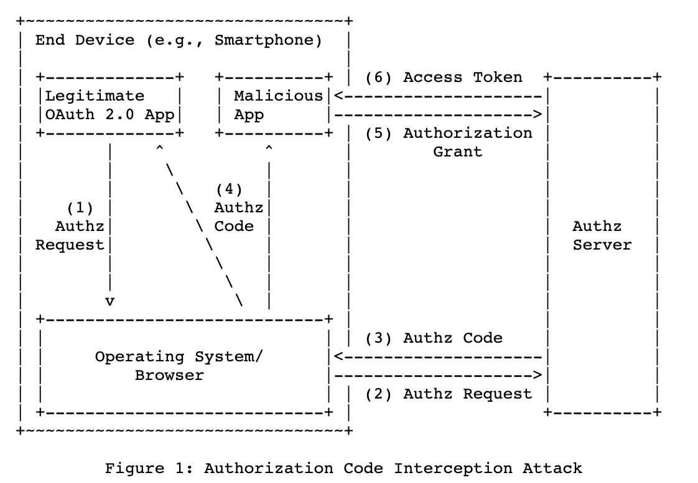
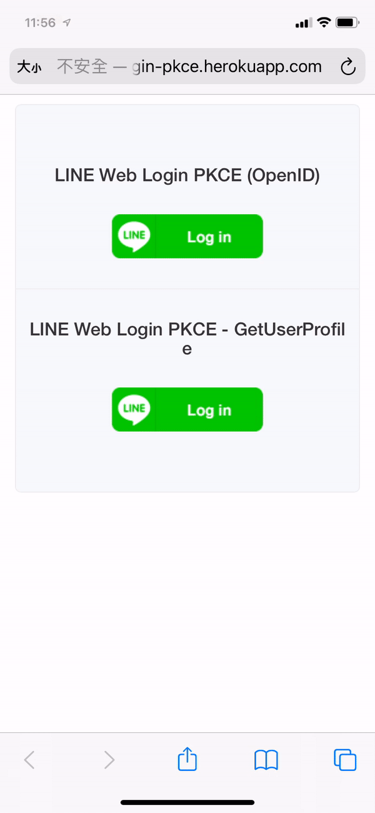

## 前言:

[在 2021/04/09 的新聞](https://developers.line.biz/en/news/2021/04/09/line-login-pkce-support/)上， LINE Login 支持了 PKCE (Proof Key for Code Exchange) 的流程。 本篇文章將清楚地解釋一下，什麼是 LINE Login ？ 為何 LINE Login 需要支持 PKCE ? 最後會透過一個範例，帶領著讀者們一起來導入與體驗 LINE Login with PKCE 。

其中本篇文章的程式碼分為三個部分，以下快速說明：

- **LINE Login Go SDK**:  
  - Github: [github.com/kkdai/line-login-sdk-go](https://github.com/kkdai/line-login-sdk-go)
- **LINE Login Starter:** 
  - GitHub:  [github.com/kkdai/line-login-go](https://github.com/kkdai/line-login-go)
  - Website: https://login-tester-evan.herokuapp.com/
- **LINE Login PKCE Starter:**
  - GitHub:  [github.com/kkdai/line-login-go](https://github.com/kkdai/line-login-go)
  - Website: https://line-login-pkce.herokuapp.com/

# TL;DR 

本篇文將要介紹以下一些的部分：

- <a href="#line-login-oauth">什麼是 LINE Login? 什麼又是 OAuth ? </a>
- <a href="#when-line-login">什麼樣的情況會建議使用 LINE Login?</a>
- <a href="#line-login-flow">LINE Login 的流程 </a>
- <a href="#oauth-issue">OAuth2 有什麼樣的缺點?</a>
- <a href="#what-is-pkce">什麼是 PKCE?</a>
- <a href="#how-to-migrate-pkce">如何在 LINE Login 之中導入 PKCE?</a>
- <a href="#summary">結論</a>
- <a href="#refer">參考文章</a>
- 

# 什麼是 LINE Login? 什麼又是 OAuth 2.0 ? 

許多的商業服務都會透過會員機制來提供許多專屬的優惠或是獎勵活動，但是會員的註冊與登入流程常常讓許多使用者覺得為難。除了要填寫許多的資料外，使用者還需要額外記住另外一組的帳號密碼。 LINE 在台灣的佔有率相當的高，並且幾乎每個使用者都有 LINE 的帳戶的狀況下，這時候如果能夠直接使用 LINE 帳戶來註冊與登入網站服務的話是不是相當的方便？

LINE Login 除了提供一個方式來登入之外，也可以提供使用者名稱，大頭照的相關資訊。並且透過 LINE Login 也可以同時讓使用者加入商業服務的 LINE官方帳號，讓使用者更無時無可都可以使用到相關的服務。

# 什麼樣的情況會建議使用 LINE Login

這裡會條列出哪些情況建議需使用 LINE Login 作為讀者來評量自己有沒有需要使用 LINE Login :

- 剛開始要建立電子商務服務或是網站，想要減少使用者註冊的時間並且快速加入。
- 想要推廣自身官方帳號的聊天機器人服務。
- 就算是已經推廣一段時間的電子商務服務，但是想要透過 LINE 來接觸不同的客戶群。

了解為什麼使用 LINE Login 以及甚麼狀況下建議使用之後，接下來就引導讀者如何使用範例程式碼

###  範例程式碼

https://github.com/kkdai/line-login-go

### 測試網站

https://login-tester-evan.herokuapp.com/

# 如何部署範例程式碼:

- 到 [LINE Developer Console](https://developers.line.biz/console/) 建立相關的 Provider 跟 Channel。
- 建立一個 LINE Login 的帳號，並且將以下兩個資訊記住:
  - Channel ID
  - Channel Secret
- 另外建立一個 [LINE@](https://at.line.me/tw/) 並且打開 MessageAPI 的功能（也就是建置 chatbot 用），並且將以下兩個資訊記住:
  - Channel Secret
  - Channel Token
- 到 https://github.com/kkdai/line-login-go 按下 Heroku Deploy ，建立該帳號並且部署該服務。這時候會要輸入三個資訊:
  - LINECORP_PLATFORM_CHANNEL_CHANNELID
    - 填入 LINE login channel ID
  - LINECORP_PLATFORM_CHANNEL_CHANNELSECRET
    - 填入 LINE login channel Secret
  - LINECORP_PLATFORM_CHATBOT_CHANNELSECRET
    - 填入 Chatbot channel Secret
  - LINECORP_PLATFORM_CHATBOT_CHANNELTOKEN
    - 填入 Chatbot channel Token
  - LINECORP_PLATFORM_SERVERURL
    - 這個資訊根據你的 heroku app 名稱來決定，假設你的 Heroku app 名稱叫做 `test-api-1234` 那麼你就該填 `https://test-api-1234.herokuapp.com`
- 回到 LINE Login 的帳號設定，[App setting] 將以下位置寫入 callback URL `https://test-api-1234.herokuapp.com/auth`
- 回到 LINE chatbot 的帳號設定，記得把 `https://test-api-1234.herokuapp.com/callback` 加到 LINE chatbot web hook 才能正確地啟動聊天機器人。

# LINE Login 的流程 

(使用 `Profile` (也就是 OAuth 2.0) 方式來讓使用者透過 LINE Login 之後取得使用者資訊)

LINE Login 提供了兩種方式來讓開發者可以安全地取得使用者資訊：

-  [OAuth 2.0 authorization code grant flow (opens new window)](https://tools.ietf.org/html/rfc6749)
-  [OpenID Connect](https://openid.net/connect/)

兩種方式的不同點在於開發者可以再請求 `scope` 的時候標注是透過 `openid` 或是 `profile` 方式來索取相關資訊。 

以下的內容均參照 [Integrating LINE Login with your web app](https://developers.line.biz/en/docs/line-login/web/integrate-line-login/)

- (1). 首先瀏覽器訪問該網站 （假設你直接使用 `https://login-tester-evan.herokuapp.com/`)，進入了 `browse()` 顯示出三個 LINE Login 按鈕。
- (2). 使用者按下了 LINE Web Login 的話，就會進入 `gotoauthpage()` 直接產生一組 API URL 直接導向到 `https://access.line.me/oauth2/v2.1/authorize` 。這邊其實有一些參數可以設定，可以參考 [LINE Login 參數設定](https://developers.line.biz/en/docs/line-login/web/integrate-line-login/#spy-making-an-authorization-request)。
- (3). 使用者這時候會連到 LINE Platform 來進行登入的步驟，不論是透過 App 登入還是輸入帳號密碼的登入方式。登入完成後會透過 `redirect_uri` 網址的位址傳回一組 code ，作為使用者資料的存取之用。 這時候會呼叫到 `auth()` 來解析 code 。
- (4). 在同一個 `auth()` 之中解析 code, state, 與 friendship_status_changed 後，檢查 state 正確性之後。就可以透過 code 去抓取使用者的資料了。 這時候會呼叫 `https://api.line.me/oauth2/v2.1/token` 的 API ，相關必要參數也可以參考[這個網址](https://developers.line.biz/en/docs/line-login/web/integrate-line-login/#spy-getting-an-access-token)。
- (5). 一樣在 `auth()` 之中，回傳的結果可以得到 id_token ，透過 id_token 需要透過解譯的方式來將它還原成使用者的資料。這邊也已經包裝好為 `DecodeIDToken()`
- 透過 `DecodeIDToken()` 就可以得到使用這名稱與大頭照。 (email 需要額外申請)

以上就是一般的電子商務網站的導入流程。

## OAuth2 有什麼樣的缺點

在 OAuth2 提出後， Google 也在 2015 Google 提出的 [RFC 7636](https://tools.ietf.org/html/rfc7636)中也提出了一些值得考量的點。 本篇文章有提到在手機端的 App 如果導入了 OAuth2 的流程中，有可能傳輸過程中被其他惡意安裝的手機 App 竊取相關資訊。 相關細節可以參考 [LINE Login 官網提供的詳細案例](https://developers.line.biz/en/docs/line-login/integrate-pkce/#pkce-merit)。

（詳細說明，請參考 [Benefits of implementing PKCE for LINE Login](https://developers.line.biz/en/docs/line-login/integrate-pkce/#pkce-merit))

這裡稍微跟大家說明相關的流程與發生的問題：

- 使用者透過手機上有串接 OAuth2 的 App 來做 Authorization 
- 進入 OAuth2 服務提供商的帳號登入畫面
- 認證完成後， OAuth2 坪台商會根據當初登記的 URL （手機上為某個登入的 URI Scheme) ，開啟相關 App。
- 這時候，如果有使用者不小心安裝了惡意的 App ，他可以登記同一個 URI Scheme ，但是因為手機設計原理兩個 App 都會收到相關的 URI Callback 。
- `惡意程式(Malicious App)` 收到 URI Callback 呼叫並且取的 `code` 與 `state` 並且透過其他方式取得 Channel ID 跟 Channel Secret  (原理透過 App 掃瞄，這裡就不詳細敘述)。
- 這時候，取的 `code` 與 `state` 的惡意程式，就可以透過呼叫 `GetAccessToken` 取的相關 Token 並且獲得權限。

由於原先的 OAuth2 在 client App 端有這樣的缺陷，所以透過 PKCE 的方式可以來補救相關問題。

##   什麼是 PKCE? 

(from [LINE Login 導入 PKCE in LINE Login 的流程示意圖](https://developers.line.biz/en/docs/line-login/integrate-pkce/#how-to-integrate-pkce))

PKCE (Proof Key for Code Exchange) 是由 Google 在 [RFC 7636](https://tools.ietf.org/html/rfc7636) 提出的 Code Exchange 機制，透過這樣的交換資訊方式。可以避免中間透過 Callback URI 所造成的竊取攻擊。 詳細的方式敘述如下：

先解釋兩個參數:

- `Code Verifier`: 一個特殊字串，長度限制為 43 ~ 128 之間。
- `Code Chanllenge`: 透過 SHA 256 將 `Code Verifier`  轉換過的字串。

接下來要解釋一下，這兩個字串如何能夠讓 OAuth2 的流程中安全性增加。由於 SHA256 是不可逆且較安全的加密模式，並且在資料的傳輸上先提供 `Code Chanllenge` 再來是 `Code Verifier` 可以確保著交握的兩端都是同一個人，因為必須要同時都有兩個才能正確地確認。 這樣就算原本的 `code` 被竊取到了，也會因為無法產生正確的 `Code Verifier` 讓惡意程式無法竊取到資料。

那麼詳細的 **LINE LOGIN withg PKCE** 流程如下：

- 產生 Web Login URL 的時候，先丟 `Code Chanllenge` 在傳遞參數中。
- 連接到 LINE 開始認證流程，完成認證流程後。透過 Callback URI 傳回 `code` 與 `state` 。
- 這時候認證方會將 `Code Verifier`送給認證伺服器來取得 Access Token 。
- 認證伺服器端會拿 `Code Verifier` 與 `Code Chanllenge` 來確認，是否是同一個需求端發出的需求。
- 返回 `Access Token` ，完成認證跟取得資訊的需求。

## 如何在 LINE Login 之中導入 PKCE?

接下來會使用 line-login-SDK-go 與 LINE-login-pkce-go 兩個範例程式碼來展示：

- **LINE Login Go SDK**:  
  - Github: [github.com/kkdai/line-login-sdk-go](https://github.com/kkdai/line-login-sdk-go)
- **LINE Login PKCE Starter:**
  - GitHub:  [github.com/kkdai/line-login-go](https://github.com/kkdai/line-login-go)
  - Website: https://line-login-pkce.herokuapp.com/

### 如何產生 Code Verifier

### 如何產生 Code Challenge 

文件上面有提供 [Code Challenge 的 python psuedo code](https://developers.line.biz/en/docs/line-login/integrate-pkce/#generate-code-challenge) ，這邊將其轉換成 Golang 的程式碼。 主要比較複雜的部分是 `sha256.Sum256()`  跟字串要做 URLEncoding 處理。 主要要根據 [Base 64 Encoding with URL and Filename Safe Alphabet (opens new window)](https://tools.ietf.org/html/rfc4648#section-5) 的處理方式來做。 其實在 Golang 只要一行就可以搞定了。

### 產生 Web Login 網址

這一段程式碼則是利用  [github.com/kkdai/line-login-sdk-go](https://github.com/kkdai/line-login-sdk-go) 所產生的網頁轉址的程式碼，主要就是產生 `codeVerifier` 與 `codeChallenge` (Global 參數)。請注意，在 SPEC 中，每一個 Web Login request 的  `codeVerifier` 與 `codeChallenge`  都需要是不同的，才能確保資訊的安全。

### 要求 Access Token 的程式碼修改

這裡只需要注意的是， `codeVerifier` 需要傳遞正確的，不需要重新產生即可。

### 展示

(展示影片來自網站: [PKCE LINE Login Test Site](https://line-login-pkce.herokuapp.com/))

這邊有個簡單的展示網站，也歡迎想了解如何開發的開發者們，可以直接使用以下的開源程式碼。   範例程式碼提供兩種模式的來取得使用者的登入資料。

- **OpenID**: 透過 OpenID 的格式，直接登入完成後，取得使用者登入資訊的 JWT 。並且提供相關解析的程式碼。
- **GetUserProfile**:  透過取得 User Access Token 的方式，呼叫 Get User Profile 來取得登入使用者的資訊。

更多的程式碼，歡迎參考。

**LINE Login PKCE Starter:**

- GitHub:  [github.com/kkdai/line-login-go](https://github.com/kkdai/line-login-go)

## 結論：

許多開發者在開發 Web App 的時候，最麻煩的往往是使用者資料的註冊。 因為複雜的註冊流程與多一個帳號密碼往往會讓使用者卻步。 [LINE Login](https://developers.line.biz/en/docs/line-login/) 提供良好的機制可以讓許多開發者使用到國內最多人使用的 LINE 來登入，節省掉許多開發上的麻煩。 本篇文章介紹了新的登入機制: PKCE for LINE Login 。 讓登入機制符合最新的安全機制外，更可以讓使用上沒有開發後顧之憂。  並且提供[相關範例程式碼](https://github.com/kkdai/line-login-sdk-go)x，讓開發者可以無痛的導入最新的機制。

## 相關文章：

-  [LINE Login now supports PKCE](https://developers.line.biz/en/news/2021/04/09/line-login-pkce-support/)

- [RFC7636 -  Proof Key for Code Exchange by OAuth Public Clients](https://tools.ietf.org/html/rfc7636)

- [RFC7523 - JSON Web Token (JWT) Profile for OAuth 2.0 Client Authentication and Authorization Grants](https://tools.ietf.org/html/rfc7523)

- [RFC6749- The OAuth 2.0 Authorization Framework](https://tools.ietf.org/html/rfc6749)

-  [Developer News: LINE Login now supports PKCE](https://developers.line.biz/en/news/2021/04/09/line-login-pkce-support/)

- [Developer Doc - PKCE support for LINE Login](https://developers.line.biz/en/docs/line-login/integrate-pkce/#how-to-integrate-pkce)

- [OAuth 2.0 in Go](https://levelup.gitconnected.com/oauth-2-0-in-go-846b257d32b4)