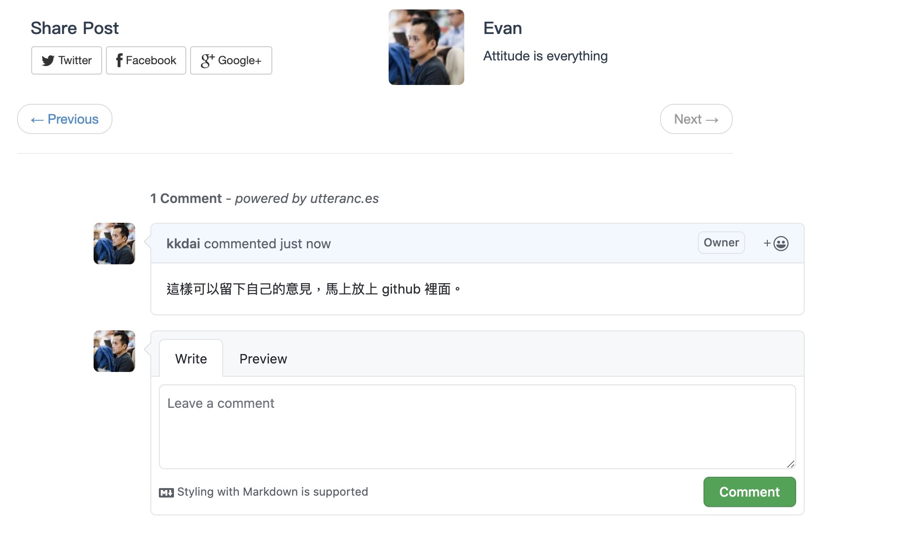

## 前言：


一直以來本站是透過 Jekyll 來架設的，之前本來有使用 Disqus 作為文章評論系統，雖然很多人說廣告太多，太慢。只是覺得還好，可能沒仔細看。 [最近覺得 disqus 的廣告越來越嚴重，影響整個效能](https://asp.net-hacker.rocks/2018/11/19/github-comments.html)。決定拿掉了。 有需要參考的可以看一下這個 [commit](https://github.com/kkdai/kkdai.github.io/commit/3dfba4885874cb1cb0c06a09fd2f4fffd892623a)  主要就是先註解掉相關的設定。 然後發送 git push 即可。 

本篇文章將告訴你如何移出，並且使用 Github Comment 作為文章評論用，現在也有個開源好用的工具。 https://utteranc.es/


## 移除 diqus

大家可以參考這個 commit. https://github.com/kkdai/kkdai.github.io/commit/3dfba4885874cb1cb0c06a09fd2f4fffd892623a

主要就是把 disqus 的設定拔掉。

```
highlighter: rouge
markdown: kramdown
#disqus: evanlin1007

#comments :
#    provider : disqus
#    disqus :
#      short_name : evanlin1007
```


## 加入 utteranc


utteranc 是一個完全 Open Source 並且使用 github comment 。並且提供一些設定，還有外觀的 theme 可以設定。感覺相當好用，社定上也很簡單：

- Install for your github app
- Put code in your Jekyll 
- Done ! (搭啦)

參考 https://github.com/kkdai/kkdai.github.io/commit/b9606abd93c08bf131efa4db78c8762e8a26f1da 可以修改 `_layouts/post.html` 如下：


```
<script src="https://utteranc.es/client.js"
        repo="kkdai/blog"
        issue-term="pathname"
        theme="github-light"
        crossorigin="anonymous"
        async>
</script>
```


## 完成品：


這樣是不是很快速（五分鐘就好了）

## 代辦事項：

接下來就要把 disqus 的評論搬到 github comment， 這邊可以先 export 出來後，寫個 Golang 來 import 。 不過現在好像找不到 Disqus Export 了，怪怪的。 持續找找看吧。

## 參考文章：

- [Removing Disqus and adding GitHub Issue Comments](https://asp.net-hacker.rocks/2018/11/19/github-comments.html)
- [Enabling Jekyll Blog Comments with Utterances](https://www.benzy.xyz/utterances/)
- 我的相關 commit:
  - 拔掉 Disqus  https://github.com/kkdai/kkdai.github.io/commit/3dfba4885874cb1cb0c06a09fd2f4fffd892623a
  - 增加 utteranc https://github.com/kkdai/kkdai.github.io/commit/b9606abd93c08bf131efa4db78c8762e8a26f1da

