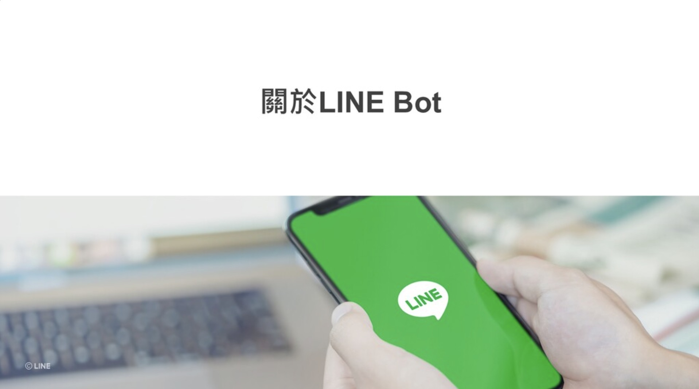

## 前言:

各位好， 我是 LINE Taiwan 資深開發技術推廣工程師 – Evan Lin。 今天這篇文章為各位詳細解釋 「 LINE Bot 開發指南」這一份投影片文件。這一份文件是來自於 [Development guidelines](https://developers.line.biz/en/docs/partner-docs/development-guidelines/) 的投影片，考量到在台灣還沒有正式的公布與中文化。這一次跟總部共同合作準備中文版本之外，並且特定用這一系列文章加以解釋，希望可以讓更多開發者有更多的了解。  [Development guidelines](https://developers.line.biz/en/docs/partner-docs/development-guidelines/)  文件內容很多，本篇文章也將以五篇文章的篇幅來加以解釋。

## 文章索引:

#### 完整投影片鏈結： <https://speakerdeck.com/line_developers_tw2/line-bot-developer-guideline-chinese>

希望各位可以持續關注：

1. [關於LINE Bot (本篇文章)](https://www.evanlin.com/2021-05-25-line-bot-guide-1/)
2. [使用Webhook URL接收請求時的注意事項]()
3. 發送 API 請求時的注意事項
4. LINE Login
5.  其他相關功能

本篇文章將專注在第一個段落，也就是 Page 3 ~ Page 8 的部分。

##  LINE Developers 相關資源

這邊主要提到兩個網站，分別是：

- **[LINE Developer Doc:](https://developers.line.biz/en/docs/)**
  - 負責存放所有的相關產品說明文件， API 詳細說明。
- [**LINE Developer Console:**](https://developers.line.biz/console/)
  - 這就是開發者稱為的控制台部分，跟[官方帳號 (Official Account) 的後台](https://manager.line.biz/)不同，這邊主要是負責設定相關的開發資源。 不論是建立新的 Channel 或是新增，修改 LIFF App 都可以利用控制來完成。

## LINE Bot 的機制

這一張投影片解釋了一個使用者傳訊息給一個官方帳號後，訊息會如何透貴 LINE 的平台傳遞到開發者的（也就是圖上的客戶端）的 Bot 伺服器。 這邊表達了幾件事情：

- 所有訊息都會透過 LINE 平台的 Talk 伺服器與 Channel Gateway 伺服器處理後傳給 「 Bot 伺服器」。訊息都是透過 Webhook 的方式傳遞，開發者只要依照官方文件開發好像關的 「Bot 伺服器」並且在登入好 webhook 的位置。就可以正確地收到訊息。
- 開發者處理完訊息後，可以透過 API 的方式發送給 LINE Channel Gateway 。 會在依照相關的訊息發送人透過 Talk 伺服器來發送訊息。

相關的開發者文件可以參考：  

- [Receiving messages (webhooks)](https://developers.line.biz/en/docs/messaging-api/receiving-messages/)

-  [Sending messages](https://developers.line.biz/en/docs/messaging-api/sending-messages/)

## 關於 LINE Bot 與 Channel 之間的相關性

這張投影片解釋了官方帳號與 Channel 之間的相關性，接下來將為讀者詳細解釋:

- 首先使用者對於官方帳號（LINE Bot) 所做的所有動作，都有相關的訊息透過 Webhook 來傳給開發者的 LINE Bot 。
- LINE Bot 收到訊息後，可以透過取得的 Access Token 來通過伺服器認證來發送訊息給使用者。
- 透過 LINE Login 的認證部分也可以將使用者鏈結到相關 LINEE Bot 帳號。（ e.g.  透過網路商城的第三方登入 LINE Login ，可以讓使用者登入網路商城後，也直接加入 LINE Bot ）。 
  - 相關部分可以參考文章：
    - [如何透過 Golang 開發 OAuth2 的 PKCE – 以 LINE Login 為例](https://engineering.linecorp.com/zh-hant/blog/pkce-line-login/)
    
    -  [如何讓 Chatbot 透過 Account Link 來串接使用者體驗](https://engineering.linecorp.com/zh-hant/blog/how-to-use-account-link/) 。

此外，這一張投影片也希望帶給各位關於 Provider 的相關概念如下。同一個 Provider 底下的 Channel 拿到的使用者ＩＤ會是相同的，也就是 LINE Login 登入取得的使用者 ID 跟 LINE Bot 上面只要是同一個服務提供者（Service Provider) 是相同的。 也提醒 LINE Login 必須要發佈(Publish)， 才能被所有人使用。（參考 [開發者文件： Published LINE Login Channel](https://developers.line.biz/en/docs/line-login/getting-started/#step-5-publish-channel) ) 。

## LINE Bot Glossary

關於 Glossary 部分，這邊講解了許多常被詢問的用字。這邊補充一些大家常用字詞。 大家可以針對這份上面的對照表尋找相關用語。 其實有更多的用字在 <https://developers.line.biz/en/glossary/> 可以找到。

## 開發 LINE Bot 的開始步驟/發布前的確認事項

這邊分成兩塊，大家可以參考官方文件上的逐步解釋。

- **在進行開發時**： 建議可以參考一下官方文件的說明，這部分已經有中文化了。 

  -  [開始使用 Messaging API（中文）](https://developers.line.biz/zh-hant/docs/messaging-api/getting-started/) 
  -  [建立聊天機器人(中文）](https://developers.line.biz/zh-hant/docs/messaging-api/building-bot/#page-title)。

- **發布給用戶之前，請務必檢查以下內容**：

  - 這邊有提到的相關資料鏈結如下：

    - [BASIC TERMS AND CONDITIONS OF LINE SERVICES FOR BUSINESS PARTNERS](https://terms2.line.me/basic_terms_and_conditions_of_line_services_for_business_partner?lang=en)
    - [SPECIFIC TERMS AND CONDITIONS OF LINE SERVICES FOR BUSINESS PARTNERS - LINE POINT CONNECT](https://terms.line.me/line_PointConnect?lang=en)
    - [LINE＠Messaging API使用條款](https://terms2.line.me/LINE_Developers_Messaging_API?lang=zh-Hant)
  - 在開發 LINE Bot 的時候請必須要注意到相關條款如下：
    - [LINE 服務條款](https://terms.line.me/line_terms?lang=zh-Hant) 建議開發者們必須要詳讀 「禁止條款」，避免 LINE Bot 踩到相關禁止條款。

這些相關補充事項，希望每一個開發者都能夠遵守。所有的資料也都請以官方網站的資料為準。

## 結論：

以上就是「LINE Bot 開發指南」第一部分的補充與分享，想要知道更多內容可以查看完整投影片，或是找到其他篇的文章來了解。 

想了解更多開發者的活動？  立即加入「LINE 開發者官方社群」官方帳號，就能收到第一手 Meetup 活動，或與開發者計畫有關的最新消息的推播通知。▼

「LINE 開發者官方社群」官方帳號 ID：@line_tw_dev

