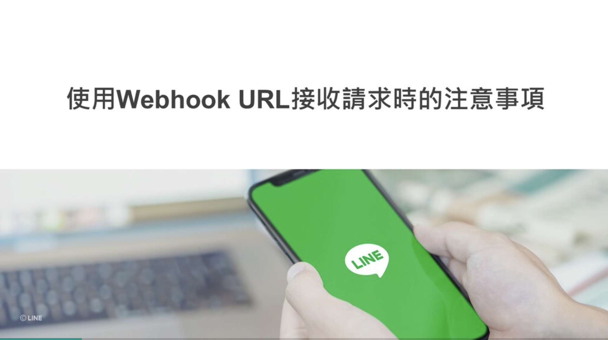

## 前言:

各位好， 我是 LINE Taiwan 資深開發技術推廣工程師 – Evan Lin。 今天這篇文章為各位詳細解釋 「 LINE Bot 開發指南」這一份投影片文件。這一份文件是來自於 [Development guidelines](https://developers.line.biz/en/docs/partner-docs/development-guidelines/) 的投影片，考量到在台灣還沒有正式的公布與中文化。這一次跟總部共同合作準備中文版本之外，並且特定用這一系列文章加以解釋，希望可以讓更多開發者有更多的了解。  [Development guidelines](https://developers.line.biz/en/docs/partner-docs/development-guidelines/)  文件內容很多，本份投影片也將以五篇文章的篇幅來加以解釋。本篇文章為第二篇文章，主要講解的會是關於設定 LINE Bot Webhook 相關注意事項。

## 文章索引:

#### 完整投影片鏈結： <https://speakerdeck.com/line_developers_tw2/line-bot-developer-guideline-chinese>

希望各位可以持續關注：

1. [關於LINE Bot ](https://www.evanlin.com/2021-05-25-line-bot-guide-1/)
2. 使用Webhook URL接收請求時的注意事項(本篇文章)
3. 發送 API 請求時的注意事項
4. LINE Login
5.  其他相關功能

本篇文章將專注在第一個段落，也就是 Page 3 ~ Page 8 的部分。

##  Webhook URL 接受請求時的注意事項

本篇注意事項中，其實在「[開發LINE聊天機器人不可不知的十件事](https://engineering.linecorp.com/zh-hant/blog/line-device-10/)」。有許多著墨，這裡稍微帶到與解釋。以下個別根據不同頁面來解釋。

- A 考量安全性的通訊環境
- B 接受到請求的時候，回覆狀態代碼 200
- C 防止來自於 LINE 以外未經授權的請求
- D 對於大規模訊息處理的考量
-  

### A 考量安全性的通訊環境

這部分提醒大家需要提升 Webhook 伺服器的安全環境，這邊也提醒大家根據 2021/01 的新聞 ([[Updated\] TLS 1.0 and TLS 1.1 support by the webhook notification source will be discontinued at the end of January 2021](https://developers.line.biz/en/news/2020/10/06/update-webhook-client-and-root-certificate/))，如果要能正常地接受到 LINE 平台的 Webhook 必須要讓伺服器支援到 TLS 1.3 。

- 平台開始支援 TLS 1.3  [LINE's APIs now support TLS 1.3](https://developers.line.biz/en/news/2020/07/01/enabled-tls1.3/) 
- 將不在支援 TLS 1.1 與 1.2 [Updated: TLS 1.0 and TLS 1.1 support by the webhook notification source will be discontinued at the end of January 2021](https://developers.line.biz/en/news/2020/10/06/update-webhook-client-and-root-certificate/)
- 第一件事：正確設定HTTPS from 在 「[開發LINE聊天機器人不可不知的十件事](https://engineering.linecorp.com/zh-hant/blog/line-device-10/)」 也有提到相關的支援，請開發者們務必要注意。 
  - 在設定HTTPS伺服器時，有下列幾點必須注意的事項：
    - HTTPS伺服器所使用的[根憑證](https://zh.wikipedia.org/zh-tw/根证书)（[Root CA](https://en.wikipedia.org/wiki/Root_certificate)）必須是在LINE平台的[白名單列表](https://developers.line.me/wp-content/uploads/2017/02/ca_root_v2.txt)中，否則LINE平台會拒絕傳送訊息。在白名單列表中大多數的憑證都需要付費申請，但是LINE平台也支援常用的免費憑證，例如[Let’s Encrypt](https://letsencrypt.org/)。
    - 請勿使用已知具有安全性漏洞的協定（例如SSL v2或SSL v3）或Cipher Suite（例如SWEET32或CVE-2016-2183）。
    - 請務必正確設定[中繼憑證](https://zh.wikipedia.org/wiki/公開金鑰認證#.E4.B8.AD.E4.BB.8B.E8.AD.89.E6.9B.B8)（[Intermediate certificate](https://en.wikipedia.org/wiki/Public_key_certificate#Types_of_certificate)），以避免無法對應到根憑證而發生錯誤。這是最常見的問題通報狀況，請在設定HTTPS伺服器時多加留意。

 更多訊息歡迎參考以下文章：

-  [LINE's APIs now support TLS 1.3](https://developers.line.biz/en/news/2020/07/01/enabled-tls1.3/) 
-  [Updated: TLS 1.0 and TLS 1.1 support by the webhook notification source will be discontinued at the end of January 2021](https://developers.line.biz/en/news/2020/10/06/update-webhook-client-and-root-certificate/)
-  [開發LINE聊天機器人不可不知的十件事](https://engineering.linecorp.com/zh-hant/blog/line-device-10/)

### B 接受到請求的時候，回覆狀態代碼 200

在 「[開發LINE聊天機器人不可不知的十件事](https://engineering.linecorp.com/zh-hant/blog/line-device-10/)」的文章的(第三件事：盡快回覆LINE平台正確的HTTP狀態碼). 中，也有提到 LINE平台在傳送事件訊息到開發者Webhook伺服器之後，若是等待1秒鐘沒有得到任何HTTP狀態碼的回覆，就會發生逾時（Timeout）錯誤，LINE平台會關閉該次HTTP連線並認為該次傳送結果失敗；若是一直發生傳送失敗的狀況，LINE平台可能會將該Webhook伺服器封鎖或進行其他處置，造成開發者的應用服務無法正常運作。 請開發者們要注意到相關的事項。

 更多訊息歡迎參考以下文章：

-  [開發LINE聊天機器人不可不知的十件事](https://engineering.linecorp.com/zh-hant/blog/line-device-10/)

### C 防止來自於 LINE 以外未經授權的請求

在 「[開發LINE聊天機器人不可不知的十件事](https://engineering.linecorp.com/zh-hant/blog/line-device-10/)」的文章中(第二件事：驗證訊息來源)也有提到，當開發者的[Webhook](https://devdocs.line.me/en/#webhooks)伺服器收到以POST方式所傳送的LINE事件訊息時，必須要立即驗證該事件訊息是否真的來自LINE平台，以避免被偽造的訊息所欺騙造成資訊安全危機。標準的驗證方式是檢查所收到[HTTP請求標頭](http://terms.naer.edu.tw/detail/2377105/)（HTTP request header）中的數位簽章。如果該HTTP POST訊息是來自LINE平台，在HTTP請求標頭中一定會包括X-Line-Signature項目，該項目的內容值是即為數位簽章。

 更多訊息歡迎參考以下文章：

-  [開發LINE聊天機器人不可不知的十件事](https://engineering.linecorp.com/zh-hant/blog/line-device-10/)

### D 對於大規模訊息處理的考量

這邊有分享一些給開發者的經驗分享，根據業務的發展狀況下，以下幾個時間將會有大量的訊息灌入開發者們的 LINE Bot ，希望開發者們可能要注意到。 （訊息集中的部分）

針對這些大量的訊息可能湧入下，建議開發者們必須要有相關的備案需求。避免因為訊息過多而造成開發者的伺服器不堪負荷。 建議如下：
- 是否有水平擴張的機制來面對大量的需求。 (Auto-scaling)
- 建議檢查每一次訊息來之後的回覆時間，儘量採取非同步方式。盡可能先回覆之後，在另外發訊息給使用者。如此一來可以避免卡住太多訊息。

此外，本頁投影片也告知幾個重要消息：

- 請勿對 GW 伺服器進行壓力測試，如果開發流程需要做壓力測試請透過其他方式來進行。 參考 [Development guidelines](https://developers.line.biz/en/docs/messaging-api/development-guidelines/#prohibiting-mass-requests-to-line-platform)。

### E-1 Webhook 的 ON/OFF

這邊提到的是切換 Webhook 開關跟「自動回覆訊息」還有「加入好友的歡迎訊息」的解釋。 這邊主要提醒開發者們，如果忘記將「自動回覆訊息」關閉的話，即便你開起來 Webhook 的開關，雖然可以收到，還是會透過「自動回覆訊息」來回覆。 相關的細節在下一頁會有更多解釋：

相關資料：

- [LINE 官方帳號自動回覆訊息說明](https://tw.linebiz.com/manual/line-official-account/oa-manager-autoreply)
- [4 招學會吸引好友想點一下的歡迎訊息– LINE商家報– LINE企業](https://www.linebiz-blog.com.tw/4招學會吸引好友想點一下的歡迎訊息/)

### E-2 Webhook 的 ON/OFF 選項設定（跟「自動回覆訊息」還有「自動歡迎訊息」的互動）

-  **使用**「Webhook]，**使用**自動回覆與加入好友歡迎訊息：

   - 訊息來了，同時會送到 Webhook 與自動回覆。
   - 但是因為自動回覆會先回覆，Webhook  不需要再回覆即可。

- **使用**「Webhook]，**不使用**自動回覆與加入好友歡迎訊息：

   - 建議開發者使用這個方式，完全透過 Webhook 來收取訊息與發送訊息。

- **不使用**「Webhook]，**使用**自動回覆與加入好友歡迎訊息：

   - 這樣 Webhook 將不會收到訊息，完全透過自動回覆來回覆。

- **不使用**「Webhook]，**不使用**自動回覆與加入好友歡迎訊息：

   - 如同投影片介紹，目前不開放也不建議開發者這樣設定。

   
### F 其他注意事項

### F-1.  一個請求包含多格訊息格式

在 「[開發LINE聊天機器人不可不知的十件事](https://engineering.linecorp.com/zh-hant/blog/line-device-10/)」的文章中(第四件事：LINE平台所傳送的事件是一個陣列) 有更多清楚解釋，歡迎大家去了解一下。 因為 Messaging API 帳號沒有大量的事件訊息傳入，每次所收到事件幾乎都只有一筆資料，所以開發者會誤以為每個事件訊息只需要處理一筆資料。事實上，LINE平台傳送給Webhook伺服器的HTTP請求本體是包括一個或多個[Webhook事件物件](https://devdocs.line.me/en/#webhook-event-object)的JSON格式物件

### F-2. Webhook 新增屬性的對應方式

這邊有建議開發者們，對於屬性的判斷上儘量要當成獨立個體之外，對於可能的新增屬性建議也要有比較好的處理方式。 建議方式可以透過 switch case 的方式來判斷，僅僅對於有處理的事件(event) 來處理，其他都略過。

相關文件：

- [LINE Dev Doc: Receiving messages (webhooks)](https://developers.line.biz/en/docs/messaging-api/receiving-messages/)

### F-3. 關於請求標題中的驗證

在 「[開發LINE聊天機器人不可不知的十件事](https://engineering.linecorp.com/zh-hant/blog/line-device-10/)」的文章中(第二件事：驗證訊息來源) 有更多清楚解釋。文章中建議[驗證方式](https://devdocs.line.me/en/#signature-validation)如下：

1. 以Channel secret作為密鑰（Secret key），使用HMAC-SHA256演算法取得HTTP請求本體（HTTP request body）的[文摘](http://terms.naer.edu.tw/detail/2359094/)值（Digest value）。
2. 將上述文摘值以Base64編碼，比對編碼後的內容與X-Line-Signature項目內容值是否相同；若是相同，表示該事件訊息是來自LINE平台，否則拒絕處理該事件訊息。

相關文件：

-  「[開發LINE聊天機器人不可不知的十件事](https://engineering.linecorp.com/zh-hant/blog/line-device-10/)」

## G 建議的請求處理步驟

在 「[開發LINE聊天機器人不可不知的十件事](https://engineering.linecorp.com/zh-hant/blog/line-device-10/)」的文章中(第三件事：盡快回覆LINE平台正確的HTTP狀態碼)  ，在此僅列出相關流程圖，更多內容歡迎各位去部落格查看。 

## H. GW 伺服器 -> BOT 伺服器的通訊錯誤

### H-1. 關於 Error Notification 

這部分可以參考以下的流程圖：

這邊是敘述說如果 LINE 平台有問題發生的時候（或是無法正確收到開發者的回覆時），將會另行發信給開發者的信箱中。相關的信件內中如文件上。

參考以下文章：

- [LINE Dev Doc: Error notification](https://developers.line.biz/en/docs/partner-docs/error-notification/#page-title)
- [LINE Dev Doc: Notification email](https://developers.line.biz/en/docs/partner-docs/error-notification/#mail)

## 結論：

以上就是「LINE Bot 開發指南」第二部分的補充與分享，想要知道更多內容可以查看完整投影片，或是找到其他篇的文章來了解。 

想了解更多開發者的活動？  立即加入「LINE 開發者官方社群」官方帳號，就能收到第一手 Meetup 活動，或與開發者計畫有關的最新消息的推播通知。▼

「LINE 開發者官方社群」官方帳號 ID：@line_tw_dev

