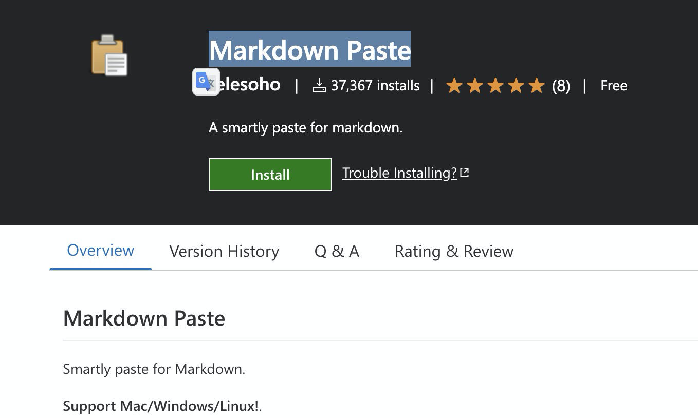
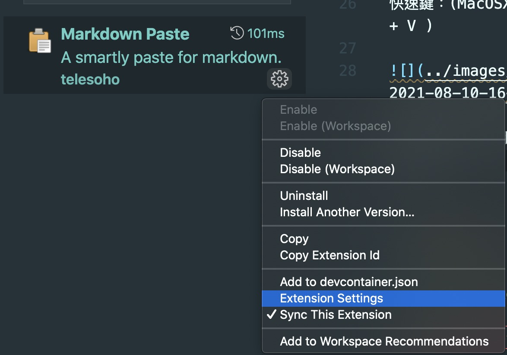

## VSCode Plugin - Markdown Paste :

*完整 Github*: [https://github.com/telesoho/vscode-markdown-paste-image](https://github.com/telesoho/vscode-markdown-paste-image)

你是用哪一套工具寫部落格？ 之前喜歡使用 Typora (這邊可以看我寫的[文章](https://www.evanlin.com/til-mdeditor-typora/)) 。 寫起來雖然很快，但是由於使用 github page 加上後台是 Jekyll 的原因，貼圖的時候總是相當的不方便。

最在查詢筆記軟體的時候，看到了這個 VSCode 的 [Plugin - Markdown Paste](https://marketplace.visualstudio.com/items?itemName=telesoho.vscode-markdown-paste-image) ，覺得相當好用。

有幾個大家一定會寫歡的功能：

### 直接貼上剪貼簿圖片

快速鍵：(MacOSX: Command + Option + V )

這個功能相當好用（主要也是為了這個功能來用的）。有一個比較麻煩的是，下載的圖片位置預設會放在 `./` 這邊可以稍微修改，透過修改設定就可以。

進去去直接修改 `MarkdownPaste.path`，以我的 case 就是改成 `./../images/2021`。這樣一年改一次就好，圖片也可以保留在我的 Github 上面，不怕找不到。

上面這張圖就是透過剪貼簿，馬上貼上。真的很方便，也不用管命名問題。（你之到 RD 很怕叫他取名字，檔案名稱也是一樣 XD)。

其實還有很多功能，大家可以到 Marketplace 網頁去查看。我也會持續研究，慢慢看有哪些習慣的功能。
## 相關文章：

- [[TIL][markdown] 好用的編輯器 - typora](https://www.evanlin.com/til-mdeditor-typora/)
- [VSCode Marketplace: Markdown Paste](https://marketplace.visualstudio.com/items?itemName=telesoho.vscode-markdown-paste-image)
