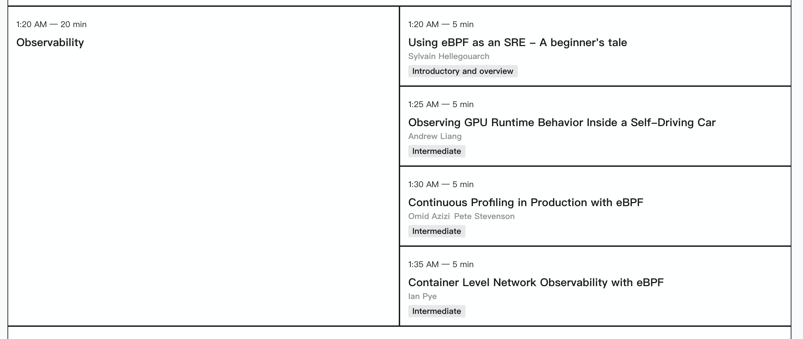

# 摘要

eBPF (Extended Berkeley Packet Filter) 是近幾年對於 dynamic tracing 裡面一個很知名的技術。 由於 Observability 受到了大家的重視，在網路層面或是 SRE 應用上都有許多相關得說明與文章。 eBPF Summit 2021 集結了許多業界知名人士，並且帶來相當多基本的介紹，歡迎大家也可以了解。

# 什麼是 eBPF (轉)

動態追蹤技術（dynamic tracing）是現代軟體的進階除錯和追蹤機制，讓工程師以非常低的成本，在非常短的時間內，克服一些不是顯而易見的問題。動態追蹤機制如果內建於作業系統，那麼使用者層級的程式即可隨時採集資訊，構建出一幅完整的軟體樣貌，從而有效地指導我們做一些很複雜的分析。這裡非常關鍵的一點是，它是非侵入式的。如果把軟體系統比作一個人，那我們顯然不想把一個活人開膛破肚，Berkeley Packet Filter (BPF) 最初的動機的確是封包過濾機制，但擴充為 eBPF (Extended BPF) 後，就變成 Linux 核心內建的內部行為分析工具包含以下:

- 動態追蹤 (dynamic tracing);
- 靜態追蹤 (static tracing);
- profiling events;

 (以上資訊摘自：[宅色夫](http://wiki.csie.ncku.edu.tw/User/jserv)  [Linux 核心設計](https://beta.hackfoldr.org/linux/): 透過 eBPF 觀察作業系統行為)

# eBPF Summit 2021 研討會資訊

- <https://ebpf.io/summit-2021>
- Day 1: <https://youtu.be/Kp3PHPuFkaA>
- Day 2: <https://youtu.be/ZNtVedFsD-k>

## eBPF Day 1 

### [The State & Future of eBPF](https://ebpf.io/summit-2021/#) / [Thomas Graf](https://ebpf.io/summit-2021/#)

這次的 keynote 也相當知名，第一位就是 [Thomas Graf](https://ebpf.io/summit-2021/#) 身為推廣者之一，會跟大家介紹目前的狀態跟未來的發展。

### [Getting Started with BPF observability](https://ebpf.io/summit-2021/#) / [Brendan Gregg](https://ebpf.io/summit-2021/#)

第二個算是頂尖的知名人士，身為 NETFLIX 的工程師之外， 並且他也是兩本知名書籍的作者：

- [Systems Performance 2nd edition](https://amzn.to/37K3D5M) - Brendan Gregg (Addison-Wesley, 2020)
- [BPF Performance Tools](https://amzn.to/2OWoQQX) - Brendan Gregg (Addison-Wesley, 2019)

他的知名事件就是 [An Unbelievable Demo - Brendan Gregg](https://www.brendangregg.com/blog/2021-06-04/an-unbelievable-demo.html) (有人翻譯成中文 [我的开源代码被科技巨头偷了，对方还跑到我面前演示](https://www.sohu.com/a/478142366_355140) ) 

第一天其他議程都專注在 [Observability](https://ebpf.io/summit-2021/#) 可以好好學習。

其他議程可以慢慢了解。

# 影片

<iframe width="560" height="315" src="https://www.youtube.com/embed/Kp3PHPuFkaA" title="YouTube video player" frameborder="0" allow="accelerometer; autoplay; clipboard-write; encrypted-media; gyroscope; picture-in-picture" allowfullscreen></iframe>

# Reference

-  [Linux 核心設計: 透過 eBPF 觀察作業系統行為](https://hackmd.io/@sysprog/linux-ebpf)
-  [An Unbelievable Demo - Brendan Gregg](https://www.brendangregg.com/blog/2021-06-04/an-unbelievable-demo.html)

-  [我的开源代码被科技巨头偷了，对方还跑到我面前演示](https://www.sohu.com/a/478142366_355140) 

