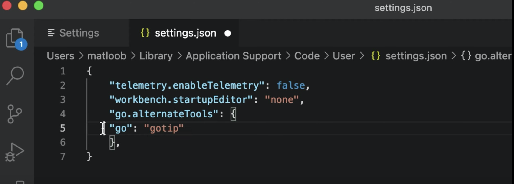

- Proposal: [45713 Workspace Mode](https://go.googlesource.com/proposal/+/master/design/45713-workspace.md) 
- PR: [45713](https://github.com/golang/go/issues/45713) 
- Demo Video: [YouTube](https://www.youtube.com/watch?v=wQglU5aB5NQ)

# 摘要

Vendoring 跟 Dependency Management 是 Golang 一直想要解決的問題，透過了 `go mod` 原本可以管理第一層的套件。透過 `go mod vendor` 你可以下載完相關的依賴的套件在本地端的 `vendor/` ，如果要改上一層的 dependency 就可以直接修改。 但是如果你要改的 Denpedency 上一層跟他的更上一層的 檔案呢？

以往作法可以透過 `go mod edit ` 來一個個修改，但是一但檔案很多的時候就會相當的複雜。 有什麼方式可以快速在 local 做一些確認，也才好去發 PR 到 upstream 去？ 這邊介紹一個正在做最後審核（如果通過了，預計是 go 1.18 的功能： Multi-Module Workspaces )。

Proposal 作者很貼心，還發了有著大狗狗的 Demo Video 。必須說～因為有隻可愛的大狗～我乖乖的把 proposal 看完了。


<iframe width="560" height="315" src="https://www.youtube.com/embed/wQglU5aB5NQ" title="YouTube video player" frameborder="0" allow="accelerometer; autoplay; clipboard-write; encrypted-media; gyroscope; picture-in-picture" allowfullscreen></iframe>

# 如何安裝

```
＃ 取得最新版本的 golang source code
> go install golang.org/dl/gotip@latest

# 下載某個 CL base 的 gotip 
> gotip download dev.cmdgo

# 看一下修改後的相關指令，注意 initwork, editwork ...
> gotip help mod

The commands are:

	download    download modules to local cache
	edit        edit go.mod from tools or scripts
	editwork    edit go.work from tools or scripts
	graph       print module requirement graph
	init        initialize new module in current directory
	initwork    initialize workspace file
	tidy        add missing and remove unused modules
	vendor      make vendored copy of dependencies
	verify      verify dependencies have expected content
	why         explain why packages or modules are needed
```


## Editor (VSCode) 要怎麼改

`[Preference] -> [Setting] -> [Extension]`



如果改成 `gotip` 這樣可以讓 VSCode 裡面的 `Go` 使用到最新版本的 `gotip` 來用最新功能。

# 如何使用 Muti-Module Workspaces

## 情境假設 

現在有兩個套件:

- https://github.com/kkdai/iloveptt
- https://github.com/kkdai/photomgr

其中 https://github.com/kkdai/iloveptt 會引用到 https://github.com/kkdai/photomgr 套件。 以往在修 bug 的時候，需要回到他的 upstream `photomgr` 去修。 這時候只有兩個方式：

1. 先發 PR 到 `photomgr`，然後進版號。  iloveptt 在抓新的版本，再來測試。
   1. 這個有時候會有一個問題，就是 local module cache 會造成你的困擾。要抓好幾次才會看到新的版本。
2. 透過 Vendor 的方式，先改 local 。但是很多時候會忘記要送 PR 到上一層。

可以透過 module replace 來改，但是每一個得寫一次，如果你用到很多個檔案，就會相當的複雜。

## 如何透過 Muti-Module Workspaces 解決問題：

這時候解決方式為： (註解： 以下 `gotip` 因為是嘗鮮版本，之後整進去後就會使用 `go` )

- 在上一層 `/Users/evanlin/src/go/src/github.com/kkdai` 使用 `gotip mod initwork iloveptt photomgr`

就這麼簡單，現在修改檔案 https://github.com/kkdai/photomgr 不用在送 PR 了，可以先在 Local 改。 改完後再分別送 PR 即可。


## 相關文章：

<a id="refer"></a>

- [45713 Workspace Mode](https://go.googlesource.com/proposal/+/master/design/45713-workspace.md) 
- [Demo Video YouTube](https://www.youtube.com/watch?v=wQglU5aB5NQ)

