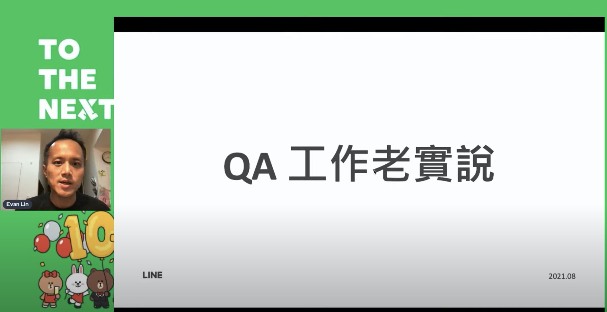
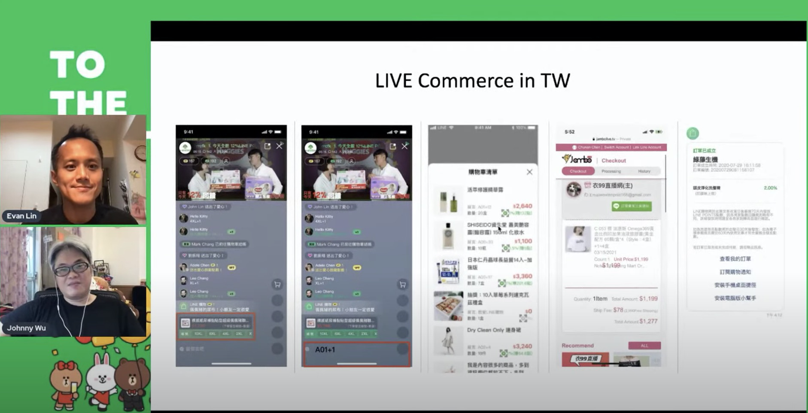
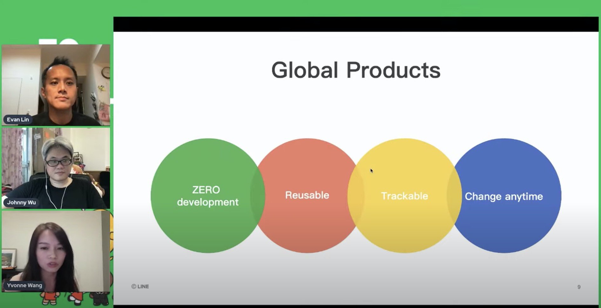
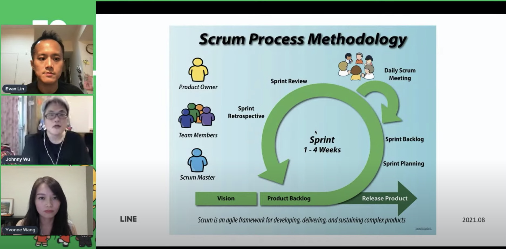
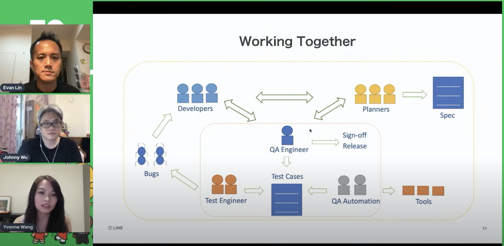
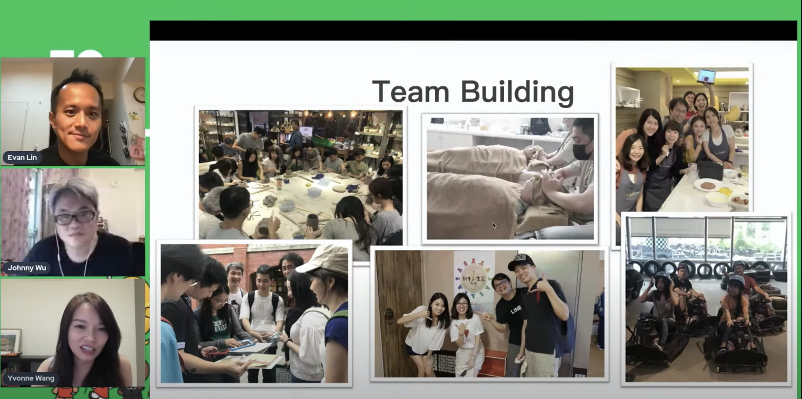

# 前言

大家好，我是 LINE Developer Relations 團隊的資深開發技術推廣工程師 - Evan Lin 。主要的工作項目就是平台技術推廣與技術品牌的建立與溝通。「LINE 工程團隊的訪談」是一個新的系列活動，裡面包括了許多團隊的成員的分享。我們希望藉由這個活動，可以讓外部的夥伴可能夠了解在身為開發團隊在 LINE 台灣的生活狀況，會有許多有趣的小故事或是分享在相關的訪談中。 上個月[【訪談】TECH FRESH 工作老實說 – 後續花絮與相關資訊整理](https://engineering.linecorp.com/zh-hant/blog/what-is-tech-fresh-interview/) 我們邀請了兩位技術新星實習生(LINE TECH FRESH)來談談實習生的有趣生活。

經常在許多社群聚會 (Test Corner) 上經常有夥伴好奇跑來問，聽說 LINE 的服務上線的是幾百萬，幾千萬人用。那這樣 QA 會很累嗎？ 聽說 LINE 有跑敏捷開發， QA 在敏捷開發之中扮演著什麼角色呢？ 這一次很開心邀請到負責全球化共用模組產品的 QA Manager - Yvonne Wang ，還有負責過 LINE SPOT 與目前要參與 Live Commerce 的 QA Manager - Johnny Wu  一起來談談 LINE 台灣開發團隊有趣的分享。 

 

## 直播影片:

<iframe width="560" height="315" src="https://www.youtube.com/embed/NNc_L9Npsu0" title="YouTube video player" frameborder="0" allow="accelerometer; autoplay; clipboard-write; encrypted-media; gyroscope; picture-in-picture" allowfullscreen></iframe>

## 講者自我介紹

首先先有

### Live Commerce 的 QA Manager - Johnny Wu

([按下去直接跳到該片段](https://youtu.be/NNc_L9Npsu0?t=653))

Johnny Wu 有了十二年的從業經驗，在 LINE 台灣也有五年左右的工作經驗。算是對於整體工作流程相當的熟悉的管理人員。主要工作角色有兩個：

- **身為 Service QA**:  撰寫準備測試計畫，籌劃好產品服務的自動化測試，壓力測試與整個 Release Management 有參與。
- **身為 QA Lead**: 身為 QA Manager 主要工作在於人力資源的調配，相關的資訊跟員工訓練，設定目標與招募等等。

而 LIVE Commerce 更是近幾個月才剛上市的新功能，大家可以參考「 [LINE購物直播＋1 喊單功能上線，最有趣的互動式購物等你來 ](https://event-web.line.me/ectw/v2/article/Baw8pQ) 」的介紹。 直播主透過 LIVE Commerce 的購物直撥平台可以透過影音直播的方式，快速將商品讓參與的人來了解，一起透過 「 +1 」來快速購買。 相關直播內容可以看 [LINE購物 超級直播天團](https://event-web.line.me/ectw/publication/ef313846be6e89b76f3f21595110a9c7404b31ef9543c6bee27eaa567996ca99) 來了解。

### Global Product 的 QA Manager - Yvonne Wang

([按下去直接跳到該片段](https://youtu.be/NNc_L9Npsu0?t=859))

第二位 Global Product 的 QA Manager - Yvonne Wang 則是有著相當有趣的經歷，曾經有當過工程師的她，在擔任 Global Products Team Manager 。 而 Global Product 團隊負責的是許多產品或是服務中共用的模組，因為許多跨國的模組都需要重複的使用，並且希望可以在各個服務快速導入。 所以 Global Product 團隊對於產品的研發跟測試上有著許多特別的測試方式。

## 關於 Scrum 導入 QA 團隊的狀況

([按下去直接跳到該片段](https://youtu.be/NNc_L9Npsu0?t=1082))

## 平常如何與 PM 開發人員合作呢?

([按下去直接跳到該片段](https://youtu.be/NNc_L9Npsu0?t=1432))

# 常見問題：

## 1. 許多人以為 QA 都在最後才驗證。

## 2. 開發時程被壓縮時，專案 Delay 後該如何控管？

## 3. QA 在整個專案團隊中是不是比較弱勢？

## 4. QA 比較有成就感的地方?

## 5. 合作中時出現類似「你不需要懂那麼多」時，該如何應對？

# 團隊學習與分享

## 怎麼分享學習成果？

## 最快樂跟最痛苦的一天？

# 求職相關的部分，給應徵者的一句話

# 參與者的相關詢問：

## 1. 有35-40歲，由software RD轉職QA成功的案例嗎？ 這樣轉會是 Junior 還是 Senior 呢？

###  A:

## 2. 想問一下自動化測試工具基本上會用到哪些？Selenium?Postman?Jmeter?

### A:

# 想投履歷

- **[QA 測試工程師（派遣）]( https://m.104.com.tw/job/6o9hg)**
- **[QA Automation Engineer](https://careers.linecorp.com/jobs/18)** 
- **[QA Engineer](https://careers.linecorp.com/jobs/19)**

# 關於 LINE  開發者官方社群

立即加入「LINE開發者官方社群」官方帳號，就能收到第一手Meetup活動，或與開發者計畫有關的最新消息的推播通知。▼

「LINE開發者官方社群」官方帳號ID：[@line_tw_dev](https://lin.ee/s5RsZHo)

## 關於「LINE開發社群計畫」

LINE今年年初在台灣啟動「LINE開發社群計畫」，將長期投入人力與資源在台灣舉辦對內對外、線上線下的開發者社群聚會、徵才日、開發者大會等，已經舉辦30場以上的活動。歡迎讀者們能夠持續回來察看最新的狀況。詳情請看:

- [2019 年LINE 開發社群計畫活動時程表](https://engineering.linecorp.com/zh-hant/blog/line-taiwan-developer-relations-2019-plan/)
- [LINE Taiwan Developer Relations 2019 回顧與 2019 開發社群計畫報告](https://engineering.linecorp.com/zh-hant/blog/line-taiwan-developer-relations-2019/)
- [2020 年LINE 開發社群計畫活動時程表](https://engineering.linecorp.com/zh-hant/blog/2020-line-tw-devrel/)

