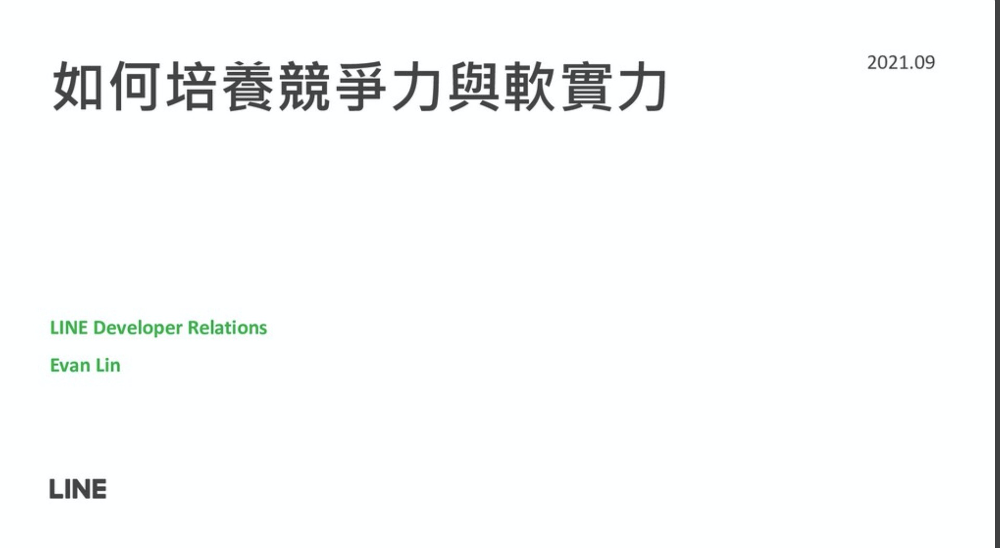

# 前言

大家好，我是 LINE Developer Relations 團隊的資深開發技術推廣工程師 - Evan Lin 。主要的工作項目就是平台技術推廣與技術品牌的建立與溝通。 這次很榮幸受到邀請幫 DSC (Developer Students Club) 開發者學生社群的暑期夏令營活動 (Summer BootCamp) 分享關於如何打造自己的對於軟實力(Soft Skill) 的一些見解，也希望透過增強軟實力來讓同學們提升職場的競爭力。

## 投影片

<script async class="speakerdeck-embed" data-id="a62ae4f456db4615bf54a6337005b2ea" data-ratio="1.77777777777778" src="//speakerdeck.com/assets/embed.js"></script>

# 軟實力 - 寫作

第一個希望同學們了解的寫作 (Writing) ，寫作是一個很好的習慣，尤其是資訊科技的從業人員。 寫作能力可以帶來好的文件撰寫，更可以讓你有「技術溝通」的能力。

這邊的寫作，不要想得太困難，建議用以下方式來寫：

- 請透過 Today I Learn (今天我學到什麼) 來開始，今年你學到什麼，不需要太多的內容。可以單純的流水帳即可。
- 如果撰寫過一些的文章，可以試著讓其他人了解文章的內容。 如果有人看不太懂，可以試著寫得更簡單一點。

# 軟實力 - 技術溝通力

<script async class="speakerdeck-embed" data-slide="12" data-id="a62ae4f456db4615bf54a6337005b2ea" data-ratio="1.77777777777778" src="//speakerdeck.com/assets/embed.js"></script>

「技術溝通能力」通常指的是技術事件的溝通，是有「目的性」的。通常都是為了工作上的事情而溝通，或是為了專案上台報告。許多人在學生時代的專案報告都會相當的簡章，到了公司後反而更是徬徨無措。以下有一些建議可以給同學們。

- **為了聽眾著想 / Think about your audience**: 你今天是跟誰溝通？ 跟同專案的同事，跟其他專案的同事？還是跟你老闆？ 記得對方的角色，如果不是同專案的同事，請千萬不要用太多艱深的專案名詞，反之需要用簡單的方式來解釋。
- **練習！ / Practice**:  要做專案報告或是技術分享時，對於任何人都是一個困難的。建議可以把要講的事情寫成講稿，不斷的練習。才能讓你的報告更加的簡短而清楚。。
- **儘量讓報告簡單 / Explain in simple** ： 不要試著讓你的報告或是分享看起來很艱深難懂，如果你無法讓你的聽眾了解，那麼你的報告就沒有達到目的。這邊有些脈絡的經驗分享：
  - **背景介紹**： 這個專案的一些簡單背景分享。
  - **目前問題**：目前的專案有哪些問題，或是目前專案有那些進度。
  - **新的解決方式**：一個新技術的分享，往往是因為問題帶來的解法。

透過分享或是報告，可以讓你對於這個技術更容易理解。

# 軟實力 - 自我行銷力

<script async class="speakerdeck-embed" data-slide="13" data-id="a62ae4f456db4615bf54a6337005b2ea" data-ratio="1.77777777777778" src="//speakerdeck.com/assets/embed.js"></script>

雖然我們都是軟體開發相關科系，同學們未來也都會是軟體開發從業人員。但是自我行銷能力也是相當的重要，因為懂的如何分享，如何表現自我的專業形象，在公司裡面對於陞遷會相當有幫助。

- 建立自我專業形象可以打造良好的職場生涯。
- 不論是透過各種的社群媒體，可以讓你結識更多志同道合的專業夥伴。
- 建議要使用 Twitter ，往往有 140 個字的限制，可以讓你的文章與發文更加的精簡，不會讓人覺得煩瑣。


# 軟實力 - 超速學習

身為軟體從業人員，很重要的能力是要有不斷學習的習慣。願意學習之外，往往更需要有能力可以在極短的時間內「有效的學習」。

- **透過實作來學習 / Learning By Action** : 學習任何語言，先練習去講。學習程式語言，先練習寫。 透過實作來學習，讓你更容易開始，更有信心，也更容易了解哪裡不懂。
- **故意練習 / Intention Setting Practice**: 常常會聽到有「一萬小時法則」，裡面是說透過一萬個小時的練習，可以讓你成為某個領域的專家。 但是真正要成為頂尖的專家，你這一萬個小時的練習，往往需要有目標性的練習。 根據每一次學習上的困難，加以克服。 身為籃球員，發現運球不順暢，專心的練五個小時。投籃不穩定，專心的練習投籃。才能讓你的練習更有效率。
- **時時審核 / Review Yourself** : 經常要知道自己學習的進度，才知道如何改善。

# 軟實力 - 時間管理

<script async class="speakerdeck-embed" data-slide="17" data-id="a62ae4f456db4615bf54a6337005b2ea" data-ratio="1.77777777777778" src="//speakerdeck.com/assets/embed.js"></script>

到了社會以後，由於工作壓力。往往許多的社會新鮮人都希望可以好好表現。 往往拼了命在加班，回到家中耗盡力氣就睡著。 隔天到了公司可能會偷懶上上網，晚上又拼命加班。 如此惡性循環容易讓人對於工作心生厭倦而討厭工作。對於工作的時間管理，我有以下的建議：

- **工作時間全神貫注，讓事情留在上班時間**：專注力（全神貫注在某一件事情）會是出社會後最珍貴的資產，安排固定得時間來回信，不要讓信件與 SNS 中斷你的專注狀態。因為全神貫注是消耗體力而且無法長久的，所以可以透過蕃茄鐘等小工具來設定以 25 分鐘為一個單位。
- **下班時間，一定要花時間充實自己**：下班後，有空絕對不看公司的事物。將時間放在充實自己與自我成長。
- **將生活放在最高優先權**：許多新鮮人，拼命的加班最後厭煩而離職。把生活放在第一位，可以保持對於工作的熱誠，讓你的熱情長久。

# 軟實力 - 自我約束

能夠定期健身或是運動是一個很好的習慣。 你會發現許多高科技業的高層往往花更多時間來健身。 因為週期性的健身除了可以帶來良好的體態外，更可以建立良好的自信心。 更何況，良好的身體也可以讓你擁有更好的體力，也能夠增加你的專注時間。=

# 競爭力 - 經常更新你的履歷表

<script async class="speakerdeck-embed" data-slide="22" data-id="a62ae4f456db4615bf54a6337005b2ea" data-ratio="1.77777777777778" src="//speakerdeck.com/assets/embed.js"></script>

講到競爭力，最容易的就是來說說如何寫履歷表。 還記得曾經在大學時代的學生社團的社長，我們當時給社員的課程就是寫履歷表。 一份好的履歷表可以讓你通過 HR 那一個關卡，直接送到用人主管的手上。這邊有幾個重點分享給同學：

- 履歷表需要經常更新，建議一年更新一次。
- 履歷表每一份工作應徵的時候需要調整，比如說應徵前端的工作，你的履歷表上面總不能都是後端的成就？ 每一個人就像是鑽石依樣，有許多的面相。應徵就是要拿出對方最需要你的那一個面向。
- 不需要太複雜的排版，市面上有許多簡單排版工作。往往最好。 [https://github.com/posquit0/Awesome-CV]( https://github.com/posquit0/Awesome-CV)
- **千萬不要! 千萬不要! 千萬不要! 直接用求職網站上面的資料輸出**。那都是制式的。會浪費審視履歷的人時間。（還有你浪費一次機會）
- 內容排版建議：
  - GitHub, 跟聯絡資料。
  - 快速簡介，通常用一句話介紹你自己。
  - 為什麼你適合這份工作？ 請真誠寫出該公司的名稱跟職稱，這樣很專業。 
  - 工作經歷，如果沒有可以加上 side project 或是比賽作品。
  - 學歷放最後，並且要強調你最強的科目。 (GPA 總分高很好～但是我比較想看到你程式設計是全班最高)
- 這樣的排版是針對看履歷的人通常都要看兩三百份。你的履歷只會在他眼睛出現 10 秒，第一頁就是重點。第二頁以後應該是不重要（或是補充資料。 不要浪費審核官的時間。
- 如果你有我前面整理過的「軟實力」，可以寫上去。這些都是你的加分項目的。

```
每一個人就像是鑽石一樣，有許多的面。應徵就是要拿出對方最需要你的那一個面。
```


# 如何找一份好的實習工作

<script async class="speakerdeck-embed" data-slide="25" data-id="a62ae4f456db4615bf54a6337005b2ea" data-ratio="1.77777777777778" src="//speakerdeck.com/assets/embed.js"></script>


在 Joel on Software 這本書裡面，有提供了給同學們的一些建議，該如何同學們的競爭力。

- **畢業前學會寫作**：如同我在軟實力裡面提過，寫作能力與技術溝通能力。將讓你一輩子受用無窮。
- **學會C語言**：這有一點歷史因素，但是學會 C 語言對於系統架構與資料結構絕對是有好處的。
- **學會個體經濟學**: 懂的基本的供需關係，可以更了解如何挑選好的產業，好的工作。也能對於未來安排上更有計畫。
- **不要因為CS 無聊就放棄**：CS (Computer Science) 資訊科學是資訊從業人員的基礎，不論是進階的資料結構，演算法，到許多相關的數理概念。 目前學校時候學習可能會很痛苦，但是其實每一個演算法與資料結構都被應用在許多的服務中。都是許多架構或是服務的基礎。
- **研習撰寫大量程式的課程**：寫程式這種事情是需要練習與複習的，建議每一位同學都需要研習一到兩個需要大量實作的課程，除了可以保持程式撰寫能力外，更可以了解許多應用。
- **找一門好的實習工作**： 找一個好的學生時代實習工作很重要，除了可以讓你知道軟體公司的工作流程外，更可以讓你了解你對於軟體產業的興趣在哪裡。

接下來會跟各位分享， LINE 台灣提供的學生實習機會。 讓許多同學可以在正統的開發流程下學習跨國產品與服務的開發，除了可以參與許多跨國團隊的合作外，更可以學習到許多資深前輩帶領下面對龐大流量下的設計概念。

# 關於 LINE 學生實習機會: LINE TECH FRESH 介紹


LINE 台灣工程團隊每年透過 [LINE TECH FRESH – 技術新星人才計劃](https://career.linecorp.com/linecorp/career/detail/20000111/704/5570?classId=&locationCd=TW&page=)，招募資訊科技相關科系，或對此領域有所涉略的大學生 / 研究生加入 LINE 團隊進行長期實習 (一年期)，讓同學們能在國際級科技公司中觀摩學習。LINE TECH FRESH 由經驗豐富的技術專案經理帶領團隊，接觸多元化的專案與產品開發，學習業界實際的軟體專案分工，並體驗跨國團隊合作。往年工作內容包含 server、web、mobile app、chatbot、IoT、data、DevOps 等領域，並透過實習熟悉 LINE 平台系統、SDK、API 等。值得一提的是，LINE TECH FRESH 是有給薪的實習機會，對於軟體開發有熱情、有想法的同學們，千萬別錯過這個揮灑創意與衝勁的機會！

更多關於 LINE TECH FRESH 介紹文章有:

- [TECH FRESH 實習的一年間，除了開發還有什麼內部活動呢？](https://engineering.linecorp.com/zh-hant/blog/line-tech-fresh-2020-graduate/)

- [【訪談】TECH FRESH 工作老實說 – 後續花絮與相關資訊整理](https://engineering.linecorp.com/zh-hant/blog/what-is-tech-fresh-interview/)

- [Life in LINE – 直擊 TECH FRESH 實習內容！](https://engineering.linecorp.com/zh-hant/blog/life-in-line-tech-fresh-sharing/)

- [TECHPULSE 2020 青春主場 – TECH FRESH 議程與攤位介紹](https://engineering.linecorp.com/zh-hant/blog/techpulse-2020-tech-fresh-session/)

# 同學們的相關詢問：


## 1. 履歷的撰寫上是否需要美工排版？

###  A:

- 不需要，比起漂亮的排版。面試官比較希望收到內容簡單實在的記事本文件。

## 2. 履歷的準備上是否有頁數的限制？

###  A:

- 頁數也不要多，儘量兩頁內為主。因為審核人員一天要看幾百份。

## 3. 還有問題該如何問？

### A:

- 如果你還沒開啟你的 Github 帳號，而且你有許多疑問。可以考慮透過 Github 來詢問我。
- 任何開源問題都歡迎： [https://github.com/kkdai/AMA](https://github.com/kkdai/AMA) ，你也可以學習如何開啟一個 issue。
- 小絕竅： Github Issue 也算是一種 Contribution 喔！


# 關於 LINE  開發者官方社群


立即加入「LINE開發者官方社群」官方帳號，就能收到第一手Meetup活動，或與開發者計畫有關的最新消息的推播通知。▼

「LINE開發者官方社群」官方帳號ID：[@line_tw_dev](https://lin.ee/s5RsZHo)


## 關於「LINE開發社群計畫」

LINE今年年初在台灣啟動「LINE開發社群計畫」，將長期投入人力與資源在台灣舉辦對內對外、線上線下的開發者社群聚會、徵才日、開發者大會等，已經舉辦30場以上的活動。歡迎讀者們能夠持續回來察看最新的狀況。詳情請看:

- [2019 年LINE 開發社群計畫活動時程表](https://engineering.linecorp.com/zh-hant/blog/line-taiwan-developer-relations-2019-plan/)
- [LINE Taiwan Developer Relations 2019 回顧與 2019 開發社群計畫報告](https://engineering.linecorp.com/zh-hant/blog/line-taiwan-developer-relations-2019/)
- [2020 年LINE 開發社群計畫活動時程表](https://engineering.linecorp.com/zh-hant/blog/2020-line-tw-devrel/)

