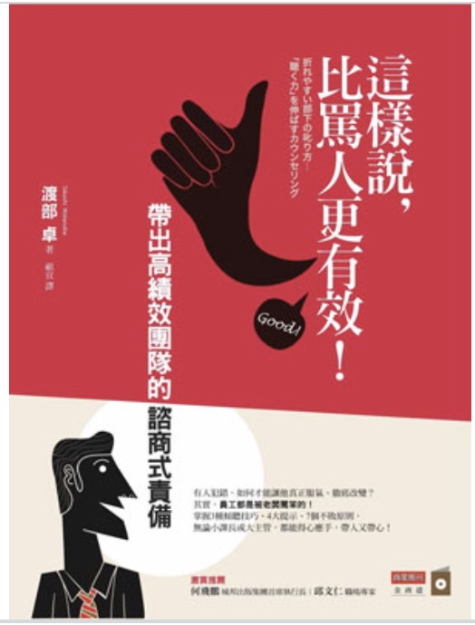

```
這樣說，比罵人更有效！：帶出高績效團隊的諮商式責備
作者：渡部卓
出版社：商業周刊
出版日期：2013-07-17
```

#### 買書推薦網址：

絕版

# 前言:

這一本是今年所讀完的第十一本書。 這是一本實體書，快速找了一下似乎也都絕版了。忽然從書櫃裡面找出來的一本書，覺得最近剛好有一些情境也蠻雷同的。就快速的把內容翻過了一次，覺得是一本不錯的書籍，也清楚的討論了 X 世代（40+) 跟 Y 世代 (30+) 還有目前年輕人 Z 世代 (20+) 的比較。

# 內容簡介與心得:

```
1.管理新世代最迫切需要的一本書！
「草莓族」是世代問題，也是幾乎每家企業頭痛的問題，本書主題能切合目前台灣職場現況，符合此時的市場需求，協助經營者或管理幹部解決人才留任及培育的問題。

2.求職者最能提前練功的寶典！
本書提出職場中令人傷腦筋的員工類型，幫助年輕員工自我檢視，更清楚自己在職場的生存之道。

3. 最簡單上手的溝通技巧！
書中逐一分析不同類型的脆弱員工特質，進而提出各種具體可能的溝通技巧，內容特別且實用，寫作筆法言簡意賅。

有人犯錯，如何才能讓他真正服氣、徹底改變？
其實，員工都是被老闆罵笨的！
掌握3種傾聽技巧、4大提示、7個不敗原則，無論小課長或大主管，都能得心應手，帶人又帶心！
這是學校沒教、企業也不傳授的人性管理學！
```

## 章節條列

## 1. 如何激勵脆弱員工

這邊給一些常常會責備員工的主管，不要急著罵員工。 先試著了解員工這麼做的主要原因，這個時候也有可能會遇到各種類型員工的反彈。 這邊也有一些建議，建議先傾聽，然後試著用問句比起用責備更好。

## 2. 罵人前必須知道的事

這邊給了許多守則，幫助許多已經怒火中燒的管理人。先不要罵出來，可以試著讓自己冷靜個幾天，或是試著轉換角度。 拋棄自已的想法，這邊也建議許多的管理人員要先傾聽，然後以讚美結束的方式。這邊也建議主管們重視事實，而非對錯。 畢竟現在員工指導正確與否固然重要，但是態度如果讓員工不能接受，那麼也就喪失效果了。

## 3. 不同個性的人怎麼教

這邊提供七種員工的十二種手法。不要急著結論，讓員工多一點時間思考，功勞給部屬，許多口語化的文字更加美化讓人能接受。

## 4. 好的主管懂得等待

這邊主要建議在責罵前要等待，讓火氣先過。有許多方式可以讓自己測驗看看是否有偏見，是否是有某些無法忍耐的特質。


## 心得:

這本有也是蠻久以前的書了，不過有清楚的提到關於 Z 世代（20+) 的管理方式。讓我相當的驚訝，或許工作壓力大的日本人，往往更易有相關的體驗。 這本書有許多好的建議，對於比較激動的管理人其實蠻推薦來看的。

## 參考網站：

- TBC

