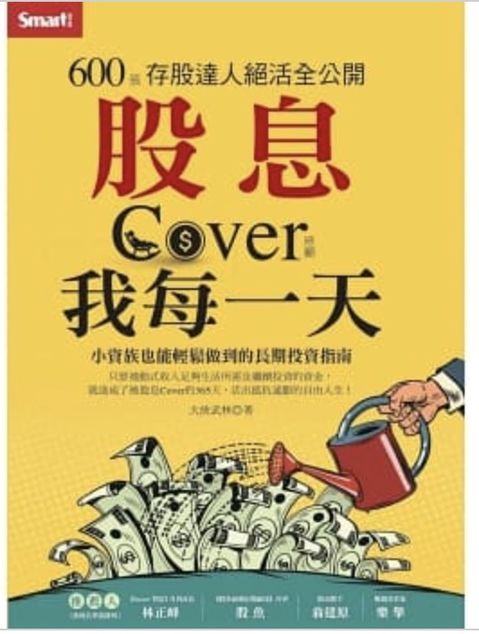

```
作者： 大俠武林  
出版社：Smart智富  
出版日期：2021/08/19

```

#### 買書推薦網址：

- 博客來: [購買網址](https://www.books.com.tw/exep/assp.php/kkdailin/products/0010898998?sloc=main&utm_source=kkdailin&utm_medium=ap-books&utm_content=recommend&utm_campaign=ap-202109)


# 前言:

這一本是今年所讀完的第十一本書。這大概是我進幾年唯一看得理財書籍，因為我很久沒有理財了（嗚臉。 之前有玩過基金，雖然運氣很好的賺了 30 ~ 40 % 。（印度基金有幾年很紅）。但是後來因為需要購屋，只好把虧損中的基金全部殺出。到也是把賺到的部分全部土回去。 

之後都採取佛係買股票策略，偶爾老婆心情好就買了一張鴻海。 抱著抱著翻背後，就賣出。當作夫妻間討論的小情趣來看待。到也沒有認真地去玩。 但是隨著房貸壓力變輕後，開始要認真思考存款該如何應用。因緣際會就看了「鼓魚」跟「大俠武林」的相關影片，覺得還蠻適合我們這種討厭天天看盤的上班族。就把這本書買回來看。

本來只是想看看心得。結果發現自己對於股票的許多專有名詞都不了解，只好苦苦地做了許多的筆記。透過這本書，到也是將自己許多基本理財概念充實了一次。 這本書對於沒有時間盯盤的上班族，希望可以有著比定存好一點的獲利即可的人來看。

<iframe width="560" height="315" src="https://www.youtube.com/embed/ShNI41_rFv4" title="YouTube video player" frameborder="0" allow="accelerometer; autoplay; clipboard-write; encrypted-media; gyroscope; picture-in-picture" allowfullscreen></iframe>

<iframe width="560" height="315" src="https://www.youtube.com/embed/0Xlz8Z3D4g0" title="YouTube video player" frameborder="0" allow="accelerometer; autoplay; clipboard-write; encrypted-media; gyroscope; picture-in-picture" allowfullscreen></iframe>

# 內容簡介與心得:

```
‧為什麼敢重壓兆豐金？
‧官股金控每年會有3波明顯上漲時段
‧資金分批進場組合技
‧投資兆豐金，要在除息前買還是除息後買？
‧搶在公司宣布前，提前估算官股金控可能配息
‧長期投資兆豐金，殖利率其實不只5％？

【1張表掌握官股金控重要投資時程】
每年哪個時期會宣布股利發多少？
每年幾月可以領到股利？
每年全年獲利，最快可以在何時得知？
每月公司會公布什麼重要數據？
大俠武林自用投資時程表無私公開
```

## 相關筆記：

### 為何選擇兆豐金

- 大股東有財政不，比較穩定。（大到不能倒）
- 長期殖利率有5% （股息穩定）

### 金融股的重大行事曆

- 一月： 去年 EPS 公布
- 四月： 董事會發布股息
- 六月：股東會公告股息（與最後的股票轉手日）
- 八月：除息
- 九月：領股息
- **十二月：外資賣壓。**

### 相關股市名詞筆記

EPS: 每股獲利盈餘，通常是用整年獲利狀況來算。可以用去年度的方式參考。

股息 = EPS x 平均盈餘分配率

股價 = 股息 / 殖利率

（通常殖利率可以透過前三年殖利率來推估出「平均殖利率」，做為推算股票的目前價位是否便宜。

除息： 股價減去股息之後的價位。

貼息（填息）：股價除息後，透過市場機制恢復到除息前的價位。（通常有個貼息日）

### 金融股的操作心得:  不在上漲多少，應該要看下跌的時候能接多少。

### 分批進場準則

- **EPS 優於去年：**
  - 8 月  ~ 12 月，每個月三次定期定額。分批入場共： 14 次。
- **EPS 低於去年：**
  - 8 月  ~ 隔年 4 月，每個月三次定期定額。分批入場共： 26 次。

### 定期定額比起 All-In 的好處

- 分散風險
- 不容易買高賣低
- 可以擁有部分資金，看到大盤大殺的時候。收更多的股票進來。

### 賣股契機

只有在「買房，買地，換股」才會賣掉股票。

## 心得:

本身就不是一個喜歡盯盤的人（比起盯盤，來寫 Leetcode 紓壓變成我近期的嗜好），這本書蠻適合我的。有許多心理建設的建議給容易患得患失的人。雖然玩過幾次股票跟基金，但是往往就是容易 All-In 造成無法正常生活。 透過存股與金融股的佈局可以讓我的資金控管有一些部分可以有更安全的部分。又可以獲得比起銀行更好的獲利。 

投資專家說得好：

```
資產放銀行收利息，少少的 1.5% 要看銀行臉色。 
資產去買銀行股票，股息發低於 5%，身為股東還可以抱怨。
有資產就要讓全世界最好的人才幫你賺錢！（股票）
```


