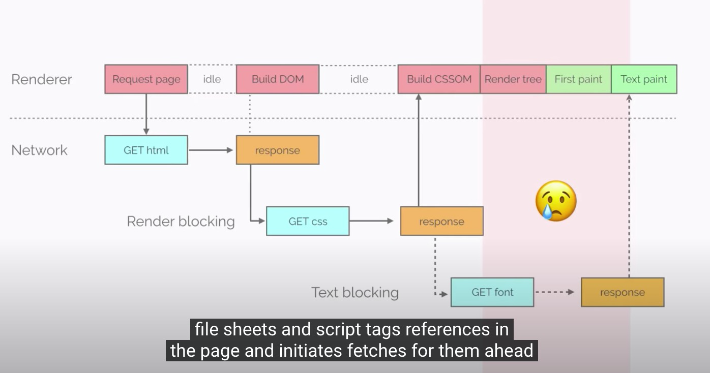
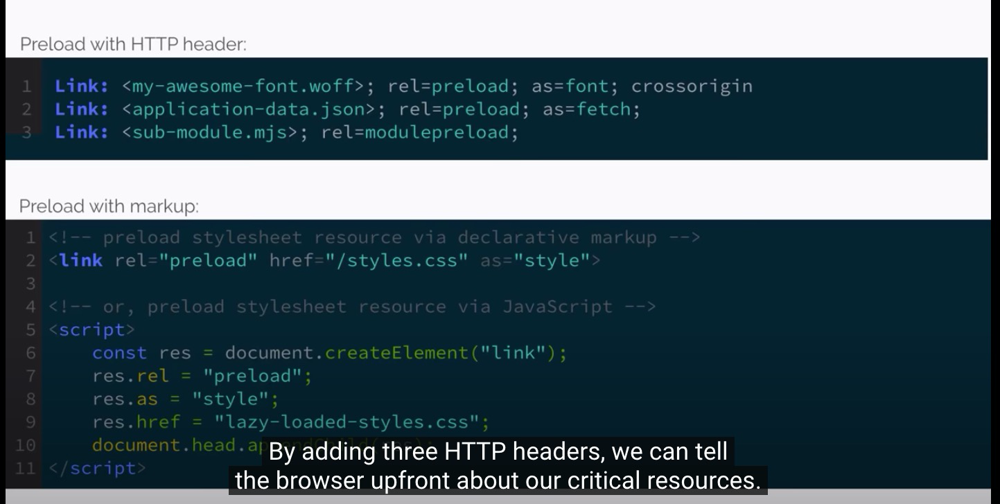
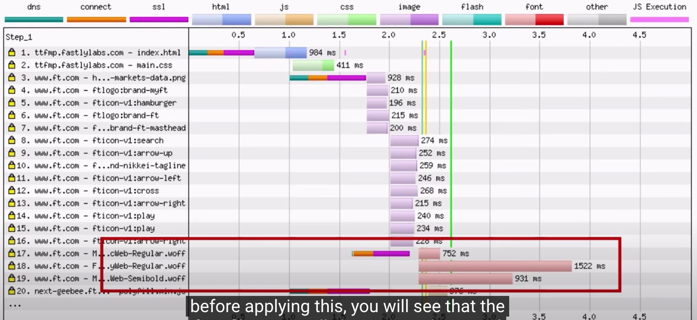
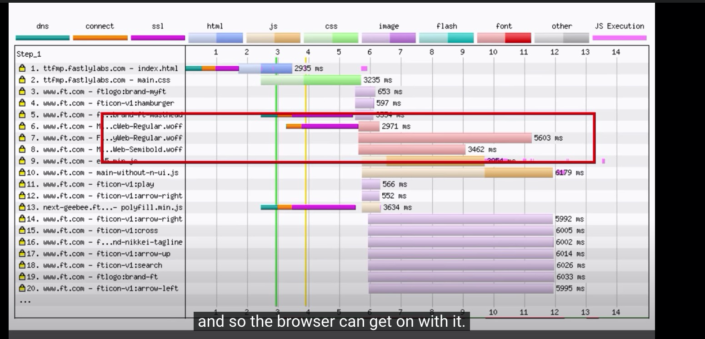
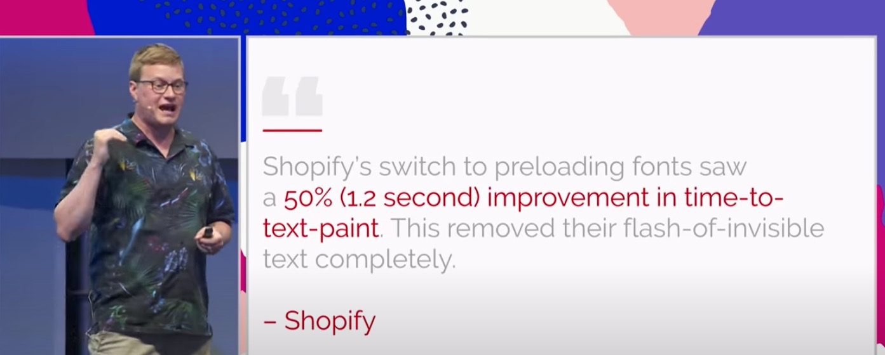
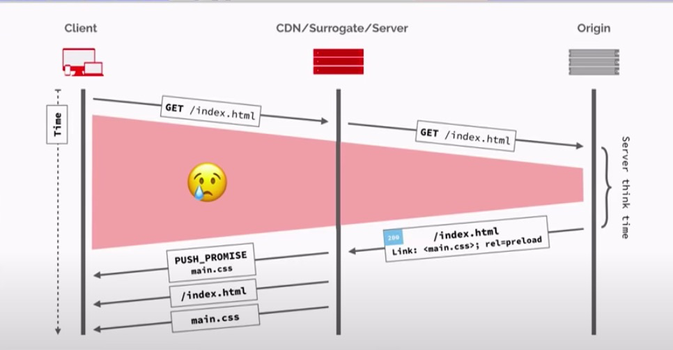
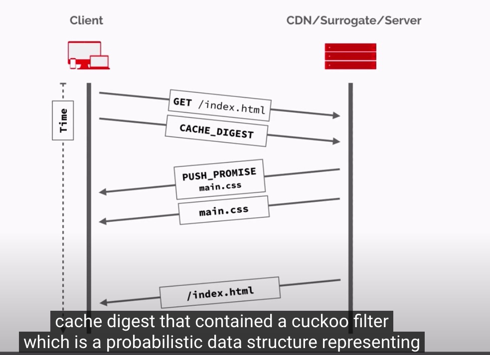
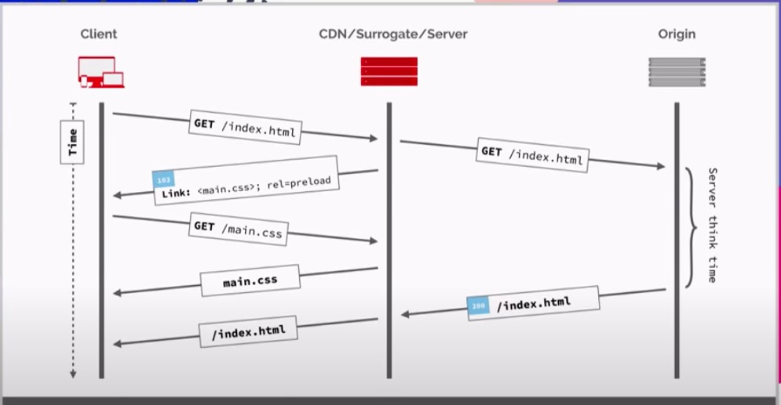
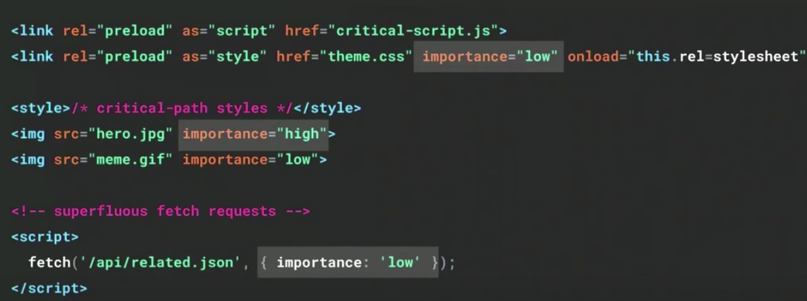
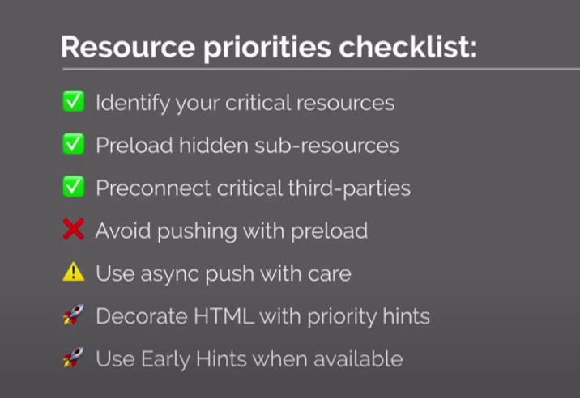

<iframe width="560" height="315" src="https://www.youtube.com/embed/cznVISavm-k" title="YouTube video player" frameborder="0" allow="accelerometer; autoplay; clipboard-write; encrypted-media; gyroscope; picture-in-picture" allowfullscreen></iframe>

# 前情提要：

最近想要看懂 HTTP/2 所帶來的新功能 Server Push ，找到這一篇相當好的整理影片。將所有原本的問題，Server Push 如何解決這樣的問題都整理好了。當然 Server Push 也不是萬靈丹，他也有相關的問題等著解決。接下來就來看吧！

# Critical Request

- 顯示出使用者最在意的資料。

# Original HTTPS

- CSS could not be pared incrementally 
- DOM need to be combination to final result

## Critical Hidden Resource

- 透過三行 Header  可以告訴 browser 哪些資源最重要。

### 在 Apply 之前

相關的 Font 是最後才下載

### Apply 之後

Font 變成是同步下載，可以讓相關資料顯示的正確且美觀。

## 其他公司透過 Pre-load FONT 達成的結果

Shopify 透過 Pre-load Font 達成 50% 的呈現速度（約為 1.2 秒)

# Server Push  面臨的問題

- 即便改成這個方式，最大的時程依舊在整個 HTML 的取得與解析
- 想要使用 Server Push 的話要確保:
  - 該資料不需要認證（FONT File)
  - 該資料不需要完整解開才能知道資料(也是因為 HTTPS 的原因)

# Cache Digest 

究竟要如何讓 Server 知道到底哪些需要 Push 哪些不需要 Push? 

### 原本問題：

所有資料需要 Auth (HTTPS) ，沒解開前無法知道哪一些資料需要。哪些資料已經有了。

### 解決方式：

透過一個由 [Cuckoo Filter (具有機率性的資料結構，可以看我之前的整理)](https://www.evanlin.com/CuckooFilter/) 傳送到 Server 端，由 Server 來決定哪一些資料要送，哪一些不要。這樣的好處是，傳送的資料（高機率）是 client 真正缺少的資料，而非已經有的資料。

### 參考資料：

- [https://datatracker.ietf.org/meeting/99/materials/slides-99-httpbis-sessb-cache-digest-00](https://datatracker.ietf.org/meeting/99/materials/slides-99-httpbis-sessb-cache-digest-00)
- RFC [https://datatracker.ietf.org/doc/html/draft-ietf-httpbis-cache-digest](https://datatracker.ietf.org/doc/html/draft-ietf-httpbis-cache-digest)

# 103 Early Hints

- 跟 Server Push 一樣的好處
- 比較簡單（大部分在 client / CDN)
- 可以知道 Browser cache ， Browser 來決定是否要用
- 讓 Client 決定是否抓下來資料

# Priority Hints

將資料本身直接給優先權 `importance` 透過這個方式來讓 client 能正確（且有順序的）讀取到 critical resource 。

# HTTP/2 所帶來的問題

HTTP/2 帶來很多優點，但是不完全沒有問題需要被解決。以下列出：

- Resource Loading in browser is hard 
- Performance is for humans, optimise for user experiences

## 最後建議：

# Reference

- [https://www.youtube.com/watch?v=cznVISavm-k](https://www.youtube.com/watch?v=cznVISavm-k)
- [https://datatracker.ietf.org/meeting/99/materials/slides-99-httpbis-sessb-cache-digest-00](https://datatracker.ietf.org/meeting/99/materials/slides-99-httpbis-sessb-cache-digest-00)
- [https://datatracker.ietf.org/doc/html/draft-ietf-httpbis-cache-digest](https://datatracker.ietf.org/doc/html/draft-ietf-httpbis-cache-digest)

