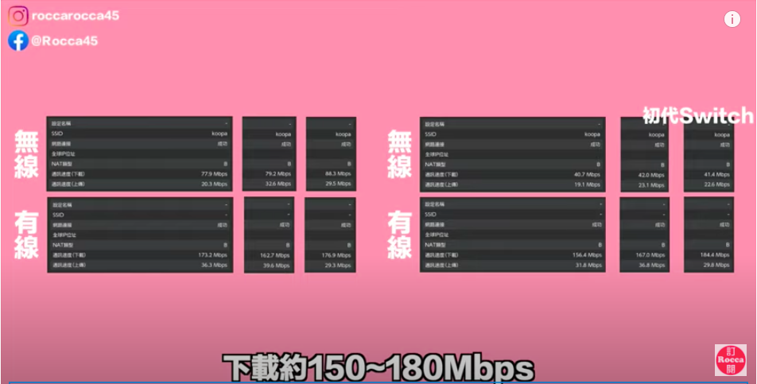

# 前情提要：

2021/10/08 任天堂正式發售了 OLED 的主機。除了螢幕變大外，又有漂亮的白色手把款式（跟機座）。買了下去，發現更換資料需要一點時間，這邊可以稍微紀錄一下相關程序給大家分享。


# 資料轉移：


大家可以參考一下官網上面的資料：[用戶資料轉移及儲存資料轉移](https://www.nintendo.tw/switch/support/secondary/transfer.html)

主要轉移資料是：

- 使用者資訊
- 使用者存擋
- 朋友

無法轉移（需要到新的主機下載）

- 遊戲本身


# 使用者資料轉移

因為我有許多任天的區域的 estore 帳號（八個），所以跑了很久。相關程序紀錄一下：

- [新的主機]-> [新增使用者] ->[繼承自其他 SWITCH 主機] （是否保留舊的，你們可以決定）
- [新的主機] -> 這時候要求你登入繼承過來使用者帳號跟密碼（還要輸入認證）
- [舊的主機]-> [設定] -> [使用者] -> [轉移使用者] 
- 兩台主機都要插電，要靠近。
- 等待轉移完成，換到下一個要轉移的使用者。

# 舊主機資料清理

使用者都轉移完畢後，需要做相關資料清理。

- [舊的主機]->[設定]->[主機] -> 清理 SD 卡的資料。（由於遊戲資料到新主機都無法使用，請記得清理）
- [舊的主機]->[設定]->[主機]->初始化 SWITCH

這樣就可以拿去賣了。


# SWTICH OLED 款式的使用心得

## 螢幕真的變得超大

雖然只有 6.2 -> 7 吋，但是拿到手上真的覺得差很多。因為近距離觀察的因素。 色彩更是漂亮的沒話說。

## WIFI 網路速度有變快

本來只是覺得新主機下載遊戲好像變快了，但是後來看到羅卡實測。

<iframe width="560" height="315" src="https://www.youtube.com/embed/6ZBa_88cOwg" title="YouTube video player" frameborder="0" allow="accelerometer; autoplay; clipboard-write; encrypted-media; gyroscope; picture-in-picture" allowfullscreen></iframe>



WIFI  速度大概有快一倍以上，此外外面資訊也有相關實測。

### [WIRED 實測](https://www.wired.com/review/nintendo-switch-oled/)

```
# That said, Wi-Fi speeds are surprisingly better. I regularly hit around 65/32 Mbps on the OLED and 30/29 Mbps on the original Switch.
```


# 總結：

主機是一個每天手上都會把玩的東西，上一台三年前玩得也完了接近一千小時吧（？）。這麼頻繁運用下，幫自己換一個漂亮的螢幕，更好的 WIFI 完全不為過啊。畢竟～～～～～～

```
買的遊戲都不知道買幾台 SWITCH 了！
買的遊戲都不知道買幾台 SWITCH 了！
買的遊戲都不知道買幾台 SWITCH 了！
```

哈～


# Reference

- [用戶資料轉移及儲存資料轉移](https://www.nintendo.tw/switch/support/secondary/transfer.html)
- [WIRED 實測](https://www.wired.com/review/nintendo-switch-oled/)
- [羅卡實測](https://www.youtube.com/watch?v=6ZBa_88cOwg)
