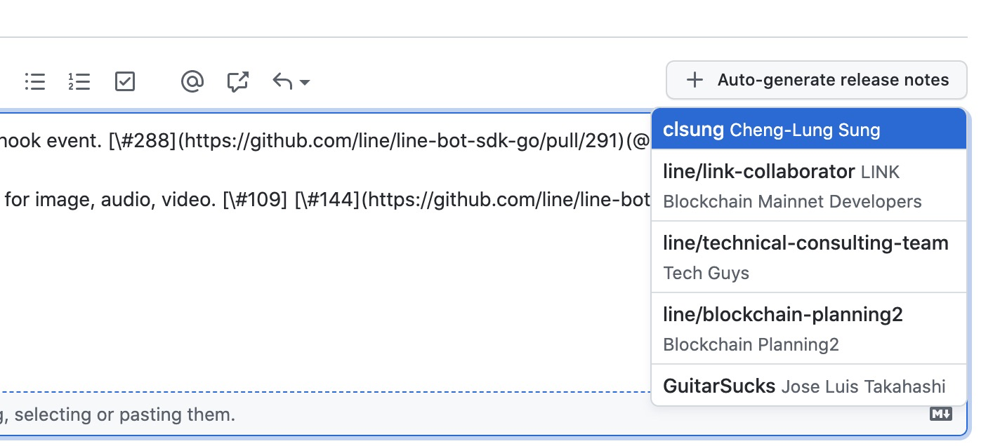

# 顯示 Contributors 在 Release Note 

最近在處理新的 [LINE Bot Go SDK](https://github.com/line/line-bot-sdk-go/releases) 的發佈的時候，發現透過 `@人` （需要透過 auto-completed) 會跑出一個 Contributors 欄位在 Release note 裡面。

# 自動 Release Note

甚至還可以自動產生 Release Note 。

- 需要是透過 PR 的新更動。
- PR 內需要有清楚的敘述（當然）

產生出來也相當方便啊啊啊

# Reference

- [Managing releases in a repository](https://docs.github.com/en/repositories/releasing-projects-on-github/managing-releases-in-a-repository)
