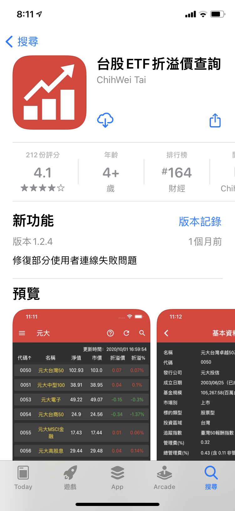

```
跟著柴鼠學FQ，做自己的提款機：為投資理財打好基本功，讓你不靠勞力，增加被動收入，快速FIRE

作者： 柴鼠兄弟  
繪者： 柴鼠兄弟
出版社：采實文化  
出版日期：2020/03/26
```

#### 買書推薦網址：

- 博客來: [購買網址](https://www.books.com.tw/exep/assp.php/kkdailin/products/0010852671?utm_source=kkdailin&utm_medium=ap-books&utm_content=recommend&utm_campaign=ap-202112)

# 前言:

這一本是今年所讀完的第十四本書。當初會知道這本書，當然就是長期有追蹤「[柴鼠兄弟 ZRBros](https://www.youtube.com/c/%E6%9F%B4%E9%BC%A0%E5%85%84%E5%BC%9FZRBros/featured)」頻道的。 必須老實說，當初會買這本書，單純是想支持「[柴鼠兄弟 ZRBros](https://www.youtube.com/c/%E6%9F%B4%E9%BC%A0%E5%85%84%E5%BC%9FZRBros/featured)」而已。 但是發現書本的內容整理的很好，文字口吻也相當的貼近並且有趣。蠻建議大家可以一起來看看。如果是股市的新人，一定要看他們的頻道來學基本常識。

# 內容簡介與心得:

```
什麼是FQ（Financial Quotient）？
FQ就是「財務智商、理財知識」，是一個人駕馭金錢的能力。

過去，大家以為FQ是財經相關人員的必修學分，
一提到「投資理財」，許多人不覺得是自己的事，
但其實，FQ是每個人的人生必修學分。

特別是在這厭、悶、窮忙、低薪的世代，
跟著柴鼠學FQ，不僅能解除你的理財焦慮，
還能讓你駕馭金錢，擁有建構被動收入機器的能力，
從此不靠兼差，也能為自己加薪！

柴鼠兄弟憑著對投資理財的興趣與自學，將多年投資心得結合媒體實務經驗，
拍成夯翻鼠FQ影片，把複雜難懂的投資理財化繁為簡，深受投資新手喜愛──
```

## 章節條列

### **Part 1 讓投資理財事半功倍的致富觀** / **Part 2 真正的懶人投資，最基礎的FQ──定存、外幣**

這邊比較基本，就先跳過。但是真的是從基本的開始分享。

### **Part 3 幫財富開外掛，打造被動收入──基金、股票**


#### 關於股市 K 線圖，什麼是紅Ｋ，什麼是黑Ｋ:

<iframe width="560" height="315" src="https://www.youtube.com/embed/V__cjhFm0L8" title="YouTube video player" frameborder="0" allow="accelerometer; autoplay; clipboard-write; encrypted-media; gyroscope; picture-in-picture" allowfullscreen></iframe>

這一篇教導了關於 K 線的詳細說明，解釋經常看到的 紅K 跟 黑Ｋ 代表的意思。 有可能是一根紅Ｋ但是卻沒有賺錢嗎？並且也解釋了 KD 代表的涵意。這一個影片讓我受益良多。


#### 關於定期定額存股，可能產生的問題:


<iframe width="560" height="315" src="https://www.youtube.com/embed/U_A95yWC2eI" title="YouTube video player" frameborder="0" allow="accelerometer; autoplay; clipboard-write; encrypted-media; gyroscope; picture-in-picture" allowfullscreen></iframe>

這一篇教導了關於定期定額可能發生的問題。以往定期定額最好是買在上升的股市，可以不斷有穩定的獲利。但是如果是買到不斷下蝶的趨勢，該如何自救呢：

- 適度停利，停扣或是轉換目標。畢竟定期定額還是要有一個好的標的。 建議挑選成分股不斷調整的 ETF 為主。
- 長期後的定期定額，容易產生僵化（後期投入影響層面變小）。

#### ETF 的優點跟缺點：

<iframe width="560" height="315" src="https://www.youtube.com/embed/o-0HkEYKzUQ" title="YouTube video player" frameborder="0" allow="accelerometer; autoplay; clipboard-write; encrypted-media; gyroscope; picture-in-picture" allowfullscreen></iframe>

購買 ETF 是許多新手（像我）的一開始入門方式，但是 ETF 有幾個問題一直讓我想不清楚：

- 既然是追蹤指數，那麼市場上買賣的價位是由什麼來決定？
- 如果因為太紅，遠遠超過指數本身會如何？
- 成分股的調整方式，造成的結果？

可以看這篇了解一下。

#### 關於 ETF 的溢價跟折價：

<iframe width="560" height="315" src="https://www.youtube.com/embed/CYJPOHiC9gA" title="YouTube video player" frameborder="0" allow="accelerometer; autoplay; clipboard-write; encrypted-media; gyroscope; picture-in-picture" allowfullscreen></iframe>

這些問題在這一部影片都有解釋，真的是相當實用的影片。也讓我了解「溢價」「折價」造成的 ETF 發行商需要主動出來控制股價的動作。也讓我在今年幾個 ETF  的溢價情形下，避免在高點入場的知識。

那麼要如何查詢「溢價」跟「折價」呢？




### **Part 4  比賺錢更困難的事：保持賺錢**

```
股神巴菲特曾經說過：「投資的第一法則，就是*不要賠錢*，第二法則就是不要忘記第一法則。」
```


<iframe width="560" height="315" src="https://www.youtube.com/embed/xts2RJgWWc0" title="YouTube video player" frameborder="0" allow="accelerometer; autoplay; clipboard-write; encrypted-media; gyroscope; picture-in-picture" allowfullscreen></iframe>

這一篇讓許多新手知道一些錯誤的迷思：

- 分批，分散，不要槓桿
- 避免交易錯誤，知道你的交易員。

<iframe width="560" height="315" src="https://www.youtube.com/embed/5MdDbP0oH-0" title="YouTube video player" frameborder="0" allow="accelerometer; autoplay; clipboard-write; encrypted-media; gyroscope; picture-in-picture" allowfullscreen></iframe>

關於定期定額的風險控管部分，這些也很重要。


## 心得:

買這本主要是支持作用，但是也稍微把整本都看完。確定自己的許多想法跟書上是沒有違背的，也避免讓自己有錯誤的理解。蠻推薦大家可以買這本書，讓你的理財智商（FQ）能夠迅速成長。
