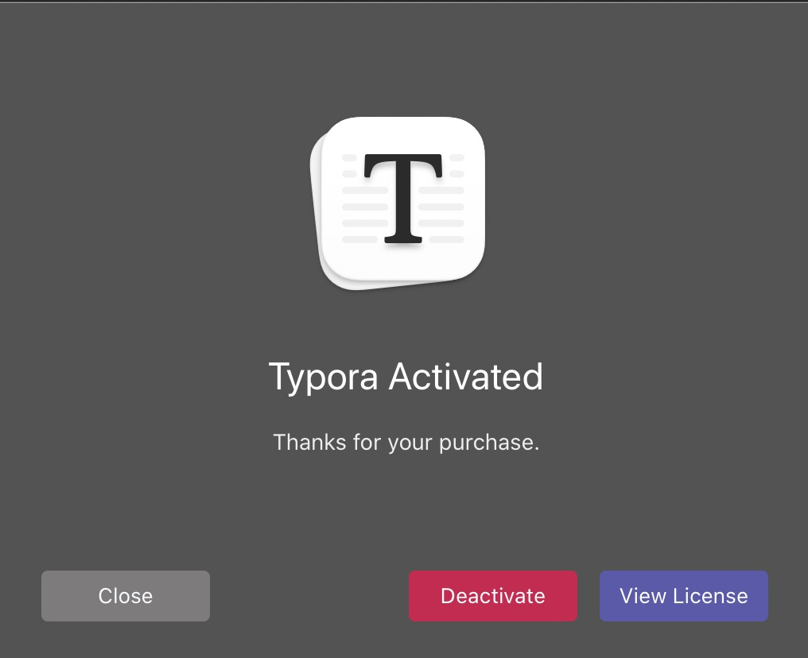
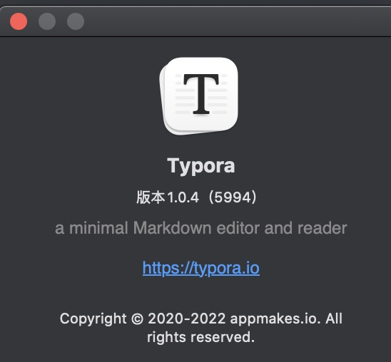
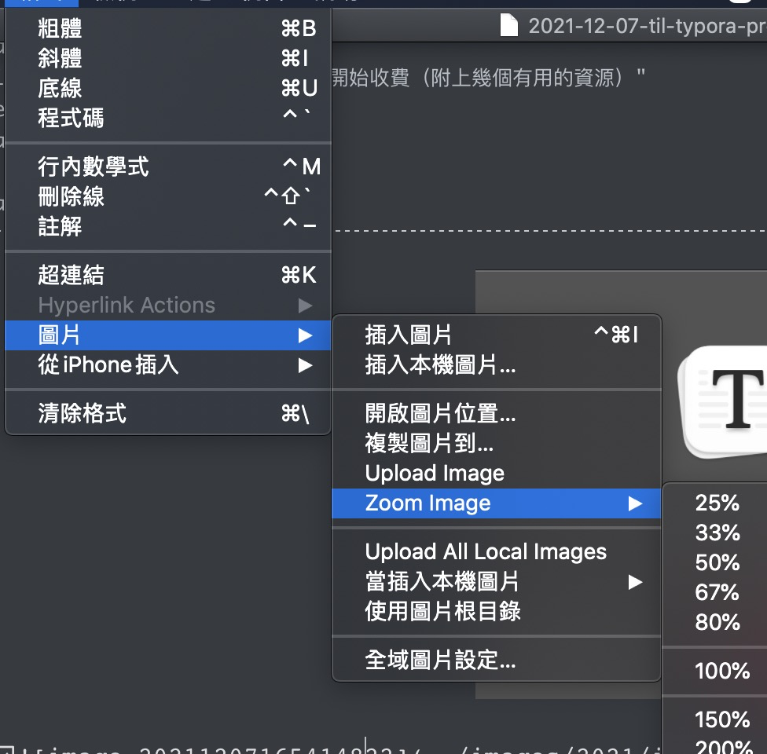
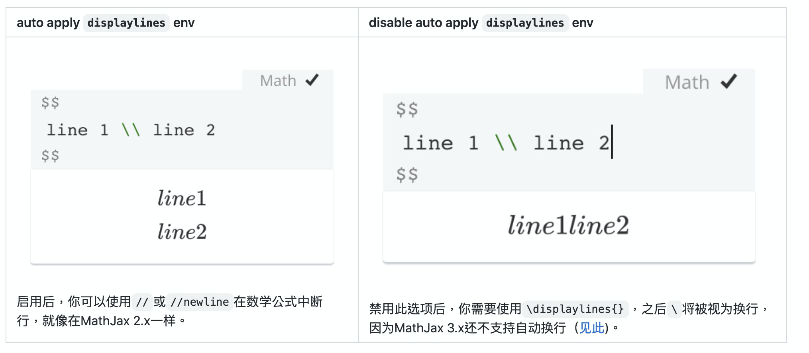
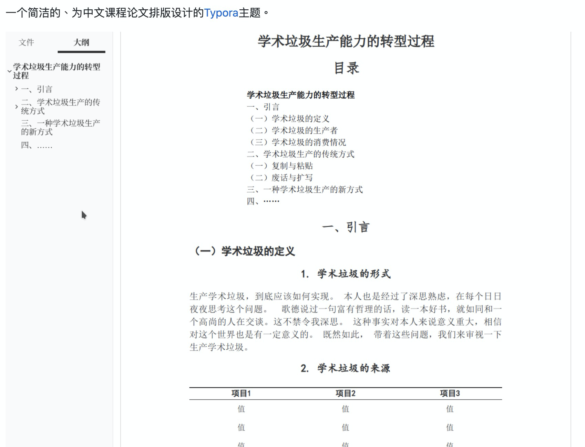

# 前情提要：

Typora 是一個我使用來撰寫文章的工具，除了速度快之外，也相當的好用。這裡快速整理我之前寫過的文章：

- [[TIL\][markdown] 好用的編輯器- typora - Evan Lin](https://www.evanlin.com/til-mdeditor-typora/)
- [[TIL\] 透過VSCode 寫Markdown 貼圖的利器- Markdown Paste](http://www.evanlin.com/til-vdcode-image-paste/)

在日前， Typora 終於 1.0 了，也正式開始收費。不過我也發現幾個很棒的修改部分。

# 1.0 之後，變好用的部分

## 更多好用的格式：

關於圖片的使用部分，變得更好用。還可以很快速的 zoom image 。

## 支援 ARM

我沒有 M1 無感！（難過

## 數學公式顯示

# 其他好用的主題:

## 學術論文主題 typora-theme-essay_cn

可以用類似論文的排版，這樣寫起來還蠻爽的。

#### [https://github.com/du33169/typora-theme-essay_cn](https://github.com/du33169/typora-theme-essay_cn)

## Typora 伪装 LaTeX 中文样式主题

可以用來寫實驗報告，也是很棒的格式啊。

#### [https://github.com/Keldos-Li/typora-latex-theme](https://github.com/Keldos-Li/typora-latex-theme)

# 總結：

好用的軟體就需要大家的支持，其實一路上我也買了好幾個 markdown 的工具啊。

- [MacDown](https://macdown.uranusjr.com/)
- [Typora](https://typora.io/)

[Typora](https://typora.io/) 效能還不錯，開啟速度也相當的快。好軟體需要大家支持。

# Reference

- [Typora 1.0 介紹](https://support.typora.io/What's-New-1.0/) ([中文](https://github.com/typora/wiki-website/blob/gh-pages/zh-Hans/Typora-1.0.md))

- [Typora 購買相關的 Q&A](https://support.typora.io/purchase/) 

  
