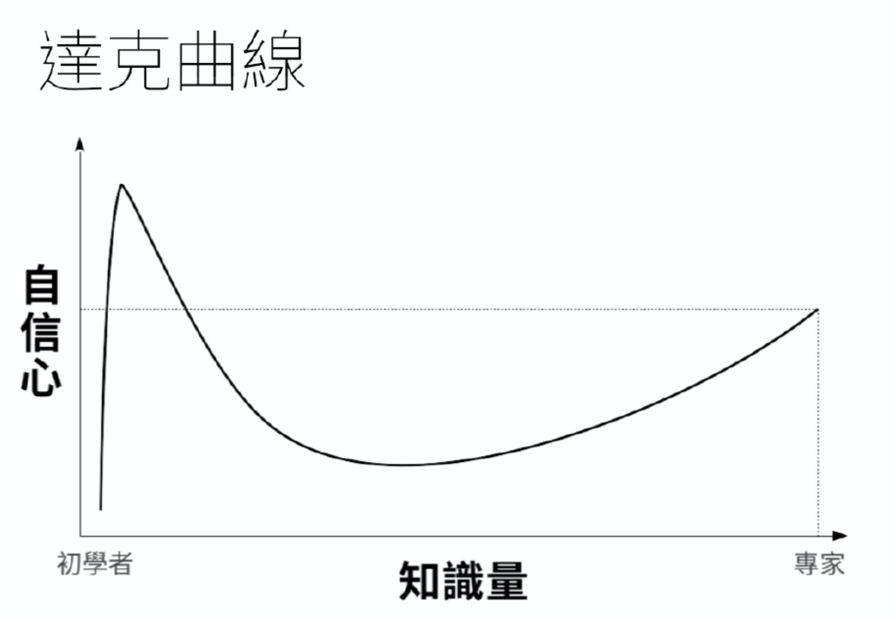

<div><a href="http://moo.im/a/8wCIMP" title="灰階思考"></a></div>


```
作者： 謝孟恭  出版社：天下文化 
出版日期：2021/04/20 
語言：繁體中文 
eISBN: 9789865251208 
ISBN: 9789865251024 
```

- 買書推薦網址：
  - 電子書: [Readmoo](http://moo.im/a/8wCIMP)

# 前言:


這一本是今年所讀完的第十五本書，會買一本書來讀當然是因為這是知名 [Podcast 「股癌」的作者 - 謝孟恭](https://podcasts.apple.com/tw/podcast/gooaye-%E8%82%A1%E7%99%8C/id1500839292) 所寫的書。「股癌」是近期最後歡迎的台灣知名 Podcase ，內容主要是針對上市公司的分析，選股的一些心法介紹，是相當實用又有趣的 Podcast。 而這本書又是主持人的力作，當然會想來看看。 蠻推薦大家一起來看看，很多心法層面的說明。相信對於投資股市，甚至是投資人生會有很大的幫助。

# 內容簡介與心得:

```
零到一之間，有無限個數字，
黑與白之間，也有無限的色階。
面對多變的市場，跳脫黑白思維，
才能看見無限大的價值！

窮人想賭博翻身，富豪想保本成長。沒有判讀力，你可能可以賭中幾次，但終究抗拒不了誘惑，最終那些靠運氣贏來的，都會靠實力輸回去。而錯誤認知就如同錯誤的飛行儀表版，即便飛機性能再好，也很可能會讓你與目標背道而馳，甚至墜落於茫茫大海。投資理財不難，唯判讀力和克服人性而已。不斷的閱讀、思考、回測，就是一種判讀力的鍛鍊，讓我們大腦擁有新的作業系統。而投資理財如同人生，沒有黑與白絕對的答案，最佳的解答，往往存在帶狀的灰色色階中。

市場是任何人都可以輕鬆加入，並把畢生積蓄賠光的地方，不要急於幾天內就要拚個你死我活。先蹲著才能跳更高，但也不要蹲到腳麻後來完全跳不起來，實際進市場的磨練才是重點。但面對市場你要：

樂觀，但不是傻天真；

耐心，要翻倍，但不要翻車；

行動，並樂於承擔風險！
```

# 章節條列

## 第一部──掃雷﹕掃除阻礙思考的常識

每一個系統都有他的「bug 」（錯誤，臭蟲），而進入股市第一件重要的事情，就是要把自己個性上有問題（針對投資上）的部分要清除掉。避免影響你獲利。

```
投資的三大因子跟一個隱藏加分：「本金，報酬率，時間加上投對胎」。
```

除了投對胎之外，重要的本金的多寡。這時候本業的獲利還是很重要的。累積基本本金也可以透過分散分險的投資方式，來讓自己體驗市場之外，也能夠儘早進入資本市場。

市場的變化是多變的，有 7% 的企業貢獻了 70 倍以上的成長。所以挑選企業比起任何買進與賣出的策略都重要許多。也因為 7% 很難挑選的到，所以不要把雞蛋全部放在同一個籃子裡面就相當的重要。

關於拜神是一個讓放過自己，放鬆的方法。面對不確定與疑惑的情況下，人類大多會拜神。對於股票則不是，需要透過許多的數據準備好。讓自己的危險機率降至到最低。並且嚴格遵守紀律，寧願少賺也千萬不要虧錢。 

- 建立正確理財觀念與加強自己的資訊判讀力
- 規劃策略，有紀律的實行

新手先從大盤，而且越早越好。才能感受到股市的震盪。

勞勃狄尼洛：「賭場的機率基本上都是算好的，經營管理者的任務就是把你留在場內就好。你可能可以賭中幾次，但終究拒絕不了誘惑。最終那些靠運氣贏來的，都會靠實力輸回去。」

## 第二部──備糧﹕建構判讀的作業系統

上戰場之前需要有完善的準備，而進入投資市場也是。

- 雞蛋不要放同一個籃子裡，（印象中可以主動 70% ，被動 30 %)
- 吸收良好的未加工知識，避免知識經過加工後加入個人偏見。 (可以去聽 13F 報告)
  - 編按： SEC Form 13F: 美國證券交易委員會 (SEC) 規定，資產管理規模超過 1 億[美元](https://invest.cnyes.com/forex/detail/usdtwd)的投資機構，必須在每個季度 (三個月) 結束之後的 45 天之內，向 SEC 提交所持有的美國股權，與相關資金去向。
  - 千萬不要聽信 3F (Friends， Family ， Fools)
- 通常贏家都良好的閱讀資訊習慣，而樂觀建立在「充分準備，遠見，熱忱，動機與逐步成長」。
- 第二個贏家特性是「耐心」。
- 對任何資訊保持質疑，並且加以驗證（詢問）。

對於自己的知識，千萬要保持疑惑，加以驗證才不會跌入達克曲線 (**鄧寧-克魯格效應**（英語：Dunning-Kruger effect) ) 造成迷思。




## 第三部──上陣﹕面對多變的市場

講到投資技巧與心法，作者這時候舉出了李小龍的：「無派勝有派」的方式。 也像是本書作者經常在 Podcast 有提到：「投資絕對不會有一些技巧是絕對會獲勝的，要不然就全部交給電腦就好，嚴格且絕對不會失誤」。

所以有著靈活的彈性，並且嚴守相關的紀律就是投資人最重要的事情。

- 首先認清楚自己是誰，對於資產的忍受度。如何睡得好。
- 半季審視自己的對帳單，不要太短期。
- 選擇有未來的股票（有夢想的企業）

```
巴菲特名言：「不願持有十年的股票，最好連十分鐘都不要持有」
```

- 對於股市大波動，先把自己所有槓桿都去掉。只留現貨，觀看市場的變化。
- 當大師遇到大跌，優雅且嚴守紀律的處理。
- 選擇最好的企業，就像挑選最正的女神。
- VIX (恐慌指數) 往往與 S&P 500 相對，所以可以適時候入場。
- 新人勿開大車，再用功都只是基本，千萬不要讓自己處在容易畢業的狀態。
- 炒股前，先炒好你的人生。

# 心得:

近期因為有認真在看股票，時常經「股癌」這幾期的資訊好好地吸收。 或許也像是作者講得很像，很多聽眾往往不一定是有在玩股票，很多時候都是聽身體健康的。 因為除了充滿很多口語化的文字，讓人經常會心一笑之外。你會發現許多投資的概念往往可能讓你的人生也會獲得很大的改善。

- 良好準備資訊
- 切勿重壓，雞蛋不要放同一個籃子
- 遇見大波動，冷靜且嚴守紀律

就算是人生，似乎也是不變的真理，對吧！


# 相關連接：

- [股癌 Podcase - Apple Podcast](https://podcasts.apple.com/tw/podcast/gooaye-%E8%82%A1%E7%99%8C/id1500839292)
-  [SEC Form 13F](https://www.sec.gov/divisions/investment/13ffaq.htm)
- [SEC 13F Filings](https://13f.info/)