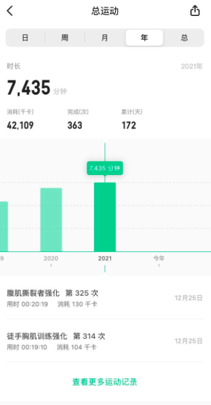

好像該寫點回顧：

1. 由於疫情，讓我可以在家裡跟女兒度過三個月的生活。

2. 女兒也順利上了小學，家長們順理成章變成晨星人。

3. 今年開始整理所有現金資產，八月多開始開始做一些比較大量的投資。有些初學者運氣，還有正報酬。 學習投資，真的是一門學問，從資本面學習，到心理層面的鍛鍊。 資產配置，調整。 主動與被動的調配後，甚至拿一些去十二月的美股繳學費，建立部位。

4. 健身部分年度健身時間從 6848 分鐘進步到 7435 分鐘。 希望 2022 年能更多！ 
5. Github 1074 (2020: 752) commits 。
6. 最後，家庭永遠是最重要的。也祝福大家新的一年身體健康，家人幸福美滿。

對了，工作的部分。之後會有專屬的文章。
