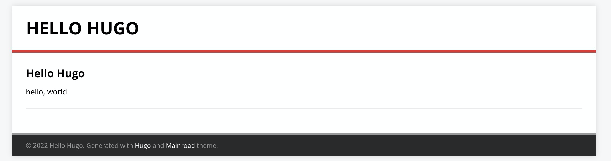
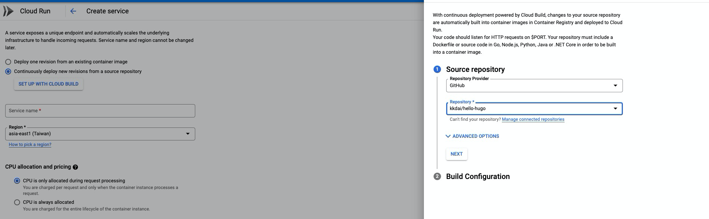
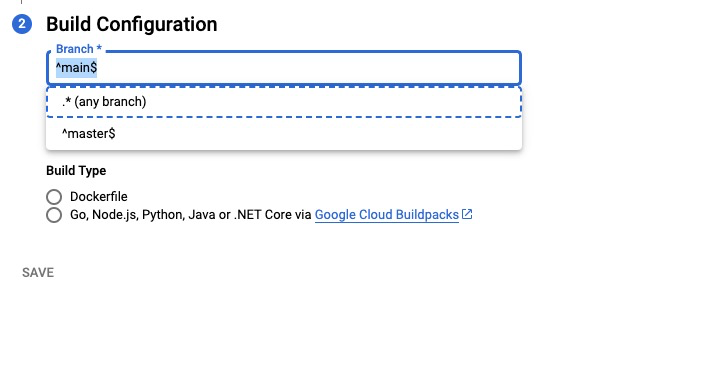
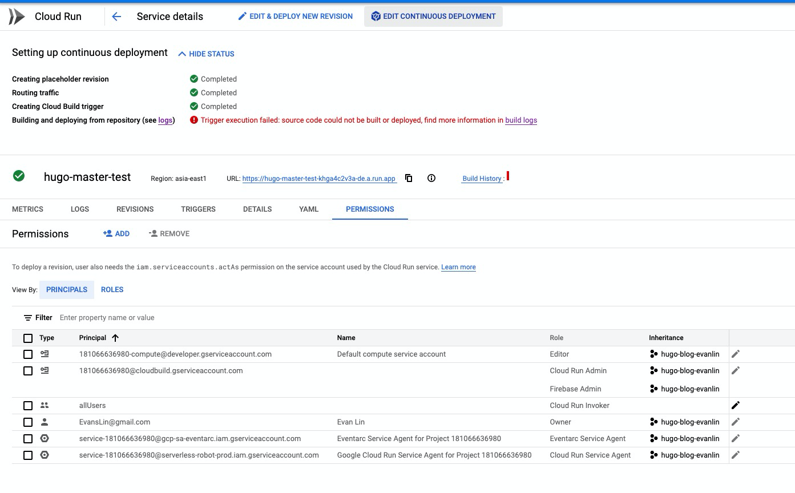
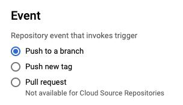
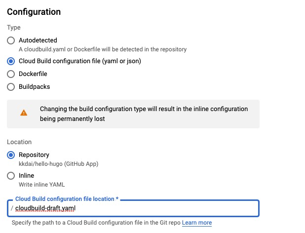
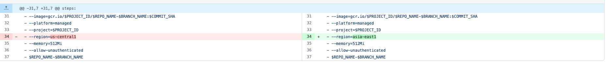
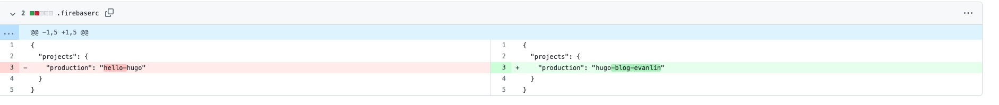
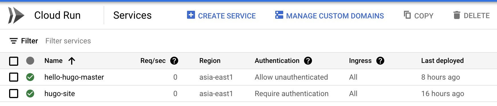
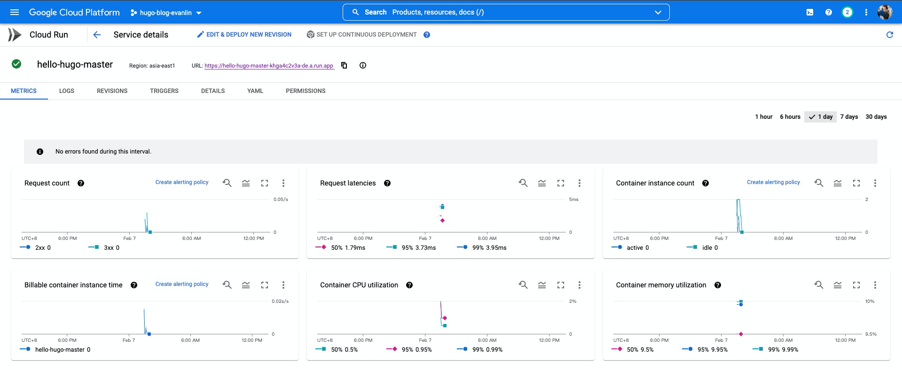

## 前言:

之前有想過把自己的部落格要移到 GCP 來使用，剛好有一些 credit 可以使用。 去尋找了一下如何在 GCP 上面架設 Hugo 部落格的文章。剛好看到官方有出一份使用 Cloud Run 來作為 Hugo host 的文章。 這裡先簡單的更新一下最新的介面，並且改成中文版本給大家參考看看。

其實就算跑完後，還有一些後續要用：

- 修改 DNS
- 搬移 Jekyll 到 Hugo 

這些就是其他篇文章的部分。

## 流程：

流程大多是依照 [Automatic Deployment of Hugo Sites on Firebase Hosting and Drafts on Cloud Run](https://developers.googleblog.com/2020/08/automatic-deployment-of-hugo-sites-on-firebase-hosting.html) 來修改成中文版本。

### 1. 設置 Hugo 新專案 

Fork GitHub 相關專案  [GitHub copy](https://github.com/jamesward/hello-hugo/fork) (i.e. fork)

[https://github.com/jamesward/hello-hugo](https://github.com/jamesward/hello-hugo)

### 2. 建立 Cloud Run 

- Set up with Cloud Build
- Connect to Github repository
- Reguib 記得選台灣 "asia-east1 (Taiwan)"
- 選取你 Fork 的專案

- Branch configuration --> `^master$` 設定是 Master branch.
- Build Type 先選 -> Dockerfile 之後還要改

### 修改 Continuous Deployment

你會發現這一次是失敗的，然後點選 "Edit Deployment"

### Edit Trigger - Event

- Event 

  - Push to branch

### Edit Trigger - Configuration

- Location --> Repository
- 記得改成檔案 `cloudbuild-draft.yaml`

### 建立 Firebase 來作為 Production / CDN'd site

To setup your production / CDN'd site, [login to the firebase console](https://console.firebase.google.com/)

啟動後，設定好相關專案。

### 修改 Github 啟動專案

1. 修改到台灣 region --> asia-east1 參考 [commit](https://github.com/kkdai/hello-hugo/commit/9ca8ee11fc1237b92aabd6d5952d4d0074fba9f8) 

2. 修改 Firebase Production 專案名稱（記得改成你的專案） 參考 [commit](https://github.com/kkdai/hello-hugo/commit/ed0ce403325fe69a0d6819d9293caeb3ab09619e) 

### 最後成品

你會發現有兩個 Cloud Run ，一個是你設定的 Trigger 。 第二個 `hugo-site`  就是透過設定跑起來 CICD 的 Cloud Run 。

點進去之後，你會看到上面有一個完整的 URL ，就是可以對外的網址。

最後網站: [https://hello-hugo-master-khga4c2v3a-de.a.run.app](https://hello-hugo-master-khga4c2v3a-de.a.run.app)

## 相關文章：

- [Automatic Deployment of Hugo Sites on Firebase Hosting and Drafts on Cloud Run](https://developers.googleblog.com/2020/08/automatic-deployment-of-hugo-sites-on-firebase-hosting.html)
- [Google CloudRun 打造 hugo 靜態網站環境，並搭配CICD持續部署，用多少收多少無基本費](https://www.minwt.com/website/server/22837.html)
