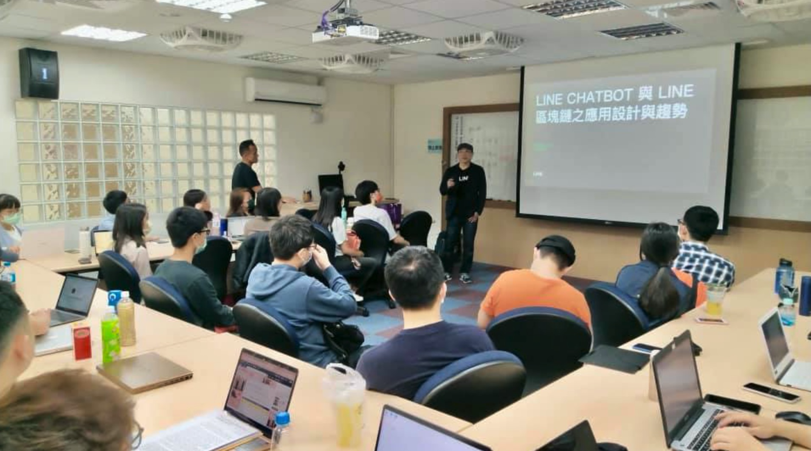

# 前言

大家好，我們是來自 LINE 台灣開發者關係與技術推廣部門 (Developer Relations)。從 2019 LINE 啟動了「開發社群計畫」之後，已經有三年的時間。期間舉辦了許多的校園招募，技術社群聚會活動與 LINE 平台開發分享活動。 本篇文章將針對校園相關的資源來做一個相關的說明，團隊也期待能與各地校園有更深入的合作計畫。本次文章將針對以下的部分加以說明：

- 來 LINE 台灣企業參訪
- LINE FRESH 校園競賽
- 校園授課與分享 
- 與學校共同舉辦的活動
- 在 LINE 台灣技術實習 - TECHFRESH 介紹與相關福利

# 來 LINE 台灣企業參訪

你知道 LINE 台灣的辦公室在哪裡嗎？ 好奇 LINE 台灣的工程團隊都是在如何的辦公環境工作呢？ 這裡我們也歡迎所有的學校單位來申請企業參訪。透過企業參訪同學們可以暸解：

## LINE 台灣辦公室開放空間參觀：

<iframe width="560" height="315" src="https://www.youtube.com/embed/vy58Kabmus4" title="YouTube video player" frameborder="0" allow="accelerometer; autoplay; clipboard-write; encrypted-media; gyroscope; picture-in-picture" allowfullscreen></iframe>

LINE 工程團隊的企業文化重視的就是 「 Be Open 」「 Trust and Respective」 跟 「Take Ownership」。而在新辦公室的裝潢上也是充滿了相關的理念，重視著高度開放與同仁間彼此信任的設施。 歡迎每一位同學們來了解，來感受一下外商的辦公環境。

這裡也分享許多 YouTuber 的影片給各位參考：

- [台灣LINE辦公室的福利竟然比蘋果好！HR直接透露提高錄取率的方法！連我們都想來上班！](https://www.youtube.com/watch?v=u6Gt3gxHbS4)
- [LINE總部海外第一大新家開箱！導演竟然邊拍邊應徵詢問職缺？福利好成這樣！](https://www.youtube.com/watch?v=YXQE84_6gJM&t=285s)
- [LINE全球海外最大辦公室在台灣｜4公尺新熊大有 3 個不同｜全新LINE Studio創作者空間首度曝光](https://www.youtube.com/watch?v=LAul_sE0s5k) 

## LINE 工程團隊的介紹

想知道外商工作的軟體開發流程是如何呢？ 如何打造出數百萬人流量的服務呢？ 企業參訪的同時， LINE 工程團隊也會安排相關的開發流程分享，讓每一位參加的同學都能了解如何參與跨過的軟體工程開發，並且也可以了解如何在資訊安全與個人隱私管理相當嚴謹的 LINE ，到底要如何的妥善處理相關的私密資訊。 每一的團隊介紹也歡迎同學們直接來投遞實習生的職缺，並且跟你們的面試官直接詢問相關的問題，可以更深入的了解相關工作內容。

### 如何申請校園企業參訪:

想知道如何申請校園企業參訪嗎？ 歡迎各個系學會與相關社團發送各位的需求到這個連絡信箱： [dl_twn_devrel@linecorp.com](mailto:dl_twn_devrel@linecorp.com)

# LINE FRESH 校園競賽

**LINE FRESH** 代表著 LINE 台灣與學生之間的深度連結，而「LINE FRESH 實習計畫」已連續舉辦6年，不僅藉此發掘校園中的各領域優秀人才，同時也有不少年輕學子由此作為職涯起點。

於是LINE台灣團隊決定，從 2020 年開始，我們舉辦第一屆的校園競賽，期望透過競賽的形式，廣邀校園中的優秀好手發揮創意，運用LINE旗下多元服務或開放的平台技術，為台灣產業創造更多商業可能性、為台灣用戶提供更全面的便利生活體驗。 

並且也在 2021 年辦理了第二屆校園競賽，並且以台灣北、中、南、東的地區四大各具特色在地商圈為主題，包含台北**師大龍泉商圈**、雲林**虎尾魅力商圈**、高雄**六龜商圈**與台東**鐵花商圈**。讓同學們針對所選擇的商圈主題之發展現況、同時結合 LINE 的數位生活服務與開放平台技術，了解商圈所需要的內容以及應用相關的技術來解決面臨到的問題，協助商圈朝數位化全速前進，創造疫情後的數位商機。

今年度 (2022) 也請各位同學期待，把握暑假過後的開始報名期限喔。 

## 相關資源:

- [LINE FRESH 校園競賽官方網頁](https://tw-fresh.line.me/)
- [LINE FRESH 2020 校園競賽黑客松組活動紀錄](https://engineering.linecorp.com/zh-hant/blog/line-fresh-2020-hackathon-final/)
- [LINE FRESH 2021 校園競賽 – 活動總結](https://engineering.linecorp.com/zh-hant/blog/line-fresh-2021/)

### 如何報名 LINE FRESH 校園競賽:

想知道如何請關注我們官方網頁 「[LINE FRESH 校園競賽官方網頁](https://tw-fresh.line.me/)」 並且關注 LINE FRESH 官方帳號

# 校園授課與分享 

你知道 LINE 台灣工程團隊其實也接受相關的授課合作嗎? 只要是跟 LINE 平台開發技術相關的議題， LINE 台灣工程團隊都歡迎老師們，系學會或是相關社團邀請我們。 不論是 LINE 台灣的開發工程團隊，或者是 LAE (LINE API Expert) LINE 官方認證的技術專家，我們都樂意到校園去授課，去了解個多同學與老師開發上的需求。

### 如何申請校園授課與分享 

想知道如何申請校園授課與分享嗎？ 歡迎各個系學會與相關社團發送各位的需求到這個連絡信箱： [dl_twn_devrel@linecorp.com](mailto:dl_twn_devrel@linecorp.com)

# 與學校共同舉辦的活動

除了許多與學校的授課活動與參訪外，其實 LINE 台灣也有許多跟校園共同舉辦或是贊助的活動。這裡列出兩個固定支持的相關活動，也歡迎更多校園活動來找我們合作。請將需求發送到這個連絡信箱： [dl_twn_devrel@linecorp.com](mailto:dl_twn_devrel@linecorp.com)

## LINE Chatbot 對話機器人設計大賽 (國立台北商業大學)

LINE PROTOSTAR 新星計劃攜手國立臺北商業大學聯合主辦的「2021 LINE Chatbot 對話機器人設計大賽」連續第三年舉行，本屆吸引超過60組團隊、240人次參與，並邀請各界專業人士、貴賓與評審共襄盛舉，於10月23日在桃園市政府青年事務局多功能展演廳舉行總決賽。10組入圍最終決賽的團隊，皆為來自學界與業界的各路高手。

其中除了有相關競賽外， LINE 台灣工程團隊也提供了相關的技術授課說明，希望能讓每一個參與競賽的夥伴能夠了解該如何開發 LINE Chatbot 。

### 相關報導

- [LINE Chatbot 對話機器人設計大賽官方網站](https://contest.bhuntr.com/tw/fklc6b98o0ueubrzel/home/)

- [《2021 LINE Chatbot 對話機器人設計大賽》決選結果出爐 由「魚事 - 關魚產銷的大小事」奪冠](https://linecorp.com/zh-hant/pr/news/zh-hant/2021/3964)

- [【2020 LINE CHATBOT 對話機器人設計大賽】課程A 林宜鋒 工程師](https://www.youtube.com/watch?v=bOGDRl1NoVQ)

  

## 梅竹黑客松

除了 LINE Chatbot 設計競賽外， LINE 台灣也與新竹市政府與梅竹黑客松的主辦單位連續合作兩年。2020 年除了有競賽前的工作坊之外，也在活動當天有到了會場擺攤與同學們相見歡。  2021 年雖然改成線上，但是熱情不減我們依舊可以感覺到同學們透過 LINE 平台想要打造出的創意與令人讚嘆的想法。

## 相關資源:

- [LINE 開發社群計畫: 2020/10/24 新竹 x 梅竹黑客松決賽 – LINE 競賽組別活動紀錄](https://engineering.linecorp.com/zh-hant/blog/meichu-2020-liff/)
- [梅竹黑客松賽前企業工作坊 – LIFF shareTargetPicker](https://engineering.linecorp.com/zh-hant/blog/meichu-liff-share-target-picker-workshop/)

# 在 LINE 台灣技術實習 - TECHFRESH 介紹與相關福利

最後，當然要跟各位同學分享關於校園計畫裡面的最重要的部分，也就是 **「LINE TECH FRESH 校園新興實習計畫」**。

LINE 台灣工程團隊每年透過 LINE TECH FRESH – 技術新星人才計劃，招募資訊科技相關科系，或對此領域有所涉略的大學生 / 研究生加入 LINE 團隊進行長期實習 (一年期)，讓同學們能在國際級科技公司中觀摩學習。LINE TECH FRESH 由經驗豐富的技術專案經理帶領團隊，接觸多元化的專案與產品開發，學習業界實際的軟體專案分工，並體驗跨國團隊合作。往年工作內容包含 server、web、mobile app、chatbot、IoT、data、DevOps 等領域，並透過實習熟悉 LINE 平台系統、SDK、API 等。值得一提的是，LINE TECH FRESH 是有給薪的實習機會，對於軟體開發有熱情、有想法的同學們，千萬別錯過這個揮灑創意與衝勁的機會！

### 更多關於 LINE TECH FRESH 介紹文章有:

- [TECH FRESH 實習的一年間，除了開發還有什麼內部活動呢？](https://engineering.linecorp.com/zh-hant/blog/line-tech-fresh-2020-graduate/)
- [【訪談】TECH FRESH 工作老實說 – 後續花絮與相關資訊整理](https://engineering.linecorp.com/zh-hant/blog/what-is-tech-fresh-interview/)
- [Life in LINE – 直擊 TECH FRESH 實習內容！](https://engineering.linecorp.com/zh-hant/blog/life-in-line-tech-fresh-sharing/)
- [TECHPULSE 2020 青春主場 – TECH FRESH 議程與攤位介紹](https://engineering.linecorp.com/zh-hant/blog/techpulse-2020-tech-fresh-session/)

### 如何申請 LINE TECH FRESH 技術新星的實習計畫呢？

對於 [TECH FRESH 計畫](https://careers.linecorp.com/jobs/83)有興趣並想了解內容，歡迎大家參考 [LINE Career 中的細節](https://careers.linecorp.com/jobs/83)。

## 小結

立即加入「LINE開發者官方社群」官方帳號，就能收到第一手Meetup活動，或與開發者計畫有關的最新消息的推播通知。▼

「LINE開發者官方社群」官方帳號ID：[@line_tw_dev](https://lin.ee/s5RsZHo)

# 關於「LINE 開發社群計畫」

LINE 今年年初在台灣啟動「LINE 開發社群計畫」，將長期投入人力與資源在台灣舉辦對內對外、線上線下的開發者社群聚會、徵才日、開發者大會等，已經舉辦 30 場以上的活動。歡迎讀者們能夠持續回來察看最新的狀況。詳情請看:

- [2019 年 LINE 開發社群計畫活動時程表](https://engineering.linecorp.com/zh-hant/blog/line-taiwan-developer-relations-2019-plan/)
- [LINE Taiwan Developer Relations 2019 回顧與 2019 開發社群計畫報告](https://engineering.linecorp.com/zh-hant/blog/line-taiwan-developer-relations-2019/)
- [2020 年 LINE 開發社群計畫活動時程表](https://engineering.linecorp.com/zh-hant/blog/2020-line-tw-devrel/)
- [2021 年 LINE 開發社群計畫活動時程表](https://engineering.linecorp.com/zh-hant/blog/2021-line-tw-devrel/)