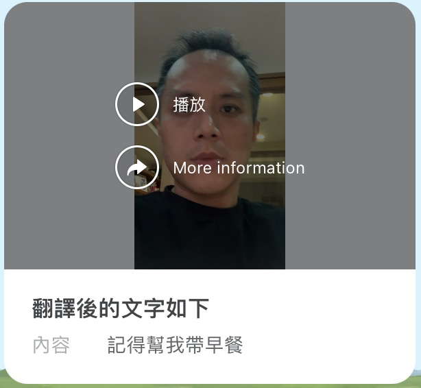

# 前言:

大家好，我是 LINE 台灣的資深技術推廣工程師的 Evan Lin 。 [Flex Message Update 3](https://developers.line.biz/en/news/2022/03/11/flex-message-update-3-released/) 在日前公佈了，除了帶來更多樣的客製化項目。 最讓人注意的莫過於可以在 Flex Message 中顯示影片元件的[ Flex Message including a video](https://developers.line.biz/en/docs/messaging-api/create-flex-message-including-video/) 了。本篇文章將透過一個長輩使用 LINE 來跟家裡人溝通很常看到的案例，並且展示如何透過 STT 的技術來讓 Flex Message 顯示更多，更有用的資訊來幫助你。

# 解決的問題痛點

不知道大家是否有類似的問題，有一些長輩或是朋友們由於可能不方便打字，經常都透過語音訊息來溝通。但是許多時候其實是不方便打開手機音量來「聽訊息」或者是「看語音影片」的，比如說在捷運上，或是在會議之中。 這個時候，經常會想到說是否有一個方便的服務可以透過上傳影片（或是語音檔案）的方式。 透過 STT ( Speech-To-Text )的技術來幫影片中的語音翻譯出文字，並且透過 LINE 這次開放的  [Flex Message Update 3](https://developers.line.biz/en/news/2022/03/11/flex-message-update-3-released/)  新格式 ，來讓使用者更快看得到你的訊息內容，而不需要打開影片內容。

# 如何用？如何架設？ :


## 開源程式碼：
不囉唆，先來看 code 。

#### 開源程式碼： [https://github.com/kkdai/linebot-video-gcp]( https://github.com/kkdai/linebot-video-gcp)

## 如何快速架設在自己平台：

請根據以下的流程，來直接透過開源的程式碼來架設一個 LINE Bot 跟 GCP  STT 與 GCS (Google Cloud Storage) 的結合。

### 事前準備

- [LINE Developers 帳號](https://developers.line.biz/console/)
  - 到 [LINE Developers Console](https://developers.line.biz/console/) 透過你的 LINE 帳號登入。
  - 開啟 LINE Developers 帳號
  - 開啟一個官方帳號 Message API Channel 並且取得 `channel secret` 與 `channel access token`。 請[參考這篇教學](https://developers.line.biz/en/docs/messaging-api/getting-started/#using-console)。
- 需要一個免費的 [Heroku](https://dashboard.heroku.com/) 帳號。
- 需要一個收費的 [Google Cloud Platform](https://cloud.google.com/) 帳號，並且取得 GCP JSON key file ，更多詳細流程請參考 [Cloud Storage client libraries](https://cloud.google.com/storage/docs/reference/libraries)。

### 開始部署

1. 請先到程式碼:  [https://github.com/kkdai/linebot-video-gcp]( https://github.com/kkdai/linebot-video-gcp)
2. 按下： "Deploy" 來部署到你的 Heroku 帳號
   
3. 除了填寫 App Name 以外，以下的參數必須要填入才能完整運行。

   1. **ChannelAccessToken**: 請到 LINE Developers Console issue 一個。
   2. **ChannelSecret**: 請到 LINE Developers Console 拿一個。
   3. **GCS_BUCKET_NAME**: Google Cloud Storage Bucket Name 你需要先建立一個 GCS bucket 並且依照稍後文章的內容來改成 public access 。
   4. **GCS_PROJECT_ID**: Google Cloud Storage Project ID
   5. **GOOGLE_APPLICATION_CREDENTIALS**: 這是必須要填寫，請勿修改。
   6. **GOOGLE_CREDENTIALS**: 這邊請將 GCP JSON key file 的內容（對～就是整包檔案裡面的 JSON 資料），全部放上去。這樣是比較安全的。
4. 請到 LINE 官方帳號的平台，到了右上角的「設定」中，選擇「帳號設定」
   1. 將你官方帳號基本資料設定好，並且打開加入群組功能。
      1. 
   
   2. 到回應設定，將以下設定改好：
      1. 
      2. 回應模式改成「聊天機器人」
      3. 停用「自動回應訊息」
      4. 啟用「Webhook」
   3. 到 Messaging API 選項，將 Webhook 網址填入`: https://{YOUR_HEROKU_SERVER_ID}.herokuapp.com/callback
   4. 關於如何快速部署的流程，可以參考另外一篇文章內的影片：
     - [How to deploy LINE BotTemplate](https://www.youtube.com/watch?v=0BIknEz1f8k)
     - [Hoe to modify your LINE BotTemplate code](https://www.youtube.com/watch?v=ckij73sIRik)
   

### 如何使用:

- 打開聊天機器人
- 傳送影片訊息
- 過一兩秒的判別時間，就會收到結果的 Flex Message

### 成果


# 開發流程記錄：

這邊透過一些開發流程，來跟各位分享該如何在 LINE 聊天機器人中來完成這樣的開發：

## 如何在 Heroku 上面開發 Golang 的 App 


以往的時候，如果要使用 Google Cloud 相關的 API (比如說: Google Cloud Storage) 存取 API ，只能透過 JSON 檔案來操作。但是如果你想要放上 Heroku 的時候，就必須要放上 GitHub ，這個時候就很容易不小心誤放 JSON 檔案而被機器人掃走而盜用。透過環境變數跟 Golang Buildpack 可以幫助你在安全無慮的狀況下部署 Herokuu 專案，也可以開源到 Github ，歡迎[參考這篇文章](https://www.evanlin.com/til-heroku-gcp-key/)。

以下也提供一個簡單的測試程式碼，可以確認連接到 GCP 是否有正確連結。

<script src="https://gist.github.com/kkdai/1a81605d33f22603762354e981990596.js"></script>

## 如何投過官方帳號 (Official Account) 來抓取 LINE 聊天對話中的影片或是聲音檔案

首先，當官方帳號收到圖片訊息(image)，影片訊息(video) 或是聲音訊息(audio) 的時候，通常會透過以下幾個 Message Hook.

- [Image Messagge Webhook](https://developers.line.biz/en/reference/messaging-api/#wh-image)
- [Video Message Webhook](https://developers.line.biz/en/reference/messaging-api/#message-event)
- [Audio Messageg Webhook](https://developers.line.biz/en/reference/messaging-api/#message-event)

以 Video Message Webhook 為例子，你會看到以下的例子（來自 LINE Dev Doc)


- 如果 Video Message 的影片提供者是外部服務，可能還可以取得檔案的連結。
- 但是如果你透過上傳影片給官方帳號，你可能會發現官方帳號無法直接存取到檔案內容。需要透過  [Get content](https://developers.line.biz/en/reference/messaging-api/#get-content) 的 API 來取的相關資訊。

以下提供範例的 Golang 程式碼，來展示如何取得上傳到 LINE 平台的影片檔案內容：

<script src="https://gist.github.com/kkdai/ad453ee5162c3c5cdd20319323d7573e.js"></script>

這個方式就可以取得檔案的 IO Reader 內容，就可以透過 `content` 這個 IO Reader 來將檔案抓下來，或是直接上傳到 Google Cloud Storage 。

## 如何將檔案上傳到 Google Cloud Storage

<script src="https://gist.github.com/kkdai/9b8a82ccdf1294d8a7ae5f7999fd42f4.js"></script>


先看程式碼，以下幾件事情要注意：

- 需要有 cancel 的 context 避免上傳時間過久，造成 API Error 。
- 依照前一個檔案範例，其實可以直接拿 `bot.GetMessageContent(message.ID).Do()` 裡面的 `content` IO Reader 來使用。不需要真的下載到本地端後，再上傳到 GCS 。
- 上傳到 GCS 的檔名，建議不要重複了。 可以使用以下方式來產生唯一的名字。 

<script src="https://gist.github.com/kkdai/660fec606ea7410654548255d7306cbb.js"></script>

上傳到 GCS 之後，就可以進入下一個階段，將檔案送到 STT 服務 - Google Speech-To-Text 來判斷。

## 如何將讓 STT 服務來判斷檔案裡面的文字

### 透過 STT console 線上測試你的檔案


這裡以 [Google Speech To Text](https://cloud.google.com/speech-to-text?hl=zh-tw) 為例子，先到控制台打開相關服務後到 [Speech Console](https://console.cloud.google.com/speech) 。並且可以在控制台上直接上傳測試一段小影片，這邊有幾個參數可以解釋一下：

- 檔案選擇上，可以 `選擇 MP4 來作為 STT 的判斷檔案，只要 Audio Encoding 選擇正確就好` 。 
- **Encoding** :記得選 **MP3**， 不然通常都會有問題。 iPhone  手機都是 MP4 container 加上 MP3 Audio Encoding 。
- **Sample Rate** : 記得選 48000 


下一個項目也有一些可以調整：

- **Spoken language**: 記得選 zh-TW ，除非你講英文錄影。
- **Transcription model**:選擇  Default 其實就很夠用。

以上流程大概就是一個讓你透過 Console 來測試你的音訊檔案，這邊有幾件事情可以注意到。

- Google STT 可以直接吃影片檔案，不用自己跑音訊擷取。
- Google STT 可以直接吃影片檔案，不用自己跑音訊擷取。
- Google STT 可以直接吃影片檔案，不用自己跑音訊擷取。

並且要注意你的 Sample Rate 不要挑選錯誤。才能讓聲音正確被讀取到。

## 使用 Go GCP STT SDK 來判斷

首先要使用 Speech To Text 的 client API 來處理內容，需要有一個檔案位置。 為了讓網路處理比較快速，這裡改用 Google Cloud Storage 內部的 File URI 的方式。可以參考以下組成方式：

```go
	// The path to the remote audio file to transcribe.
	fileURI := fmt.Sprintf("gs://%s/%s", c.bucketName, c.objectName)
```

接下來跟大家分享一下部分的程式碼：

<script src="https://gist.github.com/kkdai/f014d96504bf490eb4308115339b338f.js"></script>

這邊有些重要的事情跟大家分享:

### 1. 必須使用 beta SDK 才能支援中文與 MP3 

```
// Must use "apiv1p1beta1" version to enable support on Chinese and MP3
speech "cloud.google.com/go/speech/apiv1p1beta1" //v1p1beta1
speechpb "google.golang.org/genproto/googleapis/cloud/speech/v1p1beta1" //v1p1beta1
```

目前 Golang 的 Speech SDK 尚未支援中文，所以必須要使用 beta1 的才能找到中文支援！
目前 Golang 的 Speech SDK 尚未支援中文，所以必須要使用 beta1 的才能找到中文支援！
目前 Golang 的 Speech SDK 尚未支援中文，所以必須要使用 beta1 的才能找到中文支援！

這邊依據了這篇文章有提到，終於讓我找到解決方式。 「[iThome 鐵人賽 - Day 23 Google Cloud Speech-to-Text - 子系列最終章](https://ithelp.ithome.com.tw/articles/10223077?sc=iThelpR)」

### 2. 關於 STT 的設定

這邊已經透過 STT 控制台針對經常出現的檔案來測試，所以得出了以下的相關設定

```
Config: &speechpb.RecognitionConfig{
			Encoding:        speechpb.RecognitionConfig_MP3,
			SampleRateHertz: 48000,
			LanguageCode:    "zh-TW",
		}
```

- **Encoding**: 指的是音樂壓縮的格式，請注意只有 `v1p1beta1 才支援 MP3` 

- **SampleRateHertz**: 取樣的 sample rate ，手機跟相機通常都使用 48000

- **LanguageCode**: 這邊是指 STT 使用的 Model 語言包，請注意只有 `v1p1beta1 才支援中文 zh-TW` 

### 3. 關於結果的使用

```
// Prints the results.
	var resultStr string
	for _, result := range resp.Results {
		for _, alt := range result.Alternatives {
			log.Printf("\"%v\" (confidence=%3f)\n", alt.Transcript, alt.Confidence)
			resultStr = resultStr + alt.Transcript + " "
		}
	}
```

回傳的一系列的結果，並且有附上信心度。所以要一個個找出來處理。這邊有些東西建議要特別處理：

- `resp.Results` 有可能是空的（因為沒有適當的答案），使用上需要特別處裡 empty case 。
- 使用答案前，記得要看一下信心度是否夠高。

## 如何取得 GCS 對外的公開位置

### 打開分享權限

建議透過介面打開來權限

- [到 Console](https://console.cloud.google.com/storage/browser)  到擁有 Google Cloud Storage 的專案
- 透過 More Button 打開 Edit Access


### 注意事項：
- 如果你想透過 code 來改權限，請不要使用一個個檔案來打開。會出錯。 （[這段在最近使用就會有問題](https://github.com/GoogleCloudPlatform/golang-samples/blob/HEAD/storage/objects/make_public.go)）
- 打開一次資料夾權限，之後不需要再調整。

### 取得公開對外的檔案位置

已經修改資料夾權限，讓他可以 Public 後。如何取得 Google Cloud Storage 對外鏈結呢？

規則如下：

```
https://storage.googleapis.com/{{BucketName}}/{{ObjectName}}
```

所以可以寫成一個簡單的 function ，來幫你產生。

## 如何發送 Video Flex Component Message 



這邊的 Video Componet Flex Message 格式如下：

- Hero 本體有一個 Video Component ，並且上面有 「 More Information 」可以讓開發者連結到更多資訊的網站。可以是官方網站，或是相關的說明。
- 下面 Body 中有文字有兩段，其中有翻譯的內容。

<script src="https://gist.github.com/kkdai/5adc799f47a4644123be5c5aac80d724.js"></script>

這邊給大家一些經驗分享：

- 如果影片沒有 `PreviewURL` 可以先給一個範例，使用者播放一次影片後，會出現正確的 Preview 。
- 如果有 TextComponent 要特別處理 empty 的 case ，不然會造成以下類似的 error message ：

```
> 2022/04/13 06:19:44 linebot: APIError 400 A message (messages[0]) in the request body is invalid
> [/body/contents/1/contents/1] invalid text content
>  [/body/contents/1/contents/1] `text` or `contents` must be specified
```

- 由於 Google STT 需要超過一分鐘左右的存取跟偵測的時間，建議使用 PushMsg 來回覆這則訊息。
- 在訊息的目標方面，針對群組（聊天室）需要有特殊處理：

```
				// Determine the push msg target.
				target := event.Source.UserID
				if event.Source.GroupID != "" {
					target = event.Source.GroupID
				} else if event.Source.RoomID != "" {
					target = event.Source.RoomID
				}
```

這樣就可以完成相關的工作，請大家可以來透過開源的程式碼自己來部署。  [https://github.com/kkdai/linebot-video-gcp]( https://github.com/kkdai/linebot-video-gcp)


## 相關技術文件：

- [GCS Doc: Make data public](https://cloud.google.com/storage/docs/access-control/making-data-public)
- [iThome 鐵人賽 - Day 23 Google Cloud Speech-to-Text - 子系列最終章](https://ithelp.ithome.com.tw/articles/10223077?sc=iThelpR)
- [[學習文件\] 如何在 Heroku 上面使用透過 Golang 來存取 Google Cloud 服務](http://www.evanlin.com/til-heroku-gcp-key/)
- [GCP: Speech-to-Text client libraries](https://cloud.google.com/speech-to-text/docs/libraries?hl=zh-tw#client-libraries-resources-go)
-  [Stackoverflow: How do I retrieve a file from GCS using a browser if all I know is the gs scheme URI?](https://stackoverflow.com/questions/34214491/how-do-i-retrieve-a-file-from-gcs-using-a-browser-if-all-i-know-is-the-gs-scheme)


# 未來相關工作

這一篇文章透過大家經常聽到的功能 STT (Speech-To-Text) 結合這一次  [Flex Message Update 3 released](https://developers.line.biz/en/news/2022/03/11/flex-message-update-3-released/) 所更新的新功能 Video Component ，希望可帶給大家更多的想法，進而開發出更多可以幫助使用者的工具。

其實有更多的點子可以讓大家一起來協作，比如說：

- 透過 OA 自動上字幕的功能
- 透過 Video Component 讓廣告文字變得更生動，因為上面有客製化選單，如何讓使用者透過 Video 跟影片互動變成遊戲也變成一個方式。也是一個很值得思考的。

如果你有任何建議或是疑問，歡迎透過 [LINE Developers 的官方討論區](https://www.facebook.com/groups/linebot)或是[LINE 開發者官方社群的官方帳號跟我們聯絡](https://lin.ee/qZRsSTG)。


# LINE Developers 相關技術文件與部落格：  

- [[新聞\] Flex Message Update 3 released](https://developers.line.biz/en/news/2022/03/11/flex-message-update-3-released/)

-  [文件: Creating a Flex Message including a video](https://developers.line.biz/en/docs/messaging-api/create-flex-message-including-video/)

- [部落格: 2022 年 Flex Message 的 3 項新功能 LINE 中訊息設計釋放無限自由](https://engineering.linecorp.com/zh-hant/blog/2022-flex-message-v3/)

  

   

