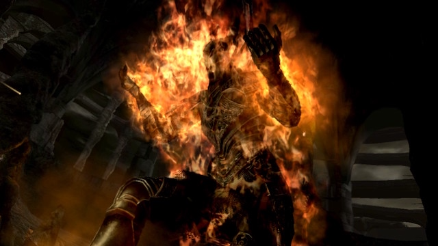
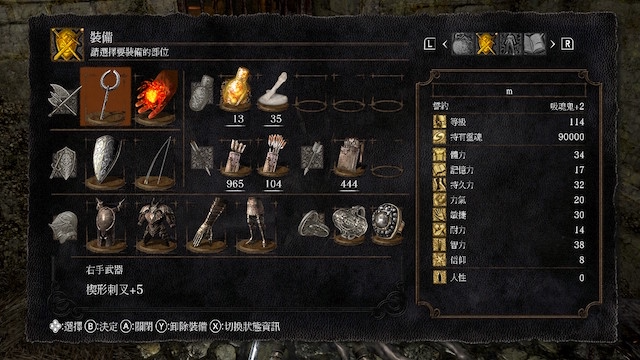

## 前情提要：

2022 最受大家期待的遊戲，當然就是黑暗靈魂的最新開放世界最新作。 [「艾爾登法環」（戲稱：艾爾登大人）](https://eldenring.bn-ent.net/tc/) 這一塊遊戲我也是第一時間就入坑（由於股癌的業配原因），買回來後當然也是相當的瘋狂的玩。短短時間我記得我已經玩了接近 80 個小時（進度慢慢打到王城）。

然後就在這個時候，因為實在很難晚上搶到電視。想說在 NS 上面也能玩一下類似[「艾爾登法環」](https://eldenring.bn-ent.net/tc/) 的遊戲，就想到了我之前好像有在特價的時候把「黑暗靈魂 - 重製版」買下來，但是一下就棄坑了。 想說也用法師來重新開局黑暗靈魂看看，這一次會不會玩得比較好。 結果玩著玩著，艾爾登法環反而被我棄坑了。 我就想說專心一點把黑暗靈魂先全破，也終於在今天全破了。  這一篇只是單純把我還記得的一些東西記錄起來，也把一些我覺得很重要的偷吃步記下來。 我是沒有任何錄影啦～ 不過網路上有很多影片可以看了。

## 新手玩家的建議

- 建議要法師開局，搭配萬能鑰匙。 你的人生會好很多。
- 升等及記得先提升「持久力」跟「體力」，能活多久就看你能滾幾次，多挨個一刀。
- 弓箭很重要，弓箭很重要，弓箭很重要。 能遠遠用弓箭射死的，絕對不要想說近戰。
- 中後半段很重要： 記得可以斷尾的魔王，一定要斷尾。武器都超好用的。
- 更多可以看 [【心得】給剛入手黑魂re的新手們一些初期開局的建議](https://forum.gamer.com.tw/C.php?bsn=16775&snA=28750)
- 流程可以參考 [黑暗靈魂Remastered 攻略順序推薦及要點](https://www.entertainment14.net/blog/post/110950735-%E9%BB%91%E6%9A%97%E9%9D%88%E9%AD%82remastered-%E6%94%BB%E7%95%A5%E9%A0%86%E5%BA%8F%E6%8E%A8%E8%96%A6%E5%8F%8A%E8%A6%81%E9%BB%9E) 。不要學我一開始跑去地下墓地，結果困在那邊只能重玩。

## 遊戲相關重點(死很大的點)

(全破的畫面截圖，我實在不喜歡實況跟紀錄)

### 羊頭惡魔 - 遠遠的火焰壺偷襲

<iframe width="560" height="315" src="https://www.youtube.com/embed/Fbc5usUzQe8" title="YouTube video player" frameborder="0" allow="accelerometer; autoplay; clipboard-write; encrypted-media; gyroscope; picture-in-picture" allowfullscreen></iframe>

就是傳說中，真正魔王是兩隻狗。 那個羊頭惡魔只是個幌子而已。 狹小的空間加上兩隻狗一直打，基本上就是被咬好玩的。 找了影片，透過這個影片教學遠遠丟，我至少先殺死一隻狗，也讓我過了。這也卡了一兩個小時。

### 打到夾縫森林得時候 - 記得拿最強盔甲 - 哈維爾套裝

<iframe width="560" height="315" src="https://www.youtube.com/embed/sFgsTq9Asu0" title="YouTube video player" frameborder="0" allow="accelerometer; autoplay; clipboard-write; encrypted-media; gyroscope; picture-in-picture" allowfullscreen></iframe>

哈維爾套裝很重要，雖然重到不行，但是可以確保你多被打幾下。很多王我都是拿這個碾過去的。

### 王城雙弓

<iframe width="560" height="315" src="https://www.youtube.com/embed/Qnd70ChyXjw" title="YouTube video player" frameborder="0" allow="accelerometer; autoplay; clipboard-write; encrypted-media; gyroscope; picture-in-picture" allowfullscreen></iframe>

大部分會以為王城雙王很難，其實比較難得是王城雙弓。 我大概卡了三個多小時吧，每次都跑很久然後被射下去。

[《黑暗之魂重製版》王城雙銀大弓簡單通過視頻教學 - 遊戲百科 ...](https://www.gamewikia.com/guide/104600)

[RE:【問題】王城的黑騎士弓手要怎麼打阿 - 哈啦區](https://forum.gamer.com.tw/C.php?bsn=16775&snA=4813)

[王城双弓详细打法攻略- 黑暗之魂Dark Souls - 豆瓣](https://m.douban.com/game/review/8395916/)

### 深淵之王 - 無恥射死他

<iframe width="560" height="315" src="https://www.youtube.com/embed/Gu4D9CLtVZY" title="YouTube video player" frameborder="0" allow="accelerometer; autoplay; clipboard-write; encrypted-media; gyroscope; picture-in-picture" allowfullscreen></iframe>

### 黑龍斷尾 - 不難打死～但是超難斷尾的。 

<iframe width="560" height="315" src="https://www.youtube.com/embed/xwZI8enVYVc" title="YouTube video player" frameborder="0" allow="accelerometer; autoplay; clipboard-write; encrypted-media; gyroscope; picture-in-picture" allowfullscreen></iframe>

認真打他的話大概三場可以打死，但是斷尾打了好幾個小時。不過黑龍大劍超強的物理攻擊力加上低需求，一定要來一把。

### 不會盾反怎麼辦 - 葛溫還是可以全破

<iframe width="560" height="315" src="https://www.youtube.com/embed/9NZXscUVSBA" title="YouTube video player" frameborder="0" allow="accelerometer; autoplay; clipboard-write; encrypted-media; gyroscope; picture-in-picture" allowfullscreen></iframe>

盾反一直抓不到時機點，最後還是參考這個影片。不過這個影片技巧要求也不低，主要是因為葛溫的招式都是連續，完全沒有機會讓你有足夠精力的時間。 最後我用黑騎士套裝（ CP 最好） 加上契形刺叉的消耗氣力最低，才打贏（大概也打了三個多小時），每天沒事就拿起來鍊手一下。

## 心得：

打完黑暗靈魂，終於有一種「原來我也是會玩魂系列的玩家呢！」的成就感。幾件事情分享：

- 絕對要查攻略，病村人家說難到不行。我也是一開始就去打王，然後就不理他。 等到裝配夠強後面再來拿寶物。
- 打不過的王一定要查，絕對有很多簡單打法。不論是拿最強盔甲來硬扛，還是遠遠射死他。
- 打不過絕對不要氣餒，過兩天手頭順了就打很快。

## 參考攻略

- [《黑暗之魂》图文攻略 黑暗之魂新手详尽图文攻略](https://www.gamersky.com/handbook/201610/817758_13.shtml)
- [黑暗靈魂Remastered 攻略順序推薦及要點](https://www.entertainment14.net/blog/post/110950735-%E9%BB%91%E6%9A%97%E9%9D%88%E9%AD%82remastered-%E6%94%BB%E7%95%A5%E9%A0%86%E5%BA%8F%E6%8E%A8%E8%96%A6%E5%8F%8A%E8%A6%81%E9%BB%9E)
- [黑暗靈魂 - 【攻略】黑暗知識與疑問 11/6更新](https://forum.gamer.com.tw/C.php?bsn=16775&snA=4530)
- [【心得】給剛入手黑魂re的新手們一些初期開局的建議](https://forum.gamer.com.tw/C.php?bsn=16775&snA=28750)
