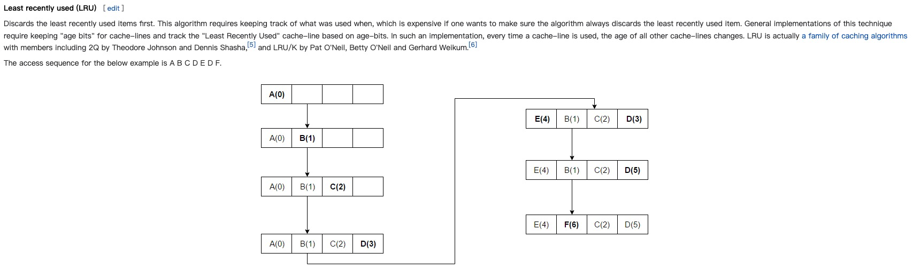
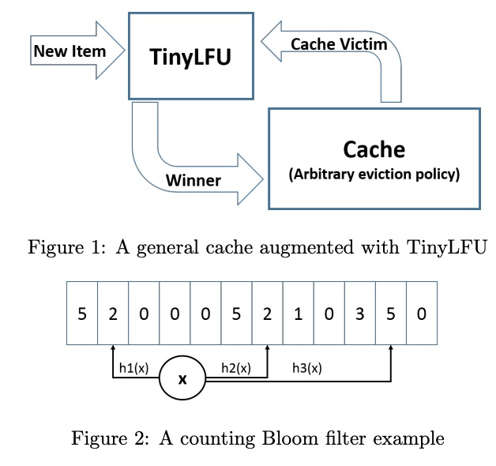

# 以前的問題 


不論是記憶體或是任何資料儲存體（或是大家常用的 Redis），都會使用 Cache 來存放短期會反覆使用到的資料。 因為 cache 具有讀取快速，但是容量相對小（且價格較貴）。所以無法將在 Physical memory 的資料全部存上，這時候就是需要有 Cache Replacement Policy (也就是「快取的取代策略」)

一般來說的做法有以下幾種：

- **FIFO (First-In First-Out):** 透過先進先出的方式，往往這樣容易有相當大的功耗在於資料不斷的換進來與換出去。
- **LRU(Least Recently Used)**: 取代資料的時候，會去選擇近來最久的。   (RecentlyUsed --)
- **LFU(Least Frequency Used):** 取代資料的時候，選擇最少被讀取到的。 (Read Count ++)

那麼這些聽起來好像都沒有問題，為什麼會需要有 **TinyLFU** ?

## 以前演算法有什麼問題。？

## LRU 有什麼問題? 
LRU(Least Recently Used)：最近最久未使用。

它是優先淘汰掉最久未訪問到的數據。缺點是不能很好地應對偶然的突發流量。比如一個數據在一分鐘內的前59秒訪問很多次，而在最後1秒沒有訪問，但是有一批冷門數據在最後一秒進入緩存，那麼熱點數據就會被沖刷掉。

## LFU 有什麼問題？

LFU(Least Frequently Used)：

最近最少頻率使用。它是優先淘汰掉最不經常使用的數據，需要維護一個表示使用頻率的字段。

- **操作 LFU 時間複查度是**： $$O(log(n))$$
- 由於取代方案取代方式是挑選短期（取決 cache 大小），來挑選最長使用的。 但是可能發生一個狀況是，如果某份資料短期不常使用，但是長期來說他頻率確是最高的。反而這個狀況會造成沒有效率。

主要有兩個缺點：

一、如果訪問頻率比較高的話，頻率字段會占據一定的空間；

二、無法合理更新新上的熱點數據，比如某個歌手的老歌播放歷史較多，新出的歌如果和老歌一起排序的話，就永無出頭之日。


那要如何解決這些問題呢？

# 什麼是 TinyLFU ? 是做什麼用？



TinyLFU 解決 LRU 和LFU上述的缺點。W-TinyLFU 算法由論文《TinyLFU: A Highly Efficient Cache Admission Policy》提出。

它主要做兩件事：

一、採用 Count–Min Sketch 算法降低頻率信息帶來的空間耗損；

二、維護一個PK機制保障新上的熱點數據能夠緩存。

Count–Min Sketch 算法類似 Bloom filter 思想，對於頻率統計我們其實不需要一個精確值。存儲數據時，對key進行多次 hash 函數運算後，二維數組不同位置存儲頻率（Caffeine 實際實現的時候是用一維 long 型數組，每個 long 型數字切分成16份，每份4bit，默認15次為最高訪問頻率，每個key實際 hash 瞭四次，落在不同 long 型數字的16份中某個位置）。讀取某個key的訪問次數時，會比較所有位置上的頻率值，取最小值返回。對於所有key的訪問頻率之和有個最大值，當達到最大值時，會進行reset即對各個緩存key的頻率除以2。

TinyLFU藉助了數據流Sketching技術，它可以用小得多的空間存放頻次信息。TinyLFU採用了一種基於滑動窗口的 `時間衰減設計機制` ，藉助於一種簡易的 reset 操作：每次添加一條記錄到Sketch的時候，都會給一個計數器上加 1，當計數器達到一個尺寸 W 的時候，把所有記錄的 Sketch 數值都除以 2，該 reset 操作可以起到衰減的作用 。


## Sample Code

https://github.com/dgryski/go-tinylfu

這邊稍微列出相關程式碼： 

[https://github.com/dgryski/go-tinylfu/blob/fba88f4a7f91124e5cc36723834506b20b5bae80/tinylfu.go](https://github.com/dgryski/go-tinylfu/blob/fba88f4a7f91124e5cc36723834506b20b5bae80/tinylfu.go)


## Paper: [https://arxiv.org/abs/1512.00727](https://arxiv.org/abs/1512.00727)

```
TinyLFU: A Highly Efficient Cache Admission Policy

Gil Einziger, Roy Friedman, Ben Manes

This paper proposes to use a frequency based cache admission policy in order to boost the effectiveness of caches subject to skewed access distributions. Given a newly accessed item and an eviction candidate from the cache, our scheme decides, based on the recent access history, whether it is worth admitting the new item into the cache at the expense of the eviction candidate.
Realizing this concept is enabled through a novel approximate LFU structure called TinyLFU, which maintains an approximate representation of the access frequency of a large sample of recently accessed items. TinyLFU is very compact and light-weight as it builds upon Bloom filter theory.
We study the properties of TinyLFU through simulations of both synthetic workloads as well as multiple real traces from several sources. These simulations demonstrate the performance boost obtained by enhancing various replacement policies with the TinyLFU eviction policy. Also, a new combined replacement and eviction policy scheme nicknamed W-TinyLFU is presented. W-TinyLFU is demonstrated to obtain equal or better hit-ratios than other state of the art replacement policies on these traces. It is the only scheme to obtain such good results on all traces.
```


# Redis 有哪一些 Cache Replacement Policy ?

參考： [93面試常問：Redis 記憶體滿了怎麼辦？](https://iter01.com/557774.html)

實際上Redis定義了幾種策略用來處理這種情況：

- **noeviction(預設策略)**：對於寫請求不再提供服務，直接返回錯誤（DEL請求和部分特殊請求除外）
- **allkeys-lru**：從所有key中使用LRU演算法進行淘汰
- **volatile-lru**：從設定了過期時間的key中使用LRU演算法進行淘汰
- **allkeys-random**：從所有key中隨機淘汰資料
- **volatile-random**：從設定了過期時間的key中隨機淘汰
- **volatile-ttl**：在設定了過期時間的key中，根據key的過期時間進行淘汰，越早過期的越優先被淘汰


# Reference

- [LRU and LFU Cache Algorithms](https://xuri.me/2016/08/13/lru-and-lfu-cache-algorithms.html)

- [W-TinyLFU论文阅读与原理分析​](https://www.modb.pro/db/218970)

- [阅读 redis 源码，学习缓存淘汰算法 W-TinyLFU](https://mytechshares.com/2021/11/07/redis-known-lru-wtinylfu/)

- [[论文《TinyLFU: A Highly Ecient Cache Admission Policy》阅读笔记](https://segmentfault.com/a/1190000016091569)](https://segmentfault.com/a/1190000016091569)

-  [93面試常問：Redis 記憶體滿了怎麼辦？](https://iter01.com/557774.html)

- [dgryski](https://github.com/dgryski)/**[go-tinylfu](https://github.com/dgryski/go-tinylfu)**
