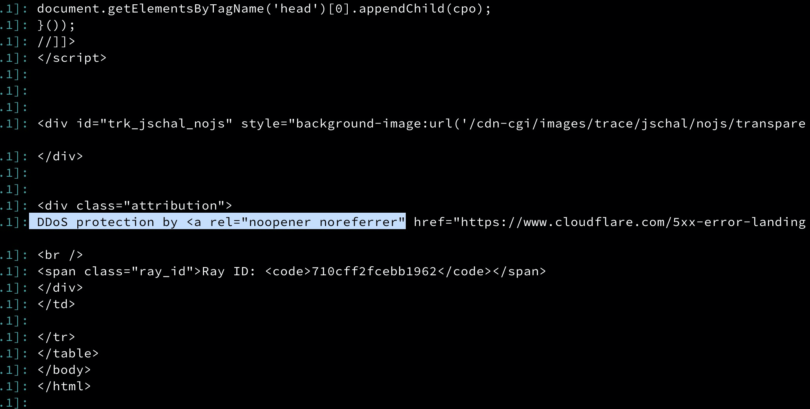

## 爬蟲出問題

原本有弄一個 [PTT 爬蟲](https://github.com/kkdai/linebot-ptt-beauty)來爬一些資料，最近發現好像沒有資料可以看到。 一下去查就發現，好像有個 CloudFlare 擋在前面。

## 錯誤訊息

```
2022-05-25T08:45:46.856731+00:00 app[web.1]: <div class="attribution">
2022-05-25T08:45:46.856731+00:00 app[web.1]: DDoS protection by <a rel="noopener noreferrer" href="https://www.cloudflare.com/5xx-error-landing/" target="_blank">Cloudflare</a>
2022-05-25T08:45:46.856731+00:00 app[web.1]: <br />
2022-05-25T08:45:46.856731+00:00 app[web.1]: <span class="ray_id">Ray ID: <code>710cff2fcebb1962</code></span>
```


只好先放著，有空再來查查看怎麼辦。 有找到一些文章先放著。

## 相關連結

- [kkdai](https://github.com/kkdai)/**[linebot-ptt-beauty](https://github.com/kkdai/linebot-ptt-beauty)**
- [How can I get html from page with cloudflare ddos portection?](https://stackoverflow.com/questions/32425973/how-can-i-get-html-from-page-with-cloudflare-ddos-portection)
- [Understanding Cloudflare DDoS protection](https://support.cloudflare.com/hc/en-us/articles/200172676-Understanding-Cloudflare-DDoS-protection)
- [How to customize your HTTP DDoS protection settings](https://blog.cloudflare.com/http-ddos-managed-rules/)
