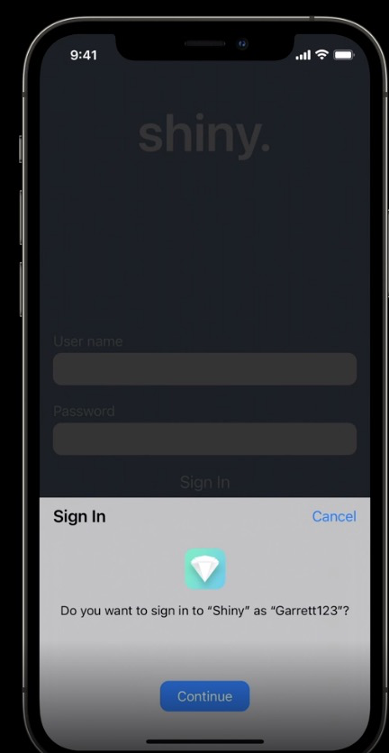
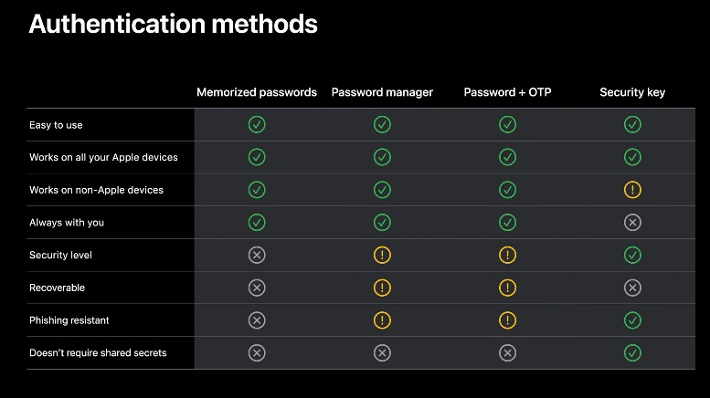
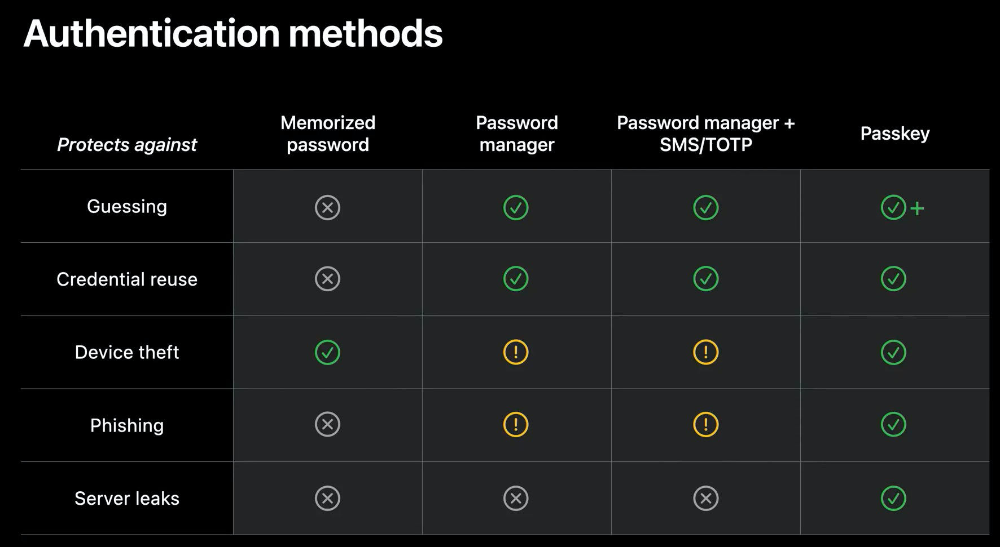
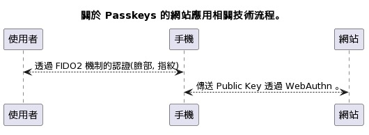
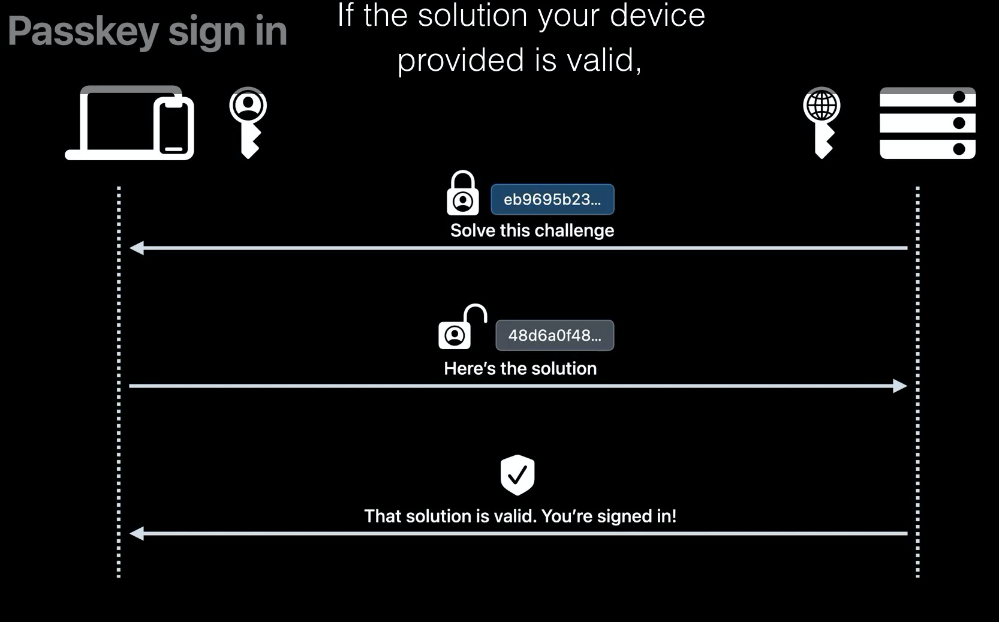
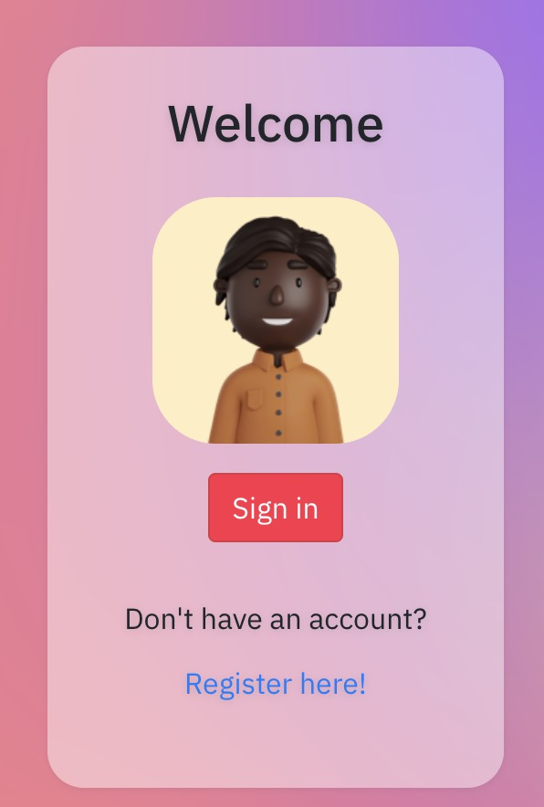

# 前情提要:

[WWDC22](https://developer.apple.com/videos/wwdc2022/) 雖然說是 Apple 的開發者大會，但是當天在看 Keynote 的時候，這個 [Passkeys](https://developer.apple.com/documentation/authenticationservices/public-private_key_authentication/supporting_passkeys) 的功能卻讓我相當的驚喜。 於是等到整個細節的議程[ Meet passkeys 的議程 ](https://developer.apple.com/videos/play/wwdc2022/10092/)，整個議程帶來許多新的想法。於是認真的的研究一下，原來 Apple 在 WWDC 21 就已經開發出來 Passkey 的相關流程跟開發方式（參考 [WWDC21 議程: Move beyond passwords](https://developer.apple.com/videos/play/wwdc2021/10106/))。但是到了 iOS16 才有原生支援在手機與 iOS App 端。

# 認證 (Authentication) 的方式到底有幾種？

Passkey 是一個溝通協定，可以比起舊的 Password 機制來說更佳的安全。現在的認證有以下幾種:

- **Memorized passwords:**
  - 就是輸入 ID, PW 的方式。然後用人力來記錄。非常危險，因為經常怕忘記而全部使用同一個。
- **Password manager:**
  - 舉凡 Apple/Chome AutoFill 都算是，這時候你可能不需要紀錄密碼（甚至會幫你產生一組密碼）。但是困擾點就是很難跨系統，甚至只是跨 browser 使用。
- **Security Key:**
  - 很多市售的 USB Security Key (也可以用其他傳輸方式)，可以直接透過 Security Key 登入一些網站。

以上幾種的相關安全度，可以看一下 WWDC 提出的整理。

(From:[WWDC21 議程: Move beyond passwords](https://developer.apple.com/videos/play/wwdc2021/10106/) )

(from [WWDC22 Session: Meet passkeys](https://developer.apple.com/videos/play/wwdc2022/10092/))

# 什麼是 Passkeys ? 

## **Passkey:**

- 最新提出的 Passkey 則是透跟 WebAuthn 與 FIDO2 的認證方式。

(Edit on [PlantText](https://www.planttext.com/?text=SoWkIImgAStDuU8goIp9ILLuENtEisbx508IYukpKokB5PxFQdc-RTFprJEVjNS-dxBY-UmT81LT3IyMJdwsjV7vYkx73KrSN4_sxWTAlcXeLR3HrRLJUDRP_MpbV2k5bmtzBnlx5DmyNVoD580YJpks0SrxiQhtnTfEZHVjdI-RL-WeFEjfVxwbMvCBeWbY0CHAAuMdJPjVDZGg19GcvMGcAtYdLiAC34zDSYmjoSXJ05lla9gN0lG30000))

這只是一個簡單的技術整理圖， Passkeys 透過了 FIDO2 與 WebAuthn 的方式來整合。並且因為在 iOS 整個生態系統上有了更多的應用。

- 原生支援在 iOS16 App 跟 Safari  （iOS15 的 Safari 就可以，只是 App 端還不支援)
- 可以使用 iCloud 備份（這邊[也是很多開發者說](https://blog.hypr.com/what-apples-wwdc-passkeys-announcement-means-for-enterprise-iam)，唯一不安全點）
- 可以把 Passkeys 分享給其他信任的人。

整個流程如上：

- Server 會透過 Public Key 去加密一段資料。
- 透過手機端上（或是瀏覽器）上的 Private Key 解開後回傳資料。
- 認證過後，確認資料是正確的。

# 身為後端開發者，你該怎麼應用?

要導入 Passkeys 須要導入以下相關流程:

- FIDO2 套件
- 透過 WebAuthn 開發伺服器相關套件

聽起來有點麻煩，不過有看到有一家公司 [HANKO](https://www.hanko.io/) 有相關的 SaaS API 服務（免費應該很夠用），可以參考 [Passkeys for web authentication](https://www.hanko.io/blog/passkeys-part-1) 這篇文章，裡面也有一個 Open Source 套件可以用。

### Golang 上開發 WebAuthn 與 Passkey

[https://github.com/teamhanko/apple-wwdc21-webauthn-example](https://github.com/teamhanko/apple-wwdc21-webauthn-example)

他也有給出[範例網站](https://apple-passkey.demo.hanko.io/)，如果你想直接玩的話。

(link: [https://apple-passkey.demo.hanko.io/]( https://apple-passkey.demo.hanko.io/))

有點想把它改成其他版本，好像也沒有完整一整套整理的流程。 其實就流程上，真的還有一點麻煩。 除了要存使用者名稱外，還要把 Public Key 存起來備用。 雖然使用者相當簡單，但是後端開發者其實要用的東西還真不少。 目前  [HANKO](https://www.hanko.io/)  提供的 WebAuthn 整合方案看起來還蠻方便的。 也有一個 [https://github.com/duo-labs/webauthn](https://github.com/duo-labs/webauthn)  (https://webauthn.io/) 的 WebAuthn 套件，也都完整有支援。需要的人可以玩玩看。

# 結語：

Passkey 是去年 WWDC 就提出的 Passwordless 的解決方案，不僅僅可以把密碼交易金鑰產生放在手機上，更可以讓登入變成簡單而快速。 開啟了未來網站與服務新的認證方式，但是整個開發流程在伺服器端還是相當的繁瑣，許多各大網站的 OpenID 也沒有支援。 如果未來能支援的網站越來越多，相信真正 Passwordless 的日子就會來臨。

這幾個範例，這次先不提開發的部分。 我來玩個幾天弄個快速部署版本給大家吧！

# Reference

-  [Apple Doc: Supporting Passkeys](https://developer.apple.com/documentation/authenticationservices/public-private_key_authentication/supporting_passkeys)
-  [WWDC22 Session: Meet passkeys](https://developer.apple.com/videos/play/wwdc2022/10092/)
-   [WWDC21 議程: Move beyond passwords](https://developer.apple.com/videos/play/wwdc2021/10106/)
-  [FIDO2: Web Authentication (WebAuthn)](https://fidoalliance.org/fido2-2/fido2-web-authentication-webauthn/)
-  [Passkeys for web authentication](https://www.hanko.io/blog/passkeys-part-1)
-  [What Apple's WWDC Passkeys Announcement Means for Enterprise IAM](https://blog.hypr.com/what-apples-wwdc-passkeys-announcement-means-for-enterprise-iam)
-  [https://github.com/duo-labs/webauthn](https://github.com/duo-labs/webauthn)
- [WebAuthn.io: A demo of the WebAuthn specification](https://webauthn.io/)

