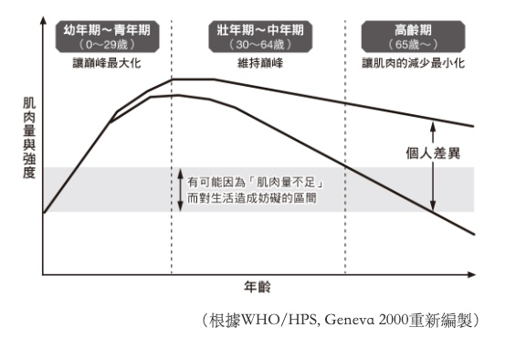
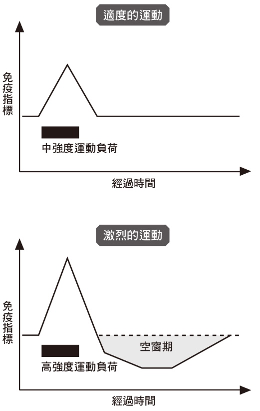

<div><a href="http://moo.im/a/57jnIX" title="想死不如健身！改變一生的超科學理由"></a></div>


```
想死不如健身！改變一生的超科學理由 破除99％肌力訓練迷思、疑慮的終極動力手冊
超 筋トレが最強のソリューションである 筋肉が人生を変える超・科学的な理由
作者： 泰史特龍  久保孝史  譯者： 劉格安 
```

#### 買書推薦網址：

- [Readmoo 線上書籍購買](http://moo.im/a/57jnIX)

# 前言:

這一本是今年所讀完的第十二本書。這一本書名就有打到我，主要也是買來鼓勵自己來健身。並且裡面也有提到一些關於健身的觀念與心態的改善。 比起減肥來說，其實健身更難。 因為減肥只要少吃多動就好，但是健身更難。 除了需要持續的重量訓練外，其實吃的，喝的，甚至是訓練部位的課程表都很重要。

最近疫情還很嚴重，也希望疫情狀況好一點後可以去健身房鍛鍊自己。

# 內容簡介:

```
最後一次下定決心！
號召114萬追蹤者／日本狂銷13萬冊／幫助無數人「化想法為動能」
★本世紀最神奇的力量，60天就能看見效果★

　　必須「馬上開始」的科學實證 ╳ 絕處逢生的6個漫畫實錄
　　「幸好加入健身房之前，我就看了這本書。」
　　「沒辦法一次看完……翻到一半只想衝去流汗。」
　　「身為教練，我發現用這本書激勵學員比什麼都有效。」

　　健身，究竟有什麼足以「改變人生」魔力？
　　根據研究，光是自己在家訓練，就算完全沒有成果，居然也能讓人提高自我評價、穩定情緒，讓生活與工作都充滿幹勁。
　　而且不論有沒有經驗、年長或年輕，只要「開始」運動，各種疾病的死亡率都會大幅下降，還能提升記憶力，是市面上條件最優的投資與保險。

　　這是科學！找到人生方向、解決99％人生問題
　　►研究證實：光是多吃蛋白質，每年就能多瘦5公斤
　　►怕身體變僵硬？肌力訓練能增加身體柔軟度
　　►沒有外表，誰要看你的內涵？用肌肉建立魅力循環
　　►健身是最強保險，能降低所有疾病的死亡率超過兩成
　　►消除憂慮→中強度訓練；提升睡眠品質→高強度訓練
　　►就算60歲才開始練，肌肉也能十週內增加7～8％
　　►想降體脂肪，你沒有比「肌力訓練＋有氧運動」更好的選擇
　　►沒空更要做！歐巴馬每週運動6天，因為肌肉讓腦袋更有效率

　　打造線條．心理健康．抗老化．高效工作力．預防受傷．魅力提升
　　購物、抽菸和喝酒都會讓人上癮，健身也會，但健身只會帶來美妙的東西，例如睪固酮、血清素、多巴胺、腦內啡，並且留下讓人幸福的改變。
```

# 章節條列	

```
第1章 　為什麼「想死不如健身」是真理
第2章 　健身是最強的抗老化之道
第3章 　想要人見人愛就只能健身
第4章 　為什麼工作表現優異的人都在健身？
第5章 　減肥的人更應該健身的真正理由
第6章 想長命百歲的話，請開始健身
第6章 想長命百歲的話，請開始健身
第7章 　破除健身的誤解與偏見
第8章 　沒有自信的人就健身吧
```

### 想殺死自己，不如來健身

許多時候，當你有沮喪與情緒不好的時候（甚至覺得自己有憂鬱）。這時後期時很建議來健身。 因為許多研究都指出，健身可以對於心理層面產生的「焦躁感」「不安感」「睡眠品質」低落。 可以透過健身來減少這些狀況：

### 睪固酮

- 維護骨骼與肌肉強度
- 預防動脈硬化或是代謝症候群
- 提升動力或是競爭心

### 血清素

- 安撫，穩定心情
- 讓頭部處於最佳清醒狀況
- 抑制疼痛

2010 年的研究也有表明「健身可以有助於治療失眠的狀況」（尤其是大重量帶來的效果更好）。而在運動科學與心理學相關的論文中「肌力訓練能維持或提升自尊心」是有獲得證實的。

### 年紀越大，健身越重要



高齡化隨著肌肉逐漸萎縮，健身變得更重要。 每個人的個人差異就在於健身與養身習慣。

```
2016 年的實驗表示，即便是 60 歲的人，只要有重量訓練，十週內還是可以增加 7~8% 肌肉量。
```

## 重訓可以讓你職場無往不利

### 肌肉男通常有高評價:

- 自制力強
- 時間管理高
- 了解營養學
- 身體強壯，可以高強度專注
- 抗壓性夠高

### 越忙碌的人越會健身

- 歐巴馬每週六天有四十五分鐘的健身（包括肌力訓練跟有氧運動）
- 晨型人往往都是公司高層
- 達成業績跟臥推 140 公斤的流程，從本質來說是一樣的。
- 高階經理人往往一週運動時間是 800 分鐘（平均每天 2 小時，一週七天）


## 長命百歲跟重訓

- 2008 年的調查，肌力水準較高的人比起較低的人死亡率減少 20~30%。
- 肌力訓練可以預防葡萄糖運輸蛋白糖分吸收所造成的第二型糖尿病
- BMO 每上升 5 ，死亡率提升 10%

### 健身的錯誤概念

- 練出礙事的肌肉，比你想像中的難。（不要怕全身肌肉不好看，其實你還離很遠）
- 健身會讓整體柔軟度變高
- 健身跟速度相反其實是錯誤的
- 高強度健身運動的人，容易感冒嗎？ --> 沒錯，高強度運動會造成免疫指標空窗期，身體要小心。
  
- 健身的人還是會長高


# 心得

這是一本很激勵人心的書籍，除了有許多淺顯易懂的文字之外，更有許多有趣的短篇漫畫，可以讓你閱讀完之後更激勵努力健身的動機。 健身的重要每個人都知道，但是往往有許多奇怪的藉口與理由推延。這一本書也針對了這些訪間常討論到的一些錯誤觀念，透過相關數據一一解除。 

健身真的是人生重要的課題，對於你的健康跟人生的目標有許多重要的關係。更可以讓你求職與就業上有許多幫助，千萬不要因此而輕視他。
