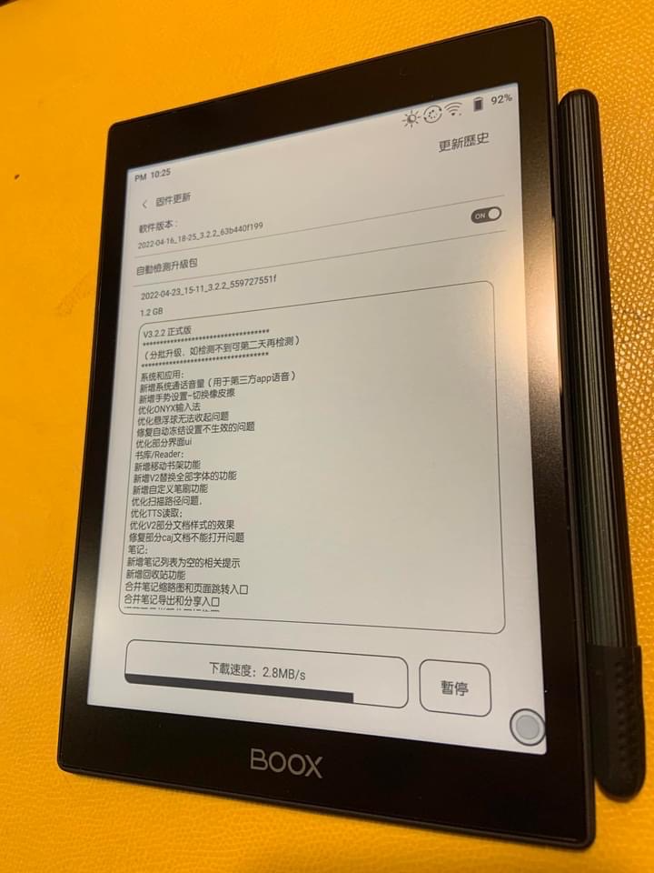
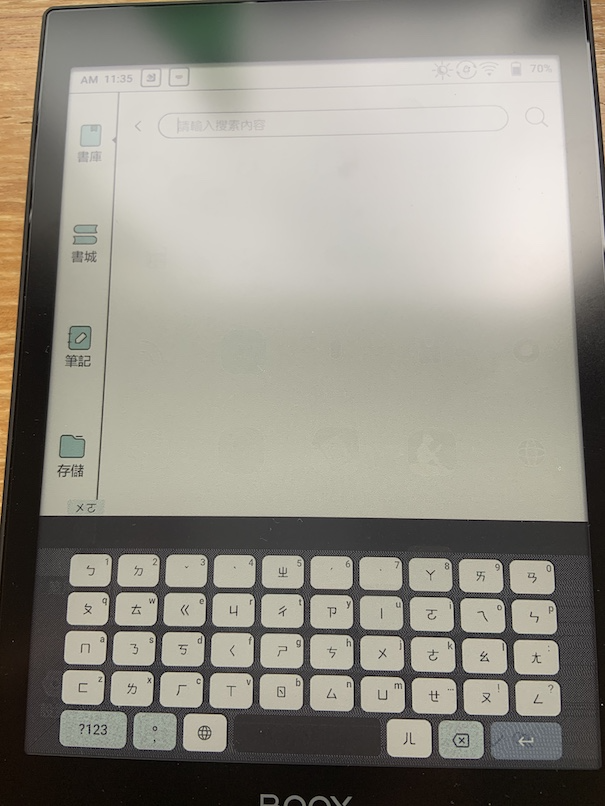

# 前情提要:

一直以來我一直都有許多台（？）電子閱讀器，其實因為要看的書散落在許多地方。 所以得都買回來，但是仔細的想想，是否可以買一個電子閱讀器可以替代所有閱讀器。大致上要求如下：

- 可以看 Readmoo
- 可以看 Kindle 
- 可以看 HyRead
- 可以看 Kobo (plus)
- 可以看漫畫 (plus)

然後看到這一台: [BOOX Nova Air C](https://www.bearboss.com/SalePage/index/7685258) 的相關評論，後來就決定要買回來 (2022/06/16) 好好研究一下。  這邊碎念一下，如果會怕直接去京東買的話，可以買台灣代理商比較有保險的感覺。

而今天 07/17 也過了一個月，來寫一下幾個心得想法跟可能會發生的問題。

# 發生的問題解決:

講心得之前，先來寫幾個遇到的問題。

## 輸入法 - Gboard 看不到選字

應該蠻多人（可能第一個 Android Device 使用者) 都會跟我一樣的問題，因為開啟 Android Device 的時候都會安裝中文輸入的 Gboard 。 但是在電子紙上面，一安裝就會出現選字都看不到，所以這裡建議要去修改背景顏色。

# 用後一個月的心得：

- Readmoo 跟 漫畫人使用起來超讚～沒有任何需要銜接的地方。其中 Readmoo (讀墨) App 也可以做到關機，重啟後馬上繼續看書。
- 買了官方保護套，還有上下頁實體按鍵可以使用，切換頁數變得更方便。
- 速度整個很快，手寫效果也不錯。
- 我已經賣掉我的 Mooink C ，至於 Kindle Paperwhite 就看有緣人吧，不是很急著賣他。

# Reference

-  [比全是漫畫更實用的漫畫 APP！讓您的平板電腦變成專屬漫畫閱讀器 Tachiyomi 使用教學](https://mobileai.net/2021/09/13/tachiyomi/)
-  [[TIL\][Kindle] Kindle Paperwhite 充電無法作用（充不進去）怎麼辦？](https://www.evanlin.com/til-Kindle-cannot-charge/)
