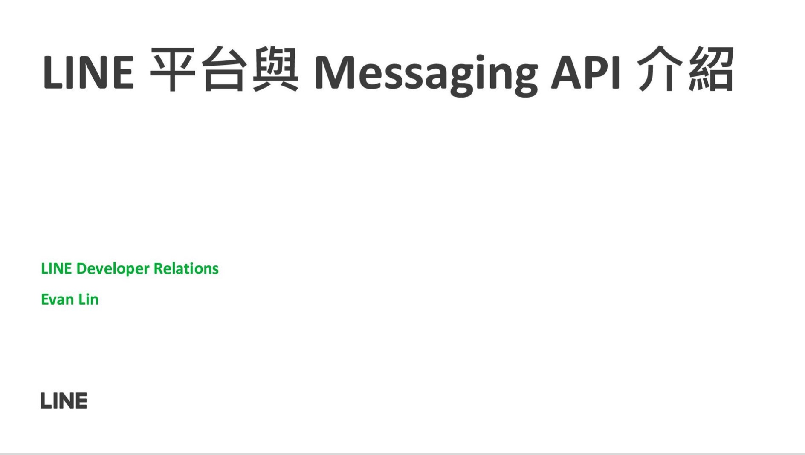

# 前言

大家好，我是 LINE Taiwan Developer Relations 團隊的資深開發技術推廣工程師 - Evan Lin 。主要的工作項目就是平台技術推廣與技術品牌的建立與溝通。 這一次跟大家來分享 LINE 的平台介紹，並且介紹關於 Messaging API 開發上的相關細節。 本次的介紹將會有以下的部分：

- 基礎的 LINE 平台介紹
- 2022 所開放的新功能簡介
- 相關的學習資源

而本篇文章將會專注在 2022 的相關新功能與學習資源，希望能讓所有讀者能夠更了解關於 2022 的相關新功能介紹。

## 投影片

<iframe class="speakerdeck-iframe" frameborder="0" src="https://speakerdeck.com/player/03a90c9b72924b0a806731066338249f" title="2022 新星挑戰賽-LINE 平台與 Messaging API 介紹" allowfullscreen="true" mozallowfullscreen="true" webkitallowfullscreen="true" style="border: 0px; background: padding-box padding-box rgba(0, 0, 0, 0.1); margin: 0px; padding: 0px; border-radius: 6px; box-shadow: rgba(0, 0, 0, 0.2) 0px 5px 40px; width: 560px; height: 314px;" data-ratio="1.78343949044586"></iframe>

**教學影片：**

<iframe width="560" height="315" src="https://www.youtube.com/embed/jz82rScXIRA" title="YouTube video player" frameborder="0" allow="accelerometer; autoplay; clipboard-write; encrypted-media; gyroscope; picture-in-picture" allowfullscreen></iframe>

# LINE 平台的介紹跟相關整理：

希望大家可以參考以前相關的相關學習文章。

1. [關於LINE Bot](https://engineering.linecorp.com/zh-hant/blog/line-bot-guideline-1/)
2. [使用Webhook URL接收請求時的注意事項](https://engineering.linecorp.com/zh-hant/blog/line-bot-guideline-2/)
3. [發送 API 請求時的注意事項](https://engineering.linecorp.com/zh-hant/blog/line-bot-guideline-3/)
4. [LINE Login ](https://engineering.linecorp.com/zh-hant/blog/line-bot-guideline-4/)
5. [LINE Login (補充)](https://engineering.linecorp.com/zh-hant/blog/line-bot-guideline-5/)
6. [其他相關功能](https://engineering.linecorp.com/zh-hant/blog/line-bot-guideline-6/)

# 2022 的新功能整理

## 2022/02/02 Rich Menu Playground 

<iframe class="speakerdeck-iframe" frameborder="0" src="https://speakerdeck.com/player/03a90c9b72924b0a806731066338249f?slide=47" title="2022 新星挑戰賽-LINE 平台與 Messaging API 介紹" allowfullscreen="true" mozallowfullscreen="true" webkitallowfullscreen="true" style="border: 0px; background: padding-box padding-box rgba(0, 0, 0, 0.1); margin: 0px; padding: 0px; border-radius: 6px; box-shadow: rgba(0, 0, 0, 0.2) 0px 5px 40px; width: 560px; height: 314px;" data-ratio="1.78343949044586"></iframe>

在 2022/02/02 有開放一個 [Rich Menu Playground is now available](https://developers.line.biz/en/news/2022/02/02/rich-menu-playground/) 的文章，可以過投影片裡面的 QR Code （或是[這個連結](https://liff.line.me/1645278921-kWRPP32q/?accountId=try_richmenu))來加入一個官方帳號。透過這個[官方帳號](https://liff.line.me/1645278921-kWRPP32q/?accountId=try_richmenu)，你可以測試一些 RichMenu 的相關功能，不論是：

- 透過 RichMenu 來挑選時間的 - [datetime picker action](https://developers.line.biz/en/reference/messaging-api/#datetime-picker-action)
- 快速切換 RichMenu 的 -  [rich menu aliases](https://developers.line.biz/en/docs/messaging-api/using-rich-menus/#switching-between-multiple-rich-menus)

## 2022/04/19 Webhook Redelivery 

<iframe class="speakerdeck-iframe" frameborder="0" src="https://speakerdeck.com/player/03a90c9b72924b0a806731066338249f?slide=48" title="2022 新星挑戰賽-LINE 平台與 Messaging API 介紹" allowfullscreen="true" mozallowfullscreen="true" webkitallowfullscreen="true" style="border: 0px; background: padding-box padding-box rgba(0, 0, 0, 0.1); margin: 0px; padding: 0px; border-radius: 6px; box-shadow: rgba(0, 0, 0, 0.2) 0px 5px 40px; width: 560px; height: 314px;" data-ratio="1.78343949044586"></iframe>

開發者常常詢問到如果在自己開發的 LINE Bot 伺服器發生問題的時候，是否有辦法可以讓 LINE 平台在發送一次訊息呢？ 這時候 [In the Messaging API, a feature to redeliver webhooks that fail to be received has been added](https://developers.line.biz/en/news/2022/04/19/webhook-redelivery/) 所公布的 Webhook Redelivery 就是一跟相當時用的設定。 透過在 LINE Developer Console 的設定，你就可以完成以下的功能：

1. 增加 Webhook Redeliivery 的設定 - [Add the webhook redelivery feature](https://developers.line.biz/en/news/2022/04/19/webhook-redelivery/#add-webhook-redelivery-2022-04-19)
2. LNE 平台傳送的訊息中將會增加 Webhook Event 的元件 - [Add common properties to webhook event objects](https://developers.line.biz/en/news/2022/04/19/webhook-redelivery/#add-common-properties-2022-04-19)
3. 可以有一個總結的表格，讓你一目了然自己開發的伺服器是否有發生問題？ - [Publish error statistics aggregation](https://developers.line.biz/en/news/2022/04/19/webhook-redelivery/#publish-error-statistics-2022-04-19)

## 2022/05/13 New RichMenu Actions

<iframe class="speakerdeck-iframe" frameborder="0" src="https://speakerdeck.com/player/03a90c9b72924b0a806731066338249f?slide=49" title="2022 新星挑戰賽-LINE 平台與 Messaging API 介紹" allowfullscreen="true" mozallowfullscreen="true" webkitallowfullscreen="true" style="border: 0px; background: padding-box padding-box rgba(0, 0, 0, 0.1); margin: 0px; padding: 0px; border-radius: 6px; box-shadow: rgba(0, 0, 0, 0.2) 0px 5px 40px; width: 560px; height: 314px;" data-ratio="1.78343949044586"></iframe>

05/133 在 RichMenu 裡面也終於加上了 postbackAction 的屬性，讓大家再點選 RichMenu 可以做出下的動作：

- `closeRichMenu`: 關閉 rich menu
- `openRichMenu`: 開啟 rich menu
- `openKeyboard`: 開啟輸入鍵盤
- `openVoice`: 開啟語音輸入

### 參考文章

- [董老師 - 自動幫用戶開啟RichMenu與鍵盤or語音輸入](http://studyhost.blogspot.com/2022/05/richmenuor.html)

- [新功能：在官方帳號開關選單、切換文字或語音輸入](https://taichunmin.idv.tw/blog/2022-05-14-line-postback-input-option.html)

- [[Updated\] Added features such as automatic opening and closing of the rich menu when tapping a rich menu](https://developers.line.biz/en/news/2022/05/13/richmenu-keyboard/)

# 相關學習資源:

- [相關SDK 介紹 - Messaging API SDK](https://developers.line.biz/en/docs/messaging-api/line-bot-sdk/)
- [API Status Info 可以讓你檢查目前 LINE 平台伺服器的狀況](https://api.line-status.info/)
- [Messaging API 的 Document](https://developers.line.biz/en/docs/messaging-api/) 
- [最專業的官方認證技術專家 - LINE API Expert](https://www.line-community.me/en/apiexpert?filterby=Taiwan) 

# 參與者們的相關詢問：

## 1. Icon Switch API 是否要收費？

###  A:

Icon Switch 可以讓官方帳號切換顯示的名稱跟圖示，可以讓使用者更有相關的感受。 這裡可以參考這篇文章。[使用 Icon Switch 來變更聊天機器人的暱稱與圖示](https://engineering.linecorp.com/zh-hant/blog/chatbot-icon-switch/)。

## 2. ImageMap 有機會新增 Postback Action 嘛？
#### A: 我們歡迎各種的使用疑問，可以透過 LAE 來提供各種開發者的問題。

# 關於 LINE  開發者官方社群

立即加入「LINE開發者官方社群」官方帳號，就能收到第一手Meetup活動，或與開發者計畫有關的最新消息的推播通知。▼

「LINE開發者官方社群」官方帳號ID：[@line_tw_dev](https://lin.ee/s5RsZHo)

## 關於「LINE開發社群計畫」

LINE 2019 年初在台灣啟動「LINE開發社群計畫」，將長期投入人力與資源在台灣舉辦對內對外、線上線下的開發者社群聚會、徵才日、開發者大會等，已經舉辦30場以上的活動。歡迎讀者們能夠持續回來察看最新的狀況。詳情請看:

- [2019 年LINE 開發社群計畫活動時程表](https://engineering.linecorp.com/zh-hant/blog/line-taiwan-developer-relations-2019-plan/)
- [LINE Taiwan Developer Relations 2019 回顧與 2019 開發社群計畫報告](https://engineering.linecorp.com/zh-hant/blog/line-taiwan-developer-relations-2019/)
- [2020 年LINE 開發社群計畫活動時程表](https://engineering.linecorp.com/zh-hant/blog/2020-line-tw-devrel/)

