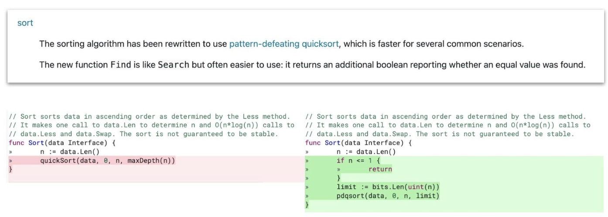

## Go 1.19 的 Sort 變快了 

Go 1.19 的 Sort 已經從 QuickSort 換成跟 #Rustlang 還有 C++ #Boost 一樣的  Pattern-Defeating #Quicksort

想知道多關於 PD Quicksort 可以[參考這篇字節跳動團隊 “”打造 Go 语言最快的排序算法""(簡中)](https://blog.csdn.net/ByteDanceTech/article/details/124464192)

### 快速解釋什麼是 PD Quicksort？ 

- 從 QuickSort 優化，最佳狀況從 O(n log n) --> O(n)
-  - 最差狀況 O(n log n) 

## 相關文章：

- 圖片來自投影片(日文)： https://speakerdeck.com/po3rin/go1-dot-19decai-yong-sareta-pattern-defeating-quicksort-falseshao-jie 

- 演算法實作： https://github.com/orlp/pdqsort 
- 作者說明影片： https://www.youtube.com/watch?v=jz-PBiWwNjc

