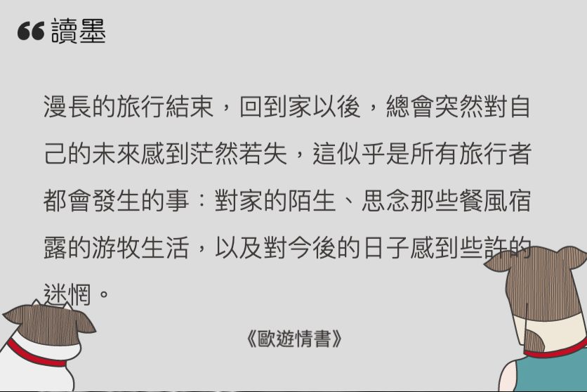
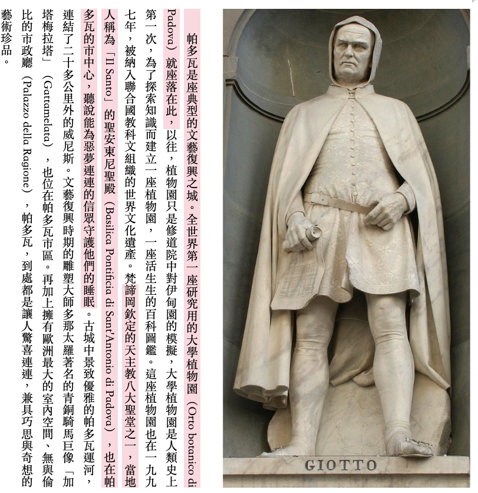
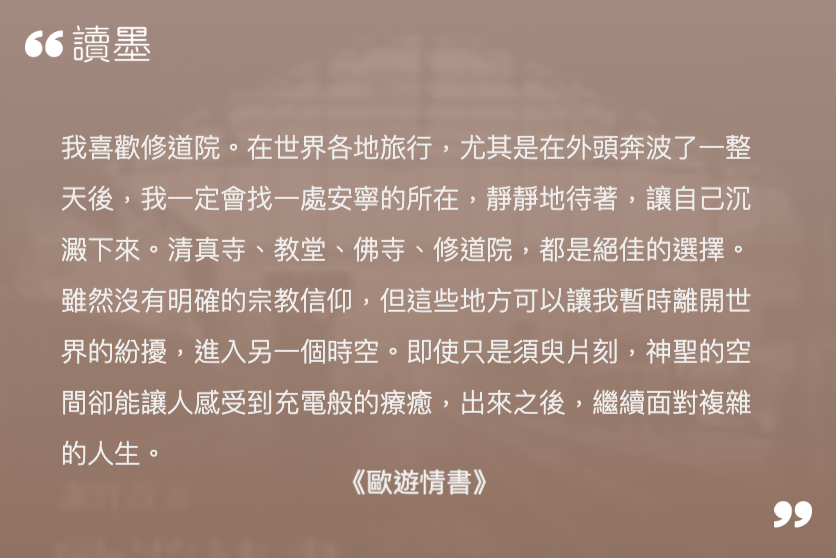
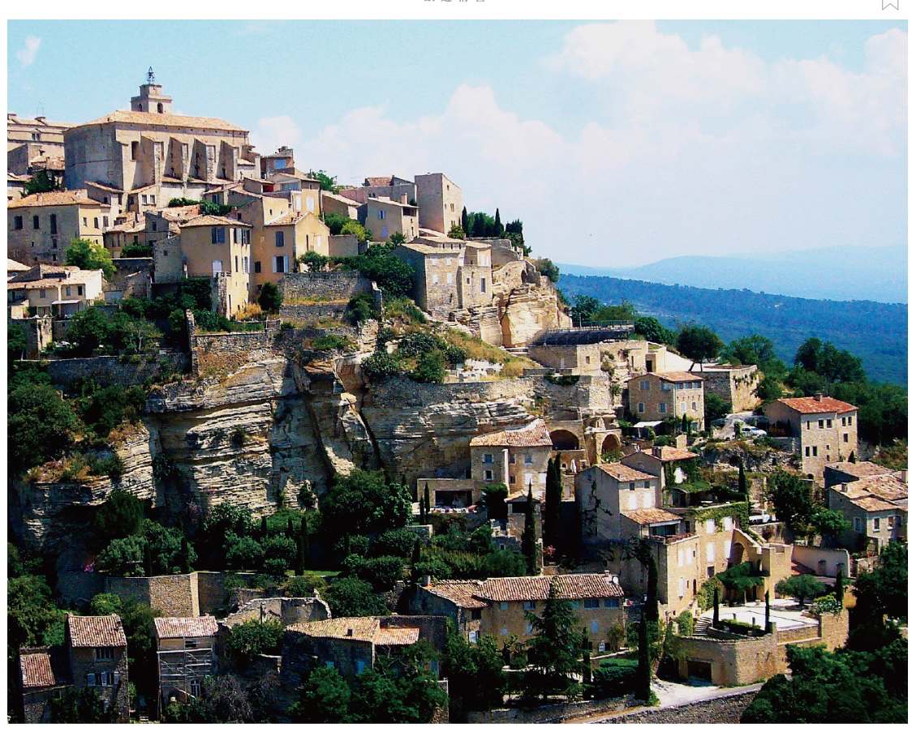
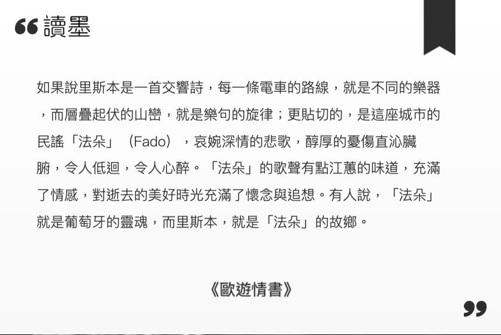

<div><a href="http://moo.im/a/mqzMVZ" title="歐遊情書"></a></div>


```
歐遊情書 - 因為太美，一定要說給你聽的風景
作者： 謝哲青  
出版社：圓神出版 
ISBN: 9789861334837
```

#### 買書推薦網址：

- [Readmoo 線上書籍購買](http://moo.im/a/mqzMVZ)

# 前言:

這一本是今年所讀完的第十八本書。這一本當初就是衝著最受男人歡迎的史地學家 - 謝哲青所買的。 當初其實也很擔心，旅遊的書應該是一堆圖片，都是網路年代了，會不會看著影片會更有感覺呢？



但是就像上面這段文字一樣，其實裡面有很多精練的文字。就想是作者在世界各地寫的情書一樣。告訴著你這個美麗的歐洲上，一個個動人的小故事。

# 內容簡介:

```
走過86個國家，一個人的旅行，曾是他拼湊破碎靈魂的方式。
因為孤獨，他看見的不只是喧囂的華麗。

在維也納的摩天輪上，他找到了沉默而持續的堅定能量。
在克林姆的〈擁抱〉裡，他瞥見了一瞬的幸福。
在巴黎的蒙帕納斯墓園，他迷戀起生命的種種。
搭過莫斯科287站地鐵後，他體悟到不見天日的自由。

哲青說：「把自己丟進荒野裡，是很容易的事，只要專心前進就好了。生命中最刺激的冒險，其實是在日復一日、枯燥殘酷的現實中，還能繼續保有相同的衝勁。平淡的日常，才是生命最大的挑戰。」

因此，他願意將在旅程中看見的一切美麗與感悟，放進你我平淡的日常裡，陪伴你我面對生命的挑戰。歐遊情書，是寫給他心愛的人，也寫給每個愛他的人！
```

這一本大多是許多地點歷史故是敘述，或是一些關於景點的故事敘述。

### 〈序〉從寂滅之城開始的旅行

從義大利東南方被火山灰淹沒的古老沒有城市名稱的 - 寂滅之城作為第一章節，反差相當的大，卻又慢慢開始鋪成許多的故事。

### 【義大利．帕多瓦】喬托與史格羅維尼禮拜堂──從神到人的轉捩點

作者的文字很細膩，時常有一兩張照片來輔助他的史料。但是圖片卻不會太搶風采，卻深深打動人心。

 

### 【法國．塞南克】塞南克修道院──漫漫長路的小停頓

小小的修道院，作者分享了他住在那邊的感覺。與美妙的過往。



當然也有附上美麗修道院的圖片。



### 【西班牙．馬德里】羔羊的隱喻──蘇巴朗沒有說破的陰暗現實

馬德里這一個地方，則是透過 < 蘇巴朗 - 上帝的羔羊> 這一幅畫來分享這個地方。並且帶出作者小時候的一個故事。（他喜愛的小兔子，被長輩不小心拿去煮了。）

透過 "蘇巴朗" 的許多畫作的解釋，分享畫家的內心深處與那個時代的人們生活型態。 考察的時候，作者很喜歡透過當地旅遊的方式來詳細了解許多小故事。


# 心得



這是一本寫給歐洲的情書，但是裡面卻訴說著許多對於家的思念。分享著許多歷史的小故事，卻又告訴著你當地的人們如何在這一塊多采多姿的大陸上生活著。 

透過許多雕像與繪畫讓我們了解當地的特色，那個時代的故事。如果有去過這些地方的人，我相信你一定會更有感覺的。 

或許，你可以把這本書帶在身上。 讓著哲青一起陪伴你在歐洲旅遊。
