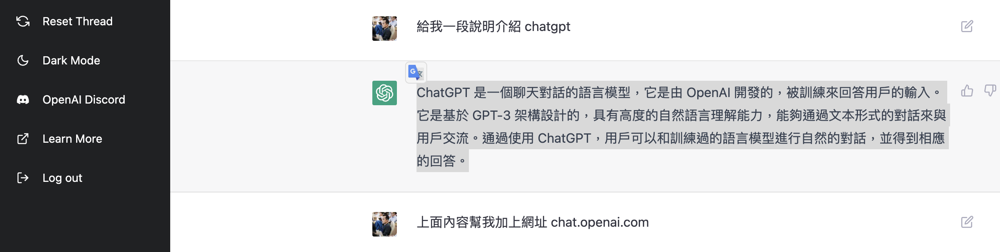

ChatGPT 是一個聊天對話的語言模型，它是由 OpenAI 開發的，被訓練來回答用戶的輸入。它是基於 GPT-3 架構設計的，具有高度的自然語言理解能力，能夠通過文本形式的對話來與用戶交流。通過使用 ChatGPT，用戶可以和訓練過的語言模型進行自然的對話，並得到相應的回答。

最近最紅的網站大概就是： 

[https://chat.openai.com/chat](https://chat.openai.com/chat)

## Github

[https://github.com/kkdai/chatgpt](https://github.com/kkdai/chatgpt)


### 參考文章：

- [https://chat.openai.com/chat](https://chat.openai.com/chat)
- [我嘗試將 GPT-3 整合到 LINE 聊天機器人中](https://dev.classmethod.jp/articles/chatgpt-line-chat-bot/)
- [https://beta.openai.com/docs/api-reference/completions/create](https://beta.openai.com/docs/api-reference/completions/create)
- [https://github.com/isdaviddong/chatGPTLineBot](https://github.com/isdaviddong/chatGPTLineBot)


# 讓 AI 來代勞

以下文章讓 ChatGPT 來寫 ，發現整體上還算很方便。正確性也還可以。

```
幫我寫一篇介紹如何用 cobra 與 go-gpt3 來寫 golang console client 的文章
```

由於 `MaxToken` 只能限制在 4000 ，所以當 ChatGPT 卡住的時候，請打上 `繼續` 即可。


-----

## 什麼是 Cobra 

Cobra 是一個用於構建強大的命令行用戶端的 Go 庫。它提供了一個模板引擎，可以讓您輕鬆地定義命令和子命令，並提供支援幫助和提示信息。

Go-gpt3 是一個 Go 語言庫，提供了一個簡單的方法來使用 OpenAI 的 GPT-3 機器學習模型。GPT-3 是一個非常強大的語言模型，可以用來處理自然語言處理任務，如文本生成和分類。

現在讓我們來看看如何使用這兩個庫來寫一個 Golang 控制台客戶端。首先，您需要安裝 Go 和 Cobra：

```
$ go get github.com/spf13/cobra/cobra
```

接下來，創建一個新的 Go 專案，並在 `main.go` 文件中寫入以下代碼：

```
package main

import (
	"fmt"

	"github.com/spf13/cobra"
)

func main() {
	// 創建一個新的 Cobra 命令行應用程序
	var cmd = &cobra.Command{
		Use:   "gpt3-console-client",
		Short: "A simple GPT-3 console client",
		Long:  "A simple GPT-3 console client built with Cobra and Go-gpt3",
	}

	// 定義子命令
	cmd.AddCommand(...)

	// 執行命令
	cmd.Execute()
}
```

這個程序定義了一個名為 `gpt3-console-client` 的 Cobra 命令行應用程序，並添加了一些子命令。

## 導入 Go-GPT3

接下來，您需要安裝 Go-gpt3 庫並導入它：

```
$ go get github.com/gpt3/go-gpt3
```

```
import (
	"fmt"
	"log"

	"github.com/gpt3/go-gpt3"
	"github.com/spf13/cobra"
)
```

現在，您可以使用 Go-gpt3 庫來創建一個 GPT-3 客戶端並進行諸如文本生成之類的操作。首先，您需要創建一個 GPT-3 客戶端，並使用您的 OpenAI API 密鑰進行身份驗證：

```
func main() {
	// 創建一個新的 GPT-3 客戶端
	client := gpt3.NewClient(gpt3.ClientConfig{
		APIKey: "YOUR_API_KEY",
	})

	// 創建一個新的 Cobra 命令行應用程序
	var cmd = &cobra.Command{
		Use:   "gpt3-console-client",
		Short: "A simple GPT-3 console client",
		Long:  "A simple GPT-3 console client built with Cobra and Go-gpt3",
	}

	// 定義子命令
	cmd.AddCommand(...)

	// 執行命令
	cmd.Execute()
}
```

接下來，您可以定義一個子命令來執行文本生成操作。例如，以下代碼定義了一個名為 `generate` 的子命令，它接受一個 `prompt` 參數，並使用 GPT-3 模型生成文本：

```
// 定義 `generate` 子命令
var generateCmd = &cobra.Command{
	Use:   "generate",
	Short: "Generate text using GPT-3",
	Long:  "Generate text using GPT-3 with the given prompt",
	Args:  cobra.MinimumNArgs(1),
	Run: func(cmd *cobra.Command, args []string) {
	// 取得用戶輸入的提示
	prompt := args[0]
	
	// 使用 GPT-3 模型生成文本
	generatedText, err := client.Generate(prompt)
	if err != nil {
		log.Fatal(err)
	}

	// 輸出生成的文本
	fmt.Println(generatedText)
},

}

func main() {
// 創建一個新的 GPT-3 客戶端
client := gpt3.NewClient(gpt3.ClientConfig{
APIKey: "YOUR_API_KEY",
})

// 創建一個新的 Cobra 命令行應用程序
var cmd = &cobra.Command{
	Use:   "gpt3-console-client",
	Short: "A simple GPT-3 console client",
	Long:  "A simple GPT-3 console client built with Cobra and Go-gpt3",
}

// 將 `generate` 子命令添加到主命令
cmd.AddCommand(generateCmd)

// 執行命令
cmd.Execute()
}

```

現在，您可以執行應用程序並使用 `generate` 子命令來生成文本了。例如，您可以輸入以下命令：

```
$ gpt3-console-client generate "Once upon a time"
```

這將會生成一段文本，以 "Once upon a time" 為提示：

```
Once upon a time, there was a beautiful princess who lived in a far-off kingdom. She had long, flowing hair and a kind heart. One day, a handsome prince came to her kingdom and asked for her hand in marriage. The princess was overjoyed, and the two of them lived happily ever after.
```

希望這篇文章對您有所幫助，讓您能夠輕鬆地使用 Cobra 和 Go-gpt3 來寫 Golang 控制台客戶端。


