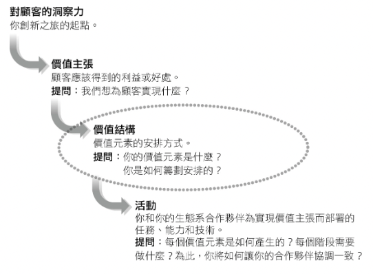
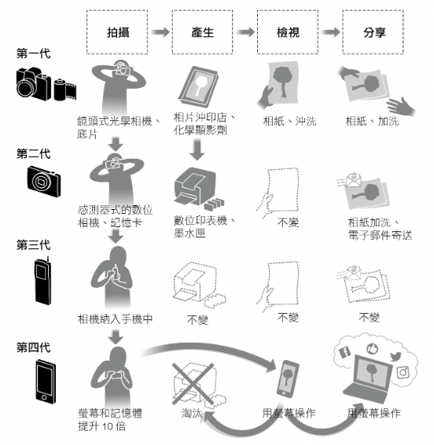
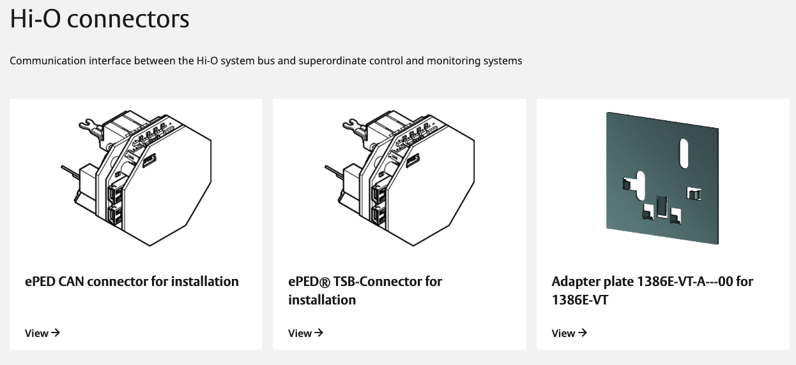
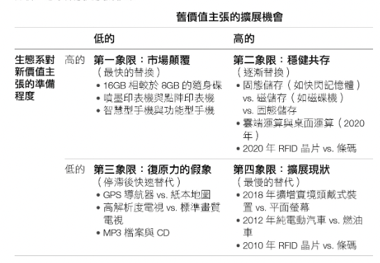

<div><a href="https://moo.im/a/exCKOZ" title="生態系競爭策略"></a></div>


```
生態系競爭策略 - 重新定義價值結構，在轉型中辨識正確的賽局，掌握策略工具，贏得先機
Winning the Right Game: How to Disrupt, Defend, and Deliver in a Changing World
作者： 隆．艾德納  
原文作者： Ron Adner  
譯者： 黃庭敏  
出版社：天下雜誌出版 
```

#### 買書推薦網址：

- [Readmoo 線上書籍購買](https://moo.im/a/exCKOZ)

# 前言:

這一本是今年所讀完的第二十四本書。這一本書本來是收到一本實體書。但是我因為出國沒有辦法拿到實體書來讀。自己又是一個喜歡讀電子書的人，所以我也買了電子書的版本下來。 並且大部分的章節都是透過電子書的朗誦的方式來閱讀，真的是蠻有趣的一本書。

在前面也先說明，這一本的遠景相當的大。從生態系轉移的流程，到生態系的建立，甚至是如何防禦與獲得勝利都講得很清楚。 但是身為從業人員的讀者們，可能會不完全同意裡面的一些方法論。 但是裡面所舉的案例倒是真的讓我補充了許多不了解的事物。


# 心得

這一本將整個生態系的競爭策略拆解的很像是課本一樣，從生態系的構成，生態系的組成元素與生態系的成長方式，以及如何在生態系中獲勝的方式寫得很清楚。 裡面有許多舉例的案例，讓我重新對於許多事情有了更多的了解：

- [柯達](https://zh.wikipedia.org/zh-tw/%E4%BC%8A%E5%A3%AB%E6%9B%BC%E6%9F%AF%E8%BE%BE%E5%85%AC%E5%8F%B8)的贏錯市場策略。
- [Lexmark](https://en.wikipedia.org/wiki/Lexmark) 的積極轉型策略。
- Spotify， TomTom 與 Wayfaire 相關策略。

以上兩個跟生態系的改變有關，但是如果是因為強大的競爭對手來的時候該怎麼辦？ 作者也有提出相關的案例來分享。 到了下半部作者提倡微軟的納德拉作為範例與轉變的例子。 因為納德拉組織了外部的生態系，並且透過內部整合資源。（這也是最難的）。

很多時候，許多組織會提倡「熱情」，但是熱情不是指導方針。信任與了解公司策略是一個讓所有人遵循的一句，更是可以在內部生態系結合變化與轉變的方法。

（心得待續）


# 內容簡介:

```
在產業轉型的過程中，贏錯賽局，比競爭失敗更快被淘汰！
《恆久卓越的修煉》管理大師柯林斯盛讚：21世紀最重要的策略思想家之一
《MIT史隆管理評論》重磅新著

2012年，柯達宣布破產，從備受推崇的全球影像龍頭企業，變為錯過數位轉型的經典失敗案例。
真是如此嗎？其實，真正摧毀柯達的，不是錯失了數位轉型的機會，而是它完全無視於生態系統改變帶來的徹底顛覆！
產業崩解、生態系重組，是現在所有企業面對的挑戰！

當機會與威脅都不再依循傳統產業界限，
誰是夥伴？誰會變成潛在勁敵？該如何競爭？

長春藤名校達特茅斯塔克商學院的策略學教授艾德納，長期研究企業創新等領域，獲獎讚譽無數，更是全球知名的企業生態系策略大師，他在這本新作中清楚說明生態系統與傳統產業不同的概念與創造價值的方式，打破過去對價值鏈、供應鏈、資源與能力分析，並且提出要在生態系競爭中成功必備的新策略思維。 
```


## 第一章　贏錯賽局，等於失敗

企業不斷地因為一些新的產品的發明，而帶動新的產業轉型。 但是 1975 就發明數位相機專利的柯達，卻在後來破產了。 新聞裡面我們都會以為是他們因為公司老舊而沒有跟著轉型，進而被數位相機淘汰了。 但是真正的故事，往往不是如此。 柯達的失敗，不是在錯失了機會，卻是因為他們贏錯了賽局。

柯達從 1980 來開始打造數位影像的領域，並且透過收購 ofoto.com （一個網路相簿的網站），來讓自己的「數位列印」領域變得更加的龐大。 2005 年柯達在美國的數位相機還是銷售第一個狀況，他們也知道底片已經是黃昏市場，他們也開始看到列印耗材，並且透過數位相片的列印來打造自己的生態環境。

```
英國廣播BBC 「 2018 年世界上最貴十種液體，排名第八，輸給蠍毒，胰島素跟香奈兒 No5 就是黑色印表機的墨水」
```

透過相片列印市場的擴張， 2007 年柯達甚至在美國各地有九萬台的數位相片沖印機。接下來透過價值主張，價值結構的變化與相關市場的變化來說明柯達失敗的主因。

### 價值主張，價值結構與活動



- **商業模式**： 你的客戶如何付錢給你。

- **價值結構**： 你如何建立價值，為什麼你的客戶願意付錢給你。

  

### 由於科技轉換帶動的價值結構的變動




所以柯達並沒有「輸」在數位轉型，反而大獲全勝。那麼他為什麼會失敗呢？ 就是因為贏錯了賽局。 2007 年第一代 iPhone 發售之後，大部分的人都透過手機來拍照與並且在「網路上直接分享照片」。 從那之後，透過數位列印相片的需求被又一次的消滅掉。

### 相反案例： Lexmark 的積極轉變

Lexmark 可能現在的人都不知道，之前他跟 EPSON 是有競爭印表機市場的。 但是隨著印表機的市場也隨著資訊變成手機上之後，全部的產業開始萎縮。 Lexmark 積極轉型成數位文件與數位文件流程的公司。 並且透過收購 Perceptive Software 等等 14 家關於文件處理的公司，來鞏固自己在數位文件處理的市場。


## 第二章　生態系的防禦：協力合作

這一章節討論的生態系的防禦，指的不是因為大環境（或是新產品）的產生而改變的世界。而是有一個強大的敵人要來你的生態系統中，你應該要如何防禦：

### Wayfaire 與 Amazon 在家具市場上的競爭

Wayfaire 本來是做傢俱與相關商品的照片陳列與銷售的中間商（也就是網路商城）。 2014 年之後，透過家具倉庫的增加，讓許多商家可以把他們的傢俱放在倉庫中來節省開銷，並切更快速的出貨。 這個時候， Wayfiare 就像是傢具業者中最大的網路商城，直到 2017 年 Amazon 也決定加入家具市場的電商服務。

知道有了 Amazon 的加入挑戰後， Wayfaire 並沒有選擇擴張他的戰場，反而是更加專注自己的相關市場 - 傢俱銷售的行業。他透過傢俱市場的獨特性：絕大多數顧客不知道自己要買什麼？或是說客戶不知道自己的空間可以買什麼？ 而 Wayfaire 就是打造一個相關的技術領域 - 只要拍一張照片的 2D 照片，他可以幫你把照片變成 3D 建模放進場景之中給客戶了解。 透過這些方式，來讓客戶自己發現他們需要的商品。

這絕對不是跟 Amazon 去競爭，而是要防禦自己的領域，鞏固自己最好的生態系。

### TomTom 對上 Googe Map 在圖資上的變通

TomTom 原本跟 Germin 都是地圖圖資上領先的公司，但是從 iPhone 3G 上市之後（又是 iPhone) 。 Google 也在 Android 2.0 的系統公佈得時候，開放了 Google Map 在手機 OS 上的服務。原本 Google 也是使用 TomTom 的子公司 Tele Atlas 的圖資，但是卻在之後開始從事自己圖資的建立。並且 Google Map 有著 API 的開放，讓整個地圖服務變成每一家軟體廠商都可以加入的案例，

這時候 TomTom 該如何應對呢？ 對於 TomTom 來說，他們的利基就是一個成為客戶資訊的忠實提供商。不會拿去做廣告之用，這樣安全的圖資變成了客戶相信的重點。反過頭來，也或許是甘於第二的主要因素？


### Spotify 與 Apple Music 

Spotify 原本就是專注在串流音樂的廠商，但是 2015 年 Apple Music 在 iOS 8.4 登場之後。 Apple Music 花了六個月就有六百萬的全球付費使用者，這是 Spotify 花了四年才達到的成果。

他們有點類似 TomTom 與 Google Map ，對於超巨大的競爭對手。他們的競爭點勁在於「我們不是巨頭，我們是大家的朋友。」雖然他們曾經因為做了「表演者實驗」的方案（讓個人創作者繞過唱片公司直接上架音樂），但是這個隨後馬上就取消了。


## 第三章　生態系的進攻：從增加競爭到改變競爭

這邊提到了生態系的建立方式：

- 建立「最低可行生態系統」 **MVE** (Minimum Viable ecosystem)
- 遵循階段性擴張的路徑
- 部署生態系的傳遞

或許這樣講有點難懂，作者還用了一些例子來說明他的生態系建立系統。

###  Amazon Alexa 的案例來舉例生態系：

- **Alexa 階段一 建立生態環境**：透過便宜又具有智慧的藍芽喇叭，讓許多人一起來購買。
- **Alexa 階段二 階段性擴張**：開放給每一廠商都可以加入 Alexa 的人工智慧溝通能力的應用 -- Alexa Skill 。
- **Alexa 階段三 生態系的傳遞**：人工智慧更加進化，每一個智慧家電可以直接使用 Alexa 。不在需要購買 Amazon Echo ，你只要跟他們合作，即便你是冷氣廠商，你也可以使用相關的功能。

### ASSA Abloy 的案例了舉例生態系：

[ASSA Abloy](https://www.assaabloy.com/au/en) 是一個傳統的門鎖廠商，他們的生態系擴張方式如下：

- **[ASSA Abloy](https://www.assaabloy.com/au/en) 階段一 建立生態環境**： 有著大量的門鎖系統，並且隨著產品演進也有著大量的數位門鎖系統。透過 CLIQ 的雲端們損系統。
- **[ASSA Abloy](https://www.assaabloy.com/au/en) 階段二 階段性擴張**： 透過數位門鎖開始連接每一個門，讓門鎖本身跟著雲端連接起來。
- **[ASSA Abloy](https://www.assaabloy.com/au/en) 階段三 生態系的傳遞**：鑰匙不在是一個鐵片，可以是你的手機，甚至是任合一個可以代表你的物品。 也讓著個「身份認證」變成他們的下一個生態系。（身份識別）

這邊提出的生態，沒有那麼順利。這邊說明一下：

- **[2004 Hi-O](https://dach.assaabloy.com/de/en/produktkatalog/effeff-t395536-hi-o-connectors)**:  統一的規格，讓大家得遵循門鎖的制定規格。但是卻限縮了門鎖廠商的自主性與客製化的空間，讓其他廠商都不願意加入。
  
- **[Aperio](https://www.assaabloy.com/pl/en/solutions/topics/access-control/aperio) **: 而 Aperio 並沒有統一門鎖的規格（孔數，大小等等），僅在於提供整個門鎖溝通的基本架構。 

<iframe width="560" height="315" src="https://www.youtube.com/embed/lCcHf7ZJnKo" title="YouTube video player" frameborder="0" allow="accelerometer; autoplay; clipboard-write; encrypted-media; gyroscope; picture-in-picture" allowfullscreen></iframe>

後來 **[Aperio](https://www.assaabloy.com/pl/en/solutions/topics/access-control/aperio) ** 的機制讓其他廠商都願意加入， [ASSA Abloy](https://www.assaabloy.com/au/en)  的門鎖的生態系才這樣擴張起來。


## 第四章　顛覆生態系的時機：太早可能比太晚更糟糕

這邊有另外一個有趣的案例，飛利浦在 1986 年制定了 HDTV 的規格後，比起其他系統的整合還早了 20 年。更甚者當時的錄影設備都還沒有到達高畫質的設備。所以這一個計畫也導致公司公司陷入 25億美元的損失。



這邊有將生態系對於新價值主張的準備程度分成了四個象限，分別是：

- **市場顛覆**： 噴墨行印表機跟點陣印表機
- **穩健共存**： Cloud Computing 跟 桌面運算
- **復原力假象**： MP3 跟 CD
- **擴展現狀**： 屬於未來的替代。


## 第五章　本位系統的陷阱

生態系是一個不同的賽局，生態系的領導者跟追隨者完成價值創造拼圖的不同部分。在成功的生態系中，沒有贏家和輸家，只有以不同方式受益的合作夥伴。

在電子病歷的這個案例上面，是一個案例很適合來講解本位系統的陷阱。 醫療科技巨頭 Cerner ([後來已經在 2022/06 被 Oracle 收購了](https://www.ithome.com.tw/news/151399)) 與 Epic 原本在推廣共用的醫療病歷系統，但是隨著美國耗費 270億美元的 (2009 經濟和臨床健康之健康資訊科技法) 讓醫院們有了相關補貼的動力來參與相關的合作關係。

## 第六章　領導生態系的思維：協調與執行

在新興生態系中建立領導地位，必須優先保護他人的價值創造。有些領導者的能力和身份，與最大化自己的組織價值連接在一起，對他們了說，新興生態系是具有挑戰性的環境，這種尚未協調的背景有賴精心打造並鞏固聯盟。

### 微軟的相關策略變化：

- **包爾默:**
  - 透過 Windows -> Cloud -> Set Top Box -> Entertainment Center
- **納德拉：**
  - 開發其他平台的 Office --> iOS office on Salesforce 。 （原本 MSFT 跟 Salesforce 在 CRM 軟體是對手）。
  - 當然有包爾默的 MVE 準備平台 (Azure 與 Office 365 )，但是納德拉部署生態系的環境，讓他發揮真正的 Office 生態系。

### 內部生態系的變化與轉變

每當一個新計畫需要跨部門相互作用得時候，就需要管理內部生態系的轉變。 在微軟的案例中， Azure 跟 Office 是兩個體系的部門負責的，卻因為有新執行的上任讓兩個組織的人願意合作一起來轉變相關的生態系。

## 第七章　讓所有人都清楚公司策略

在穩定的環境，公司可以把預算當作策略的拐杖，追蹤當前業務在當前路線上的發展。但在瞬息萬變的環境下，談論預算是一種貧乏和使策略品質惡化的溝通語言，他的層次遠遠低於你所要的問題層次。

熱情或許是一種方式，但是熱情不是指導方針。信任與了解公司策略是一個讓所有人遵循的一句，更是可以在內部生態系結合變化與轉變的方法。
