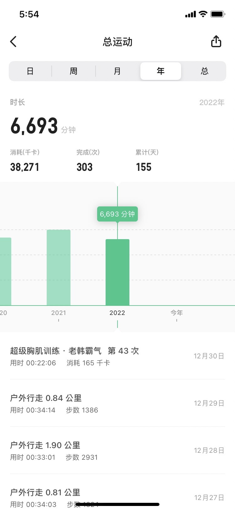
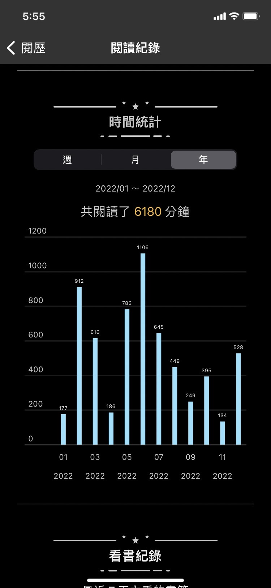
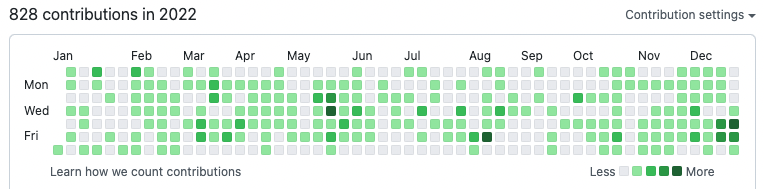
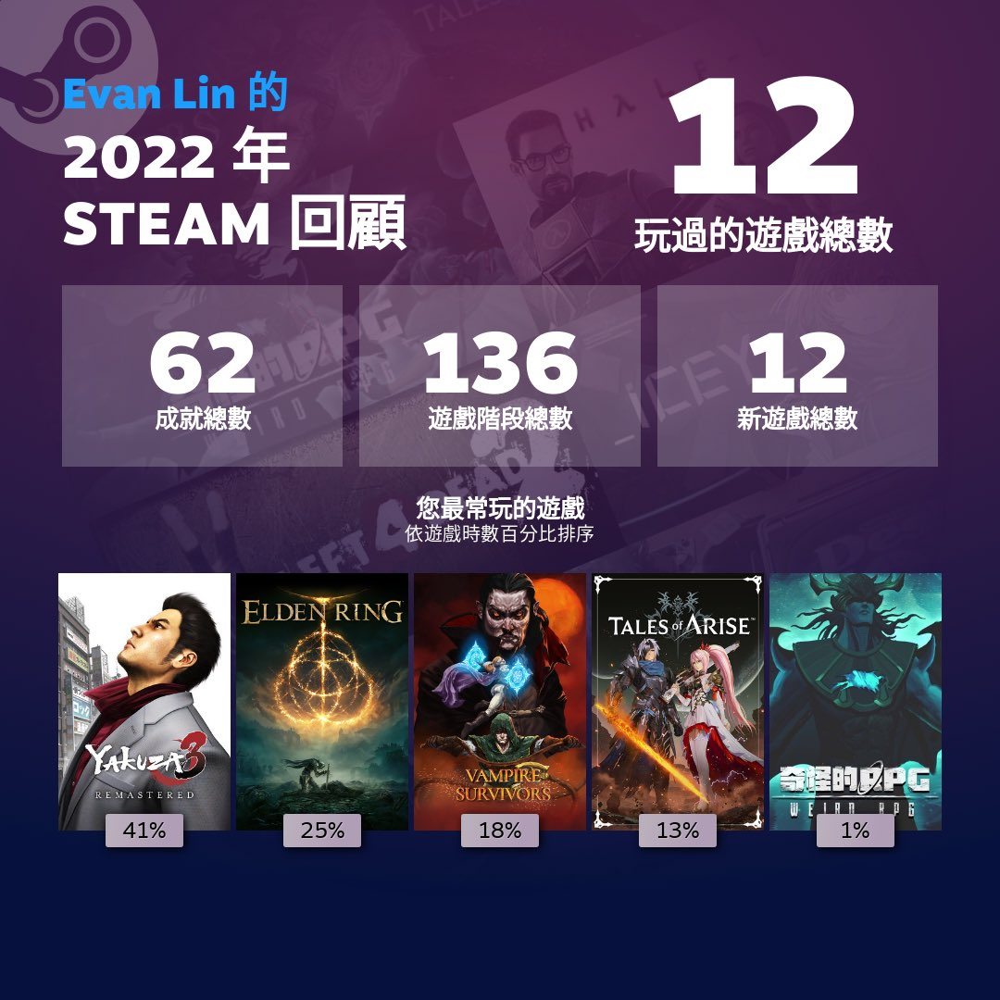
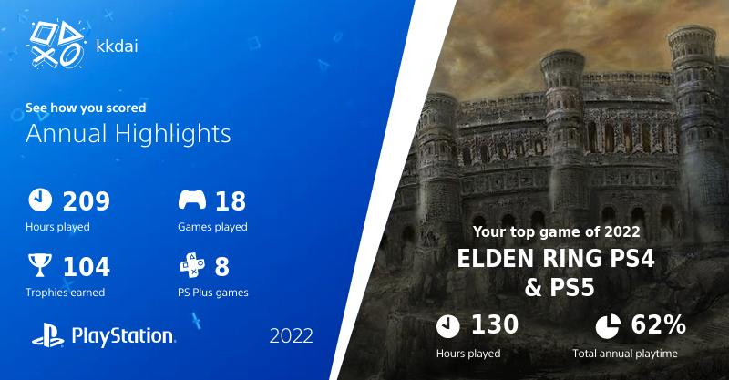

好像該寫點回顧：
1. 今年總體之後，運動上有一些退步。單純因為偷懶舉多，這件事情不太好，需要馬上改進。
   1. 2021: 7643 mins
   2. 2022: 6693 mins
2. 書籍的閱讀上，可能因為買了 BOOX 這一本屬於比較開放的系統（也比較快）。 閱讀的時間有變多一點。
   1. 2021: 15本書
   2. 2022: 24本書（有一本還在寫心得）
3. 部落格撰寫上：
   1. 2021: 56 篇文章
   2. 2022: 只有 53 篇文章
4. 投資的部分，應該也不用多說。 2022 就是大家一起虧損的一年，主要還是在學習中成長。（看我的書籍大多跟投資有關也是。）
5. 令人開心的是疫情總算鬆綁，也在聖誕節後迎來第一次國外旅遊。 希望可以把國外旅遊次數衝到一年三次左右。
6. Github 828 (2021: 1074) commits 。
7. 好像總體數據都跟我買了 PS5 跟 SteamDeck 有關？ 這些應該要好好檢討改進。 :p 
8. 最後的最後，今年的身體還算可以。 常常發作在冬季的胃食道逆流，好像也沒有了（因為一直吃？）

最後，祝福大家 2023 一樣健健康康的。 然後趕快出國去想玩的地方吧！

