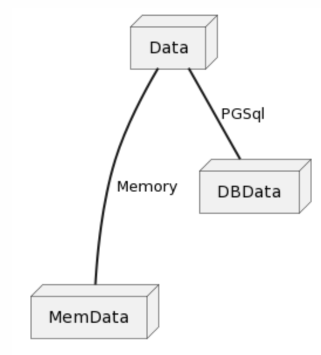
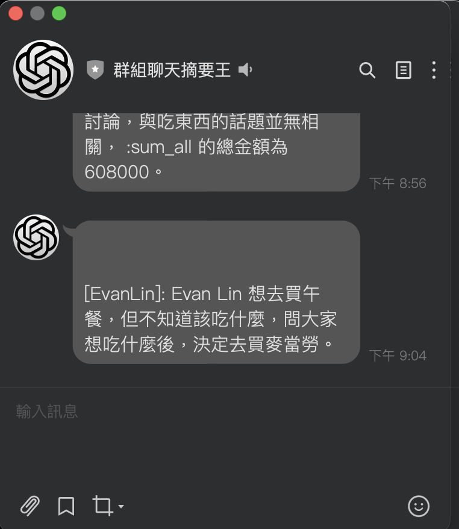

# 前提

平常在準備 LINE Bot 的相關範例程式碼的時候，通常都是沒有加上資料庫。但是有一些的範例程式碼其實有一些儲存資料會比較好。 所以這時候需要加上資料庫的相關讀寫。

當然.... 資料庫也是有窮人版的。由於許多服務都要對於他們的資料庫服務收費之後，這時候就需要有一些變通的方式。 使用記憶體當作資料庫的架設。

那如何讓你在程式碼中，只要寫一次關於資料處理方面，當你的部屬的環境變數有不同，就會使用不同的資料庫來存取呢？

比如說：

- 當你有 PostGresSQL 的資料庫 URL ，就使用 PG SQL 相關處理方式。
- 如果沒有的話，就使用記憶體做為資料庫。
- 以後也可以增加不同的雲的部署方式。（或是支援 Firebase 相關資料庫)

這一篇文章將開始敘述，如何透過 Golang 的 Interfaces 的方式來達到類似繼承的效果。 使用同一份的程式邏輯程式碼，可以根據你設定的參數不同來讀取不同得資料庫。

# 範例程式碼 LINE Bot  群組聊天摘要生成器

這次透過上一次的範例文章 [[學習文件] LINE Bot 群組聊天摘要生成器](https://www.evanlin.com/linebot-chatgpt/) 作為一個範例程式碼。 先來看整體切割方式。

 ## 資料架構切割圖

所有的 implement 都是透過 Data 也就是之後 Basic Class 的 API 來存取相關資料。 只要建立的時候，使用相關的 Interfaces 搭配不同的起始變數就可以呼叫同樣的處理資訊。

先列出相關的處理程式碼：

## 相關處理程式碼

這裡使用到定義成 Interfaces 的 `GroupDB` 的實作，根據不同的設定  `NewPGSql(url)` 或是  `NewMemDB()` 就可以讓裡面對應的實作不同。

## 詳細列出不同資料庫的開發方式

接下來列出不同資料庫的實作方式。

### Basic (Data)

這是最基礎的設定，最重要記事 interface `GroupDB` 的宣告，然後其他兩個也必須要有

- `ReadGroupInfo(string) GroupData`
- `AppendGroupInfo(string, MsgDetail)`

兩個 function 的實作，並且輸入參數跟輸出參數都要相同。 這樣才能使用到一樣的邏輯來操作資料。

### Memory DB

接下來這是使用 Memory 做為資料庫的實作，可以看到主要是透過 `map` 來操作相關資料處理。 這樣透過 memory 當作 DB 的方式，如果是在 FAAS (e.g. Heroku 或是 Render.com) 就會在服務睡眠的時候，失去你的儲存資料。

### PostGresSQL DB 

接下來這邊就是使用 PostGresSQL 的實作，主要是透過 `"github.com/go-pg/pg/v10"` 這個套件的版本，可以透過 ORM 的方式直接去操作 PostgresSQL 可以讓許多實情省下麻煩。但是很多時候，沒有直接使用 SQL 其實也是更加的麻煩。

這邊的開發流程上，沒有要注意的事情。只需要注意到必須以下實作就好。

- `ReadGroupInfo(string) GroupData`
- `AppendGroupInfo(string, MsgDetail)`

## 未來發展

透過 Interfaces 來當作資料庫存取的開發方式可以很方便，並且留下未來許多資料庫的資源空間。不論是支援 MongoDB 或是想要使用 MySQL 甚至是整個資料庫搬到 FireStore 也不需要改動我原版的商業邏輯部分。 只需要把基本的資料庫實作完成即可。

希望這篇文章可以給大家一些想法。
