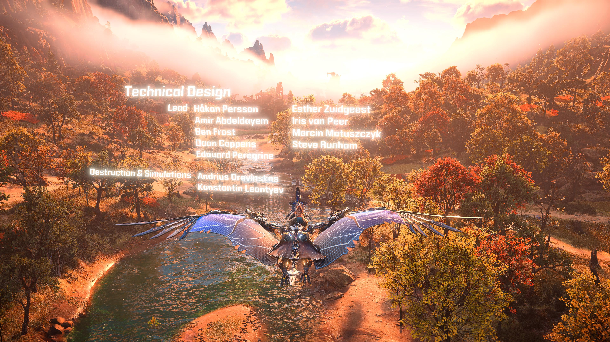

## 地平線 - 西域禁地全破心得：

由於[地平線](https://www.playstation.com/zh-hant-tw/horizon/)第一代我很喜歡（當初有買 DLC) 也破了，這次[二代西域禁地](https://www.playstation.com/zh-hant-tw/games/horizon-forbidden-west/)一放出風聲。我馬上就買了 PS4 普通版。比較讓我驚喜的是，後來運氣很好買到PS5之後，換了 PS5 搖桿真的是有相當驚喜的表現：

- 有多了相當多種類的震動規格，不論是土地震動，小寶物跑出來，大型機器獸的出場都讓人驚艷。
- 有力回饋的按鈕讓你在射弓箭的時候，更加的好用。甚至需要敲開某些東西的時候，R2 會相對應的變得很難壓下去。
- 關於攻略部分，因為支線任務太喜歡玩了。主線打王的時候，不小心等級升到 50 級，默默的碾壓過去。
- 關於攻擊部分：
  - 屬性弱點很重要，記得要先射滿屬性弱點開始打。
  - 拆解部位有點麻煩，許多重要零件都要先射下來。
  - 標槍還是最好用的，一直射一直爽。

最後結尾有很大伏筆，接下來就要等四月的 DLC Burning Shores

<iframe width="560" height="315" src="https://www.youtube.com/embed/IZJwsAhAzIU" title="YouTube video player" frameborder="0" allow="accelerometer; autoplay; clipboard-write; encrypted-media; gyroscope; picture-in-picture; web-share" allowfullscreen></iframe>
