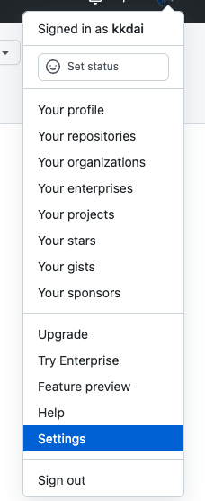
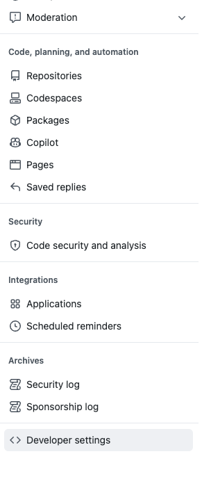
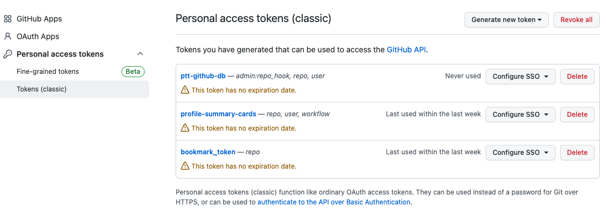

# 前提

之前說過許多資料庫都已經開始收費了，所以想要找一個免費的資料庫來使用的其實相當麻煩。不論是使用 Heroku 或是 Render 的資料庫其實都是一筆不小的費用。 所以，常常動歪腦筋到一些奇怪的儲存體來當資料庫，今天這一篇文章將透過 Github Golang 的 API 來將你個人的隱私 (Private Repository) 的 issue 來當成資料庫來使用。


### 開源套件 https://github.com/google/go-github


# 如何取得 Github Token

首先要使用 Github 的 API ，你需要取得 Github Token ，這裡附上流程：



打開設定



選到開發者選項 (Developer settings)



這邊選 **Personal Access Token** ，記得選 **Tokens (Classic)**

如此就可以取得一個開發者的 Access Token ，記得不要搞丟了。（或是不要存在 github 上面）


# 使用 Github Issue 當成資料庫的前提與方法

## API Rate Limit

如果想要使用這樣方式當成資料庫的人，首先對於你的資料格式要相當的簡單。或者是說你的資料存取是比較低流量的。因為 Github API 具有 [Rate Limit](https://docs.github.com/en/graphql/overview/resource-limitations#rate-limit)  相關資訊可能如下：

- Core:
  - Limit: 5000 (60mins)
- Search:
  - Limit: 30 (60mins)
- GraphQL:
  - Limit: 5000 (60mins)

## 資料擺放的建議

- Title: 資料庫名稱
- 每一個 comment 可以當成是一筆 record 
- 每一個 Comment 可以透過 csv (逗號來分隔)，或是透過其他方式來分隔資料。
- Tag 可以讓你快速找到類似的 Title

這些只是一些建議，以下的程式碼範例作法更加的簡單。 只是一個 Key -> Value 的方式來存放。  Key 放在 Title ，而 Value 就直接放在第一個 Comment 裏面。

# 相關程式碼：

## 基本結構

```
type GithubDB struct {
	Name   string // github 擁有者名字
	Repo   string // repo 名稱（可以使 private)
	Token  string // 剛剛取得的 Access Token
	Client *github.Client
}
```


## 初始化 Github Client 

```
func createGithubClient(token string) *github.Client {
	ctx := context.Background()
	ts := oauth2.StaticTokenSource(
		&oauth2.Token{AccessToken: token},
	)
	tc := oauth2.NewClient(ctx, ts)
	return github.NewClient(tc)
}
```

## 儲存 Github Issue  (Create)

這時候需要給 使用者名稱 `Name` 跟 `Repo` 名字。

```
func (u *GithubDB) saveIssue(title, body string) error {
	input := &github.IssueRequest{
		Title:    String(title),
		Body:     String(body),
		Assignee: String(""),
	}

	_, _, err := u.Client.Issues.Create(context.Background(), u.Name, u.Repo, input)
	if err != nil {
		fmt.Printf("Issues.Create returned error: %v", err)
		return err
	}
	return nil
}
```

## 尋找 Title (key) Get by Title 

```
func (u *GithubDB) getIssue(title string) (string, int, error) {
	ret, _, err := u.Client.Search.Issues(context.Background(), title, nil)
	if err != nil {
		fmt.Printf("Issues.search returned error: %v", err)
		return "", 0, err
	}

	log.Println("issue ret:", ret)
	for _, v := range ret.Issues {
		log.Println("return issue:", v)
		log.Println("Issue Num:", v.Number)
		log.Println("Body:", v.Body)
		log.Println("Comments:", v.Comments)
	}
	return *ret.Issues[0].Body, *ret.Issues[0].Number, nil
}
```

## 更新裡面的資料 (Update)

```
func (u *GithubDB) updateIssue(number int, title string, updatedCnt string) error {
	updateIssue := &github.IssueRequest{
		Title:    String(title),
		Body:     String(updatedCnt),
		Assignee: String(""),
	}
	ret, _, err := u.Client.Issues.Edit(context.Background(), u.Name, u.Repo, number, updateIssue)
	if err != nil {
		fmt.Printf("Issues.edit returned error: %v", err)
		return err
	}

	log.Println("Issue updated:", ret)
	return nil
}
```


## 未來發展

其實在做一些簡單的範例程式的時候，如果你資料庫本身沒有太多的欄位需求。本身的存取量也不是很大，或許可以考慮透過 Github Issue 來存放你的資料。一來你的資料庫都是「可視化」，你也可以節省一些不需要的額外開銷。 
