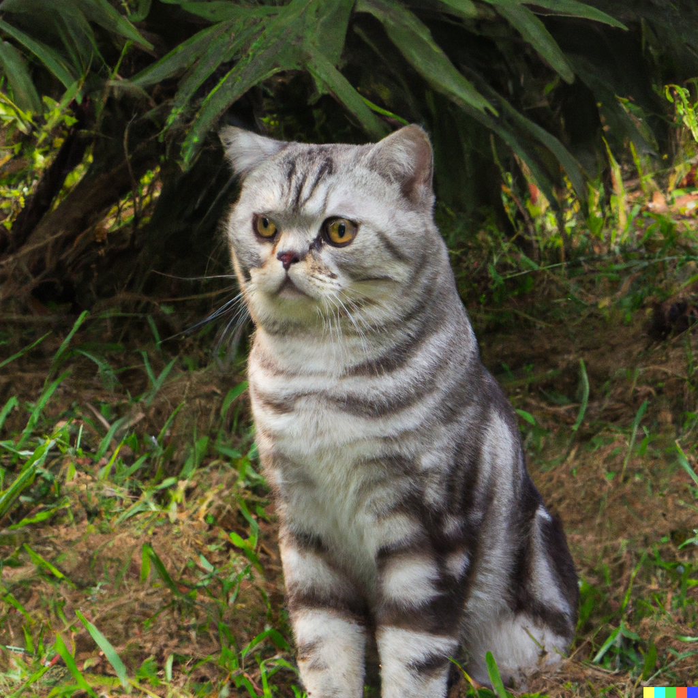
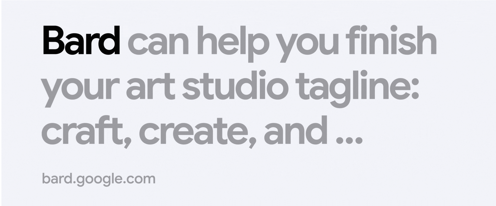
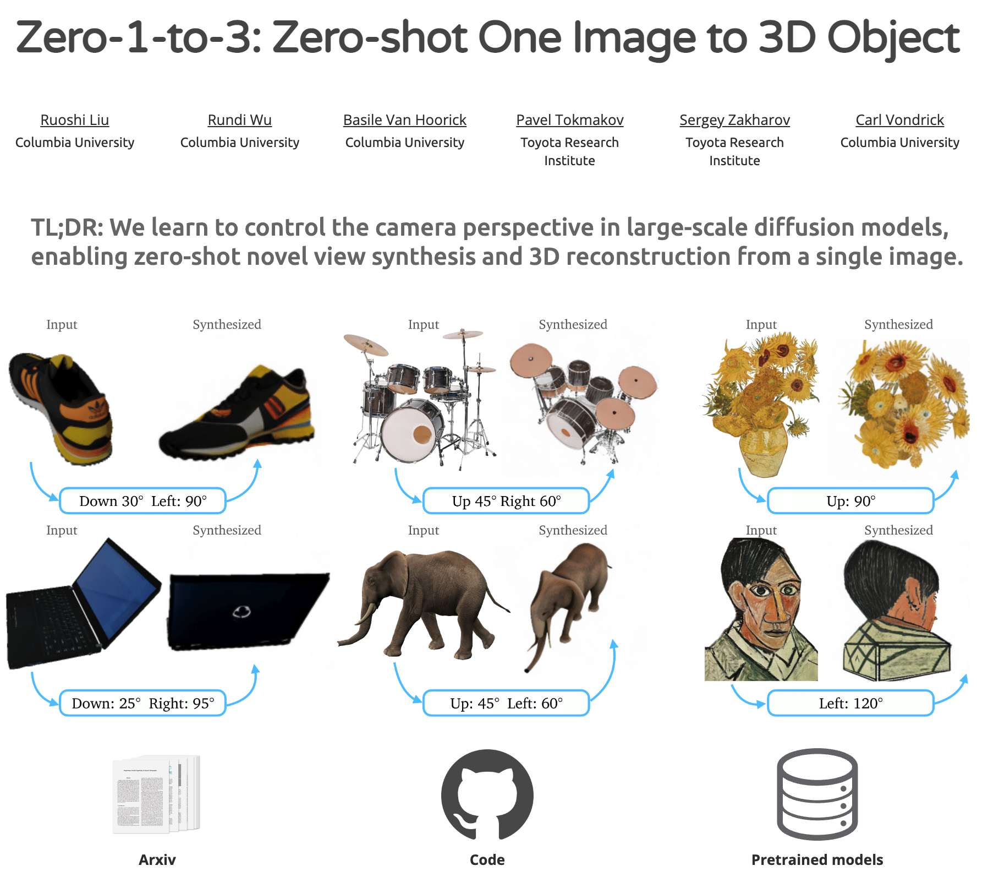
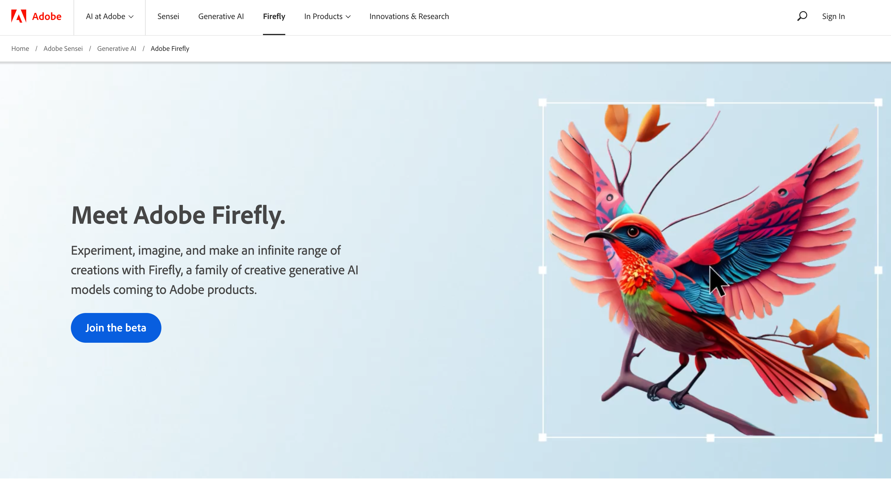
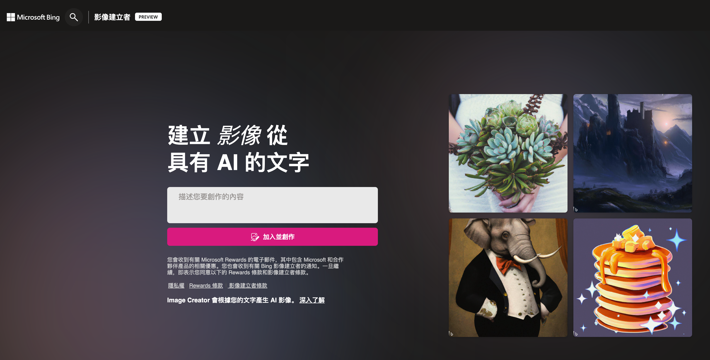
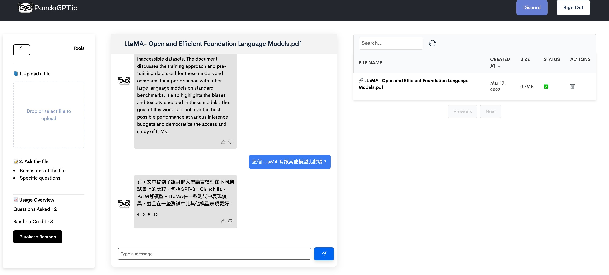

([DALL-E 的產出](https://labs.openai.com/))

# 前情提要:

因為最近的 Generative AI 相當紅（還有 ChatGPT) ，開始搜集一些相關資料。作為我 Twitter 資訊的整理。

# 相關資訊

1. **Bard：你最具有生產力、創造力、解答力的 AI 聊天機器人**

由 Google 用自己的語言模型 LaMDA 訓練而成，能夠提出各種具創意解決方案的助手，今天於美國及英國搶先推出。值得注意的是，新聞稿非常強調 AI 原則、品質與安全性，根據 BBC 報導，使用者須年滿 18 歲。•	

原文：[https://blog.google/technology/ai/try-bard/](https://blog.google/technology/ai/try-bard/)	

BBC 報導：[https://www.bbc.com/news/technology-65018107--](https://www.bbc.com/news/technology-65018107--)

2. **Zero-1-to-3: Zero-shot One Image to 3D Object**

藉由控制及訓練相機視角，實現將單一圖像重建成為 3D 物件。•	

Demo：[https://zero123.cs.columbia.edu/](http://zero123.cs.columbia.edu/)

3. **FireFly**：Adobe 所推出，沒有版權疑慮的生成式 AI 模型集

由 Adobe Stock 素材庫、公開許可內容與版權過期的公共領域內容訓練，讓生成結果可以安心商用。功能包含：圖片生成、影片風格變換、創造字型字體、甚至是 3D 物件生成。目前仍在測試版，尚未公佈定價。•	

官網：[https://www.adobe.com/sensei/generative-ai/firefly.html](https://www.adobe.com/sensei/generative-ai/firefly.html)

4. **Bing Image Creator：Bing 的圖片生成器**

於網頁可以直接用文字生成圖片，目前支援英文輸入，每人每天有 25 張圖的額度可以生成，效果很好，附上我生成的叢林風 LV 包包。•	

開始使用：[https://www.bing.com/images/create/](https://www.bing.com/images/create/)

5. [https://www.explainthis.io/zh-hant/ai-toolkit](https://www.explainthis.io/zh-hant/ai-toolkit) **生成式 AI 百寶箱**，

很多實用的工具

6. **PandaGPT: 幫你讀論文好幫手**

[https://pandagpt.io](https://t.co/jnrB8x27Yq)   輸入 paper 可以中文問論文內容。 範例論文 LLaMA: Open and Efficient Foundation Language Models

# 相關文章

- [生成式AI衝擊工作坊心得 (3/18~19)](https://t.co/nvZVPa1r6S)

  
