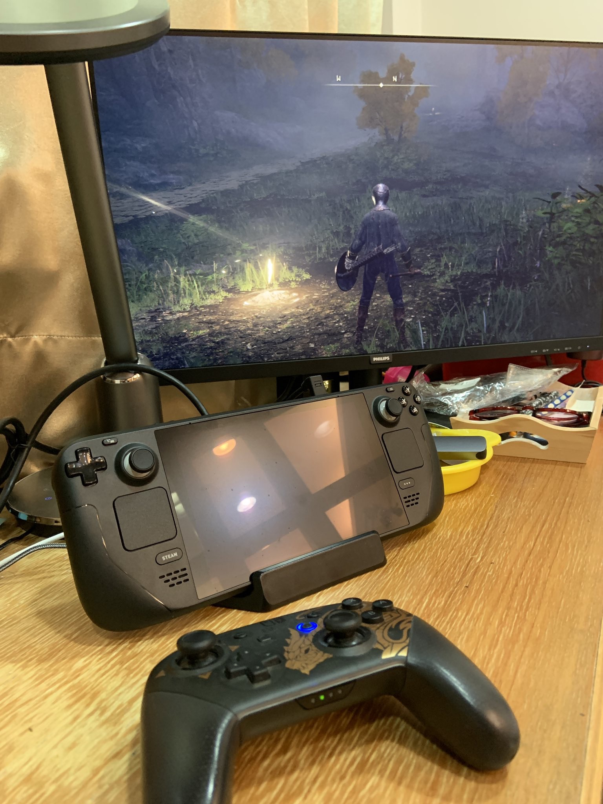

(這樣玩，隨然沒有了移動性，但是電量充足就是令人開心)

# 前情提要:

前一段時間買了 Steam Deck ，看中他可以隨時打 3A 大作的特性。 所以我馬上就買了艾爾登法環，並且開始慢慢玩。 

（兩張全破沒白金人權圖)

## 使用 Steam Deck 優缺點

### 優點：

- 可以硬體暫停（休眠關了就暫停)，因為 Elden Ring 其實很難暫停。 XD
- 隨時開機就玩，真的很方便。
- 玩 Elden Ring 相當的順暢。  [聽說有優化](https://www.eurogamer.net/digitalfoundry-2022-yes-valve-really-did-fix-elden-ring-for-steam-deck)

<iframe width="560" height="315" src="https://www.youtube.com/embed/Oh8kcKDR7A4" title="YouTube video player" frameborder="0" allow="accelerometer; autoplay; clipboard-write; encrypted-media; gyroscope; picture-in-picture; web-share" allowfullscreen></iframe>

### 缺點：

- 搖桿的手感還是沒有 PS5 好，也沒有 Switch 好。 我常常接著 Switch Pro 玩。
  - 被人笑說這樣還買這個主機
- Switch Pro 的 ABXY 四個按鈕剛好都反過來
- 不知道為何，藍芽常跳掉。

