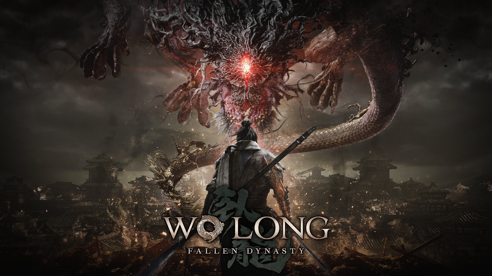

# 前情提要:

臥龍開始二周目，結果最難的是呂布的部下張遼。再來就是第一個王- 張梁。不過 Ps5 真的很方便錄影。爽爽的。

打完直接說我要前面 15 分鐘，然後直接到上傳 YouTube 即可。可以參考: [如何在PS5™主機上擷取影像和螢幕截圖](https://www.playstation.com/zh-hant-tw/support/games/capture-ps5-gameplay-screenshots/) 

# 分享一些手殘黨的打王心得

## 張梁

身為遊戲架構的導師，並且是試玩版的勸退王。其實本身設定的難度不低，尤其對於系統不熟的我，真的卡蠻久的。 不過也就是這樣，才覺得這一塊蠻好玩的。

- **第一階段：**
  - 他的連續普通招式不好抓時機，離遠一點比較好打。
  - 離遠一點，等發紅的殺招來化解。 （如果還抓不到，只能多死幾次來抓時機）
  - 遠的普通招式化解完後，可以砍個兩刀。
- **第二階段：**
  - 跟第一階段一樣，不過殺招時機不同。需要試試看。

## 呂布
<iframe width="560" height="315" src="https://www.youtube.com/embed/q4O465xVhxo" title="YouTube video player" frameborder="0" allow="accelerometer; autoplay; clipboard-write; encrypted-media; gyroscope; picture-in-picture; web-share" allowfullscreen></iframe>

## 張遼
好像沒有錄影，等打完二週的再來錄影。

## 尾王

<iframe width="560" height="315" src="https://www.youtube.com/embed/fBHUarRyD8k" title="YouTube video player" frameborder="0" allow="accelerometer; autoplay; clipboard-write; encrypted-media; gyroscope; picture-in-picture; web-share" allowfullscreen></iframe>

