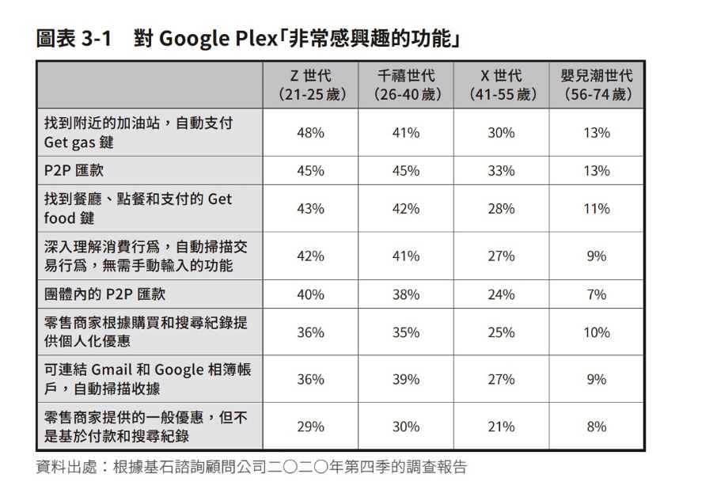

<div><a href="https://moo.im/a/36altR" title="嵌入式金融大衝擊！"></a></div>


```
嵌入式金融大衝擊！
從Google、Apple，到IKEA、賓士，科技巨擘與零售龍頭都爭先布局的創新金融版圖
エンベデッド・ファイナンスの衝撃

作者： 城田真琴  
譯者： 駱香雅  
出版社：商周出版 
出版日期：2023/02/23
```

#### 買書推薦網址：

- Readmoo: [購買網址](https://moo.im/a/36altR)

# 前言:

這是 2023 年第四本讀完的書， 當初這本書有兩個吸引我的地方： (1). 日本作者寫的書都言簡意賅，頁數比較少，可以很快讀完並且很清楚了解。  (2).  裡面有提到一些日本關於 ZHD 其他體系的金融佈局介紹。


# 內容摘要：

```
　　　＝＝＝＝＝＝＝＝＝　請想像以下的場景……＝＝＝＝＝＝＝＝＝

你突然想來一場沒有計畫的小旅行，於是直接在Google Map上預訂前往當地的機票，也一起預訂了Google一併推薦的度假飯店，並勾選旅遊平安險和航班延誤保險來保障自己，再用綁定的信用卡付款。抵達當地後，Google根據你過去的用餐紀錄推薦了一家很棒的懷石料理，並可以用購買機票的回饋點數折抵消費。最後，你在搜尋紀念品時，Google提醒你帳戶餘額所剩不多。於是你用手機把帳戶中的一部分定期存款解約，並指定將餘額投入定期定額的投資帳戶。你用Google便完成了旅途中所需的一切金融服務，快樂賦歸。

　　　＝＝＝＝＝＝＝＝＝　這就是嵌入式金融的未來！＝＝＝＝＝＝＝＝＝

嵌入式金融不止有支付 ──
「嵌入式金融」（Embedded Finance）指「發展金融以外業務的非金融公司，透過將其嵌入現有服務以提供金融服務」，是金融服務的最新趨勢。在台灣，「嵌入式支付」已經相當普及，利用行動支付直接付款可以說是生活的一部分了。不過，嵌入式金融還包含了「借貸」、「保險」、「投資」、「銀行」等領域，全新的藍海正等待開發。
```


### 科技巨頭的嵌入式金融

- Google 啟動 Google Plex 金融服務，不到一年最終收起來。



2020 年啟動的 Google Plex ，結果後續也收起來了。 參考新聞： [撐不到一年！Google 金融計畫 Plex 喊卡，40 萬消費者期待落空](https://buzzorange.com/techorange/2021/10/04/google-plex/)


# 心得:

這一本書首先針對嵌入式金融給予相當好的定義，也就是原本沒有從事金融的產業或是服務。因為某些的應用，產生了與金融相關的服務，這就是一種嵌入式金融。 

比如說： 嵌入式支付，直接在地圖軟體上的支付，或是透過相關商品的產品來保險。這一些相關的應用都是許多科技巨頭或是通訊軟體都會開拓的先業務。 這邊也針對了日本的金融體系給予相關產品說明與根據在地化的相關調整。 

日本相關體系有不同的面向來擴展他們嵌入式金融的服務：

- Z Holding (也就是 LINE 母公司)透過通訊平台來擴展相關的業務。
- Mercari 從電商開始，並且有回收等等循環式金融。也有商品保險。

相關的應用也衍伸出 BAAS (Bank as A Services) 的服務產生，許多金融項目的交易量在這些平台上大量的產生。並且透過嵌入式金融讓每一個應用軟體變成所謂的「超級應用」(SuperApp) 的概念來讓每一個用戶都離不開他們。 

蠻推薦想了解的人可以來看一下。


