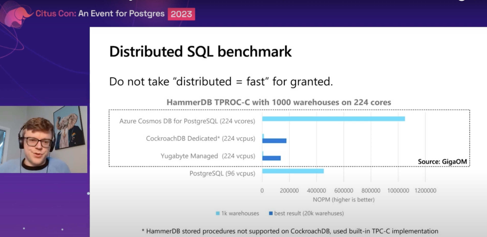

<iframe width="560" height="315" src="https://www.youtube.com/embed/6hyYqMLYyfg" title="YouTube video player" frameborder="0" allow="accelerometer; autoplay; clipboard-write; encrypted-media; gyroscope; picture-in-picture; web-share" allowfullscreen></iframe>


## 什麼是 Citus Postgres 

Citus 是由美國的一家公司 Citus Data 啟動的，並於 2019 年被 Microsoft 收購1。Citus 是一個 PostgreSQL 的擴展，它可以將 PostgreSQL 轉換為具有分片、分布式 SQL 引擎、引用表和分布式表等功能的分布式數據庫2。Microsoft 也有相關的產品，例如 Azure PostgreSQL，它可以加速 PostgreSQL 的性能和擴展性。


## Citus 使用起來如何用？

Citus Postgres 是一個架構在 PostgresSQL 上面的 Extension 。你可以在開源專案[https://github.com/citusdata/citus](https://github.com/citusdata/citus) 找到相關流程。


### 直接使用 Azure 上面 Managed 的服務。

 [Azure Cosmos DB for PostgreSQL portal](https://azure.microsoft.com/products/cosmos-db/).

### 或是自己透過開源專案來架構

參考： [https://github.com/citusdata/citus#readme](https://github.com/citusdata/citus#readme)

```
curl https://install.citusdata.com/community/deb.sh > add-citus-repo.sh
sudo bash add-citus-repo.sh
sudo apt-get -y install postgresql-15-citus-11.3
```

增加一個 extension lib 

```
shared_preload_libraries = 'citus'
```

增加 PostgresSQL Extension

```
CREATE EXTENSION citus;
```


## Azure Postgresql 和 CitusData Postgresql 差別在哪


Azure PostgreSQL 是 Microsoft 的一個產品，它是一個 PostgreSQL 的擴展，可以加速 PostgreSQL 的性能和擴展性1。Citus 是一個 PostgreSQL 的擴展，它可以將 PostgreSQL 轉換為具有分片、分布式 SQL 引擎、引用表和分布式表等功能的分布式數據庫2。因此，Citus 和 Azure PostgreSQL 都是 PostgreSQL 的擴展，但是它們的功能不同。


### 效能比



- 可以看得出來，雖然是透過 Azure Cosmos DB for PostgresSQL (網路版本) ，但是效能可以打爆 CockroachDB 跟 Yugabyte managed DB.
