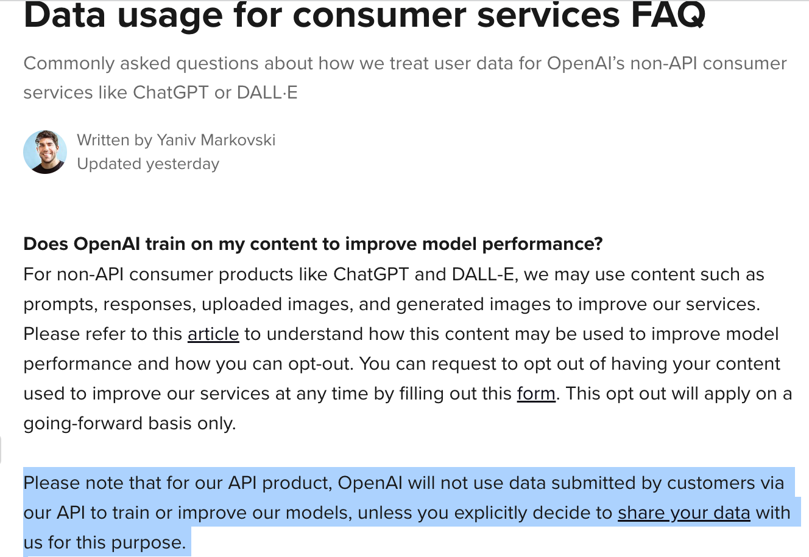
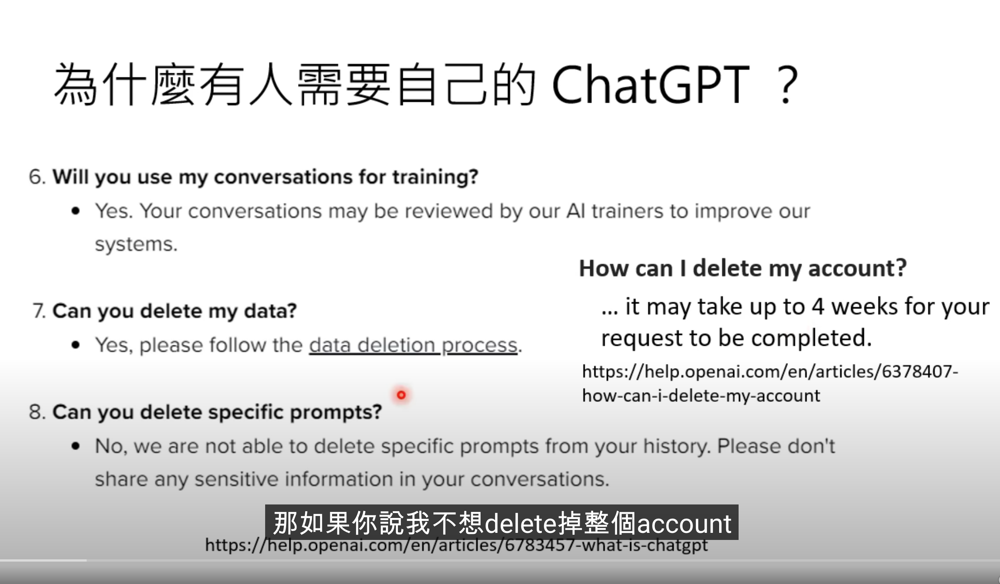

# 李宏毅教授 -【生成式AI】窮人如何低資源復刻自己的 ChatGPT

<iframe width="560" height="315" src="https://www.youtube.com/embed/rK_rZFew1yc" title="YouTube video player" frameborder="0" allow="accelerometer; autoplay; clipboard-write; encrypted-media; gyroscope; picture-in-picture; web-share" allowfullscreen></iframe>

李宏毅教授這個影片「窮人如何低資源復刻自己 ChatGPT」有提到資料被 OpenAI 訓練的部分。

- OpenAI 的 API 不會拿資料來訓練 https://help.openai.com/en/articles/7039943-data-usage-for-consumer-services-faq ，但是 ChatGPT 會。

- 如果不小心把機密資料放在 ChatGPT 要刪除其實**要四個禮拜**。  refer this link 。要注意： ChatGPT plus 並沒有支援「沒有二次使用」要等到 ChatGPT for Biz。 [OpenAI 推出新的資料控制選項來改善 ChatGPT 的隱私](https://tw.stock.yahoo.com/news/openai-推出新的資料控制選項來改善-chatgpt-的隱私-100057772.html)

- [Azure OpenAI API](https://azure.microsoft.com/en-us/products/cognitive-services/openai-service) 因為也是不會拿來訓練。 
