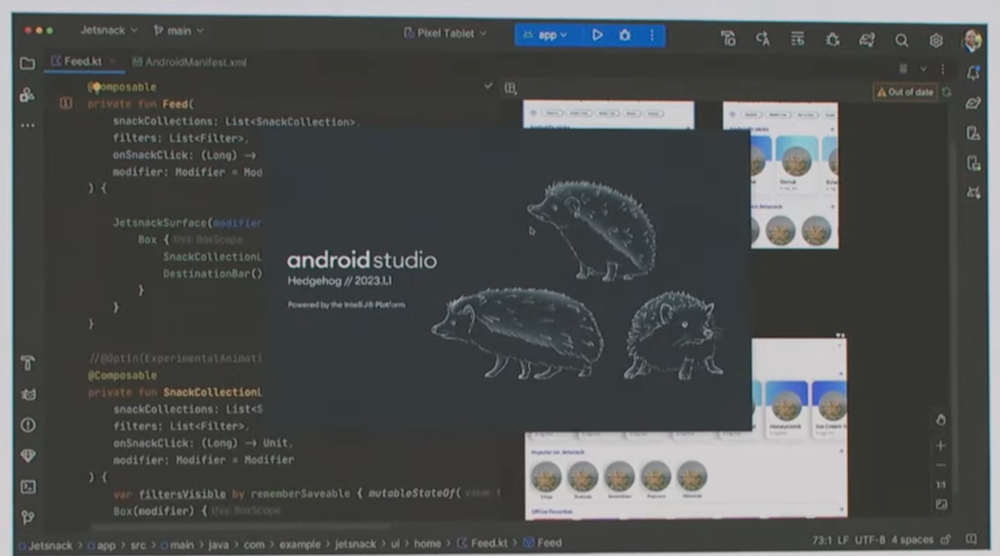

Google I/O 2023 Developer Keynote 相關資訊與討論整理串。 (賣手機跟雲服務的 Google Keynote，有太多新聞可以查，我就不列了 XD) 

## Fip IO

官方運用所有開發工具寫出的卡牌遊戲。 [Google I/O FLIP - A Generative AI Card Game](https://flip.withgoogle.com/)

## [Prompt helper on Bard: (這個名字我是創的) ](https://youtu.be/r8T0SnwHRNI)
你輸入幾個 prompt ，他會幫你把剩下的 prompt 都產生。 比如說你要 JSON ，他會產生預設的格式。 

## Android Studio Bot

目前只有在開發者先行版本 Canary Build 才有，Android Studio Bot: 就類似其他 IDE Bot ，幫你透過自然語音提供建議與程式碼。還有相關文件也給你。 [相關文件跟其他演講](https://android-developers.googleblog.com/2023/05/android-studio-io-23-announcing-studio-bot.html)。

